# IvoryOS NextGen - Agent Guidelines

## 0. Product Line Overview (read this first)

IvoryOS is four pieces across **two separate repos on disk**. If you're picking this up cold, orient here before diving into any one piece's implementation details.

| Piece | What it is | Lives in | Maturity (as of 2026-09) |
|---|---|---|---|
| **Hub** | Public web app: a driver/module/plugin/template registry (Supabase-backed) where people discover instrument drivers, assemble a stack, and generate an install bundle for Core. Also the marketing site. | `/Users/ivoryzhang/PycharmProjects/landing-page-supabase` (separate repo, Next.js + Supabase) | **Live.** Real DB-backed modules/devices/plugins/templates tables, real download flow (`ivoryos-hub.tsx` → `generateScripts` → zip). |
| **Core** | The execution engine: introspects a lab's real Python instrument drivers and reflects them into a browser UI — Designer (drag-drop sequences), Optimize (Bayesian loops), Execution/Configure (spreadsheet + batch runs), Data History, Instruments. Runs on a machine next to the hardware. | *this* repo — `edge_server/` (FastAPI backend) + `frontend/` (Next.js UI) | **Mature.** Single-lab execution, batch/optimizer/human-in-the-loop all working and tested (see sections 4-8 below). |
| **Cloud** | Meant to be: a dashboard that monitors and dispatches workflows across *multiple* Core instances (multiple physical labs) — the "connected lab" story. | *this* repo — `cloud_frontend/` | **Prototype / UI shell.** See the callout below — the polished orchestrator canvas does not yet actually reach a real Core instance. |
| **Community** | Discord, the public gallery of shared workflows, news posts, driver requests. | Discord (external) + pages inside the Hub repo (`app/hub/gallery`, `app/news`, `components/landing/community.tsx`) | **Live.** |

### The pipeline

```mermaid
flowchart LR
    subgraph COMM["Community"]
        C1["Contributors &<br/>Discord / Gallery"]
    end
    subgraph HUB["Hub — landing-page-supabase repo"]
        H1["Driver / module registry<br/>(Supabase: modules, devices,<br/>plugins, templates)"]
        H2["Assemble a stack<br/>+ pick an optimizer"]
        H3["Generate install bundle<br/>(pip installs + init args)"]
    end
    subgraph CORE["Core — this repo: edge_server + frontend"]
        K1["FastAPI runtime,<br/>runs beside the hardware"]
        K2["Introspects the real<br/>Python driver at runtime"]
        K3["Designer / Optimize /<br/>Execution / Data History"]
    end
    subgraph CLOUD["Cloud — this repo: cloud_frontend"]
        L0["daemon.js<br/>(MQTT subscriber)"]
        L1["Multi-device<br/>orchestrator canvas"]
        L2["Dispatch across labs<br/>(not yet reachable — see below)"]
    end

    C1 -->|contribute a driver| H1
    H1 --> H2
    H2 --> H3
    H3 -->|pip install, run locally| K1
    K1 --> K2
    K2 --> K3
    K3 -->|MQTT/AWS IoT: retained status/<br/>schema/sequences topics| L0
    L0 --> L1
    L1 -.->|MQTT execute topic<br/>publisher not yet wired| L2
    L2 -.-> K3
    K3 -->|share results, ask questions| C1
    H1 -.->|ROADMAP: store the introspected<br/>schema, not just install metadata| K3
```



The remaining dotted lines are the two open threads, in priority order:
1. **Cloud ↔ Core sync (read path) is wired; dispatch (write path) is not — yet.** The transport is settled: MQTT / AWS IoT Core only, chosen because Core already fully implements it (`broker.py`'s `LocalMQTTBroker`/`AWSIoTBroker`, configured entirely from a base64 `CLOUD_TOKEN` env var — no self-hosted broker required, which matters since Cloud is meant to be a zero-setup SaaS). The old HTTP long-poll path (`api/edge/heartbeat`, `api/edge/complete`) has been deleted; it was never called by a real Core instance anyway.
   - **Topic shape** (`edge_server/ivoryos_edge/server.py`): `{prefix}/{device_id}/status` (retained, tiny `{online, ts}`, republished every 5s — this is the billable-message-volume knob on AWS IoT, kept deliberately small), `.../schema` (retained, published once per connect — the instrument schema doesn't change without a restart, and it's the one payload big enough to matter for AWS IoT's 5KB-increment metering, which is exactly why it's *not* folded into the frequent status ping the way the old combined heartbeat did it), `.../sequences/{name}` (retained, one message per saved workflow from `WORKFLOWS_DIR`, republished on every reconnect *and* immediately on `POST /api/workflows/{name}`). A Last Will and Testament (`set_will`, `broker.py`) publishes `{online: false}` if Core drops uncleanly.
     - **`set_will`'s Last Will is NOT retained (`retain=False`), and that's load-bearing, not an oversight**: AWS IoT Core silently refuses the *entire connection* if the Last Will has `retain=True` — no CONNACK, ever, no error reason given anywhere, the client just hangs until it times itself out. Confirmed by direct testing against a live AWS IoT endpoint: identical connect that succeeds instantly with `retain=False` hangs indefinitely with `retain=True`, reproduced 4/4 times, independent of QoS. A local Mosquitto-style broker has no such restriction (retained wills are standard MQTT), which is exactly why this passed earlier local-broker testing and only broke against real AWS IoT. Practical consequence: the will only reaches a subscriber that's already connected at the moment the device drops — anyone who (re)subscribes afterward won't see it via the will. `status_loop`'s periodic *retained* "online" publish plus `daemon.js`'s own staleness sweep (no update in 15s → mark offline) is what actually catches the general case; don't try to "fix" this by re-adding `retain=True` to the will.
   - **Why this needs no explicit "sync" step**: MQTT retained messages replay to a new subscriber immediately, and to an *already-subscribed* one the instant the publisher reconnects — reconnecting after being offline is not a special case, it's the same retained-republish that already happens on every connect and every save. Cloud's subscriber (`daemon.js`) never polls or requests anything; it just always has the latest retained value for every topic once.
   - **`daemon.js`** is a standalone Node process (`npm run daemon`, run separately from `next dev`/`next start` — a Next.js API route is request-scoped and shouldn't own a long-lived broker connection) that subscribes to `+/status`, `+/schema`, `+/sequences/+` and upserts into **Cloud's own Supabase project** (`supabase/migrations/0001_devices_and_edge_sequences.sql` — deliberately a *separate* project from the Hub's, not shared) via the service-role key. `api/devices` now reads from that same table instead of the old in-memory `orchestrator.ts` Map. It loads `cloud_frontend/.env.local` itself via `dotenv` (a plain `node daemon.js` process gets none of Next.js's automatic env loading — without this, every var below is silently `undefined`).
     - **The daemon needs its *own* AWS IoT Thing + certificate, with a *different*, broader policy** than the per-device one above — it has to subscribe across every device's topics, not just its own. Create it once, by hand: a policy (e.g. `ivoryos-cloud-daemon-policy`) allowing `iot:Connect` (still `${iot:Connection.Thing.ThingName}`-scoped) plus `iot:Subscribe`/`iot:Receive` on `arn:aws:iot:REGION:*:topicfilter|topic/ivoryos/edge/*` (no ThingName restriction on the topic side), then a Thing (e.g. `ivoryos-cloud-daemon`) with a cert attached to that policy. `AWS_IOT_CA_PATH`/`AWS_IOT_CERT_PATH`/`AWS_IOT_KEY_PATH` point at that cert; `MQTT_CLIENT_ID` **must exactly equal the Thing name** the cert is attached to.
     - **Getting `MQTT_CLIENT_ID` wrong (or leaving it unset) reproduces the exact same silent-hang failure mode as the retained-Will bug above, for the exact same underlying reason**: the policy's `iot:Connect` permission is scoped to `${iot:Connection.Thing.ThingName}`, so a connecting client ID that doesn't match any Thing the certificate is attached to gets refused at the MQTT protocol level — TLS still succeeds (the cert itself is valid and registered), so `mqtt.js`'s `connect()` call returns normally and the process just sits there, `on('connect')` never firing, no error anywhere. Confirmed the same way as the Will bug: inspecting the process's open sockets directly (`lsof -p <pid> -i`) showed a genuinely `ESTABLISHED` TCP connection to port 8883 while the daemon had logged nothing past its startup line. If `npm run daemon` connects to AWS IoT and then goes silent forever, check this first.
   - **UNRESOLVED: recurring connection instability, cause not yet found (as of 2026-09-09)**. On at least one dev machine, the AWS IoT connection cycles connect→disconnect→reconnect roughly every 1-1.5 seconds, indefinitely (reproduced continuously across an 8+ hour span). **Confirmed not an application bug in this codebase**: a print at the top of `LocalMQTTBroker.disconnect()` (the only method here that ever tears down a connection) never fired during the cycling — the disconnects originate entirely inside paho-mqtt's own automatic-reconnect internals. Also ruled out, each with a dedicated isolated test: a client-ID collision (reproduced with zero competing connections active), a specific bad Thing/certificate (reproduced identically on a brand-new, never-before-connected Thing), the MQTT5-vs-3.1.1 protocol version (forcing `protocol=mqtt.MQTTv311` didn't fix it), AWS-side rate throttling (still reproduced after an 8-hour idle cooldown — a real rate limit would have cleared), and an outdated TLS stack (the venv's OpenSSL 3.5.6 and paho-mqtt 2.1.0 are both current). **A VPN/tunnel theory was raised and then disproven** — the machine had six active `utun` interfaces, which looked suspicious, but no VPN client, security/MDM agent, system extension, or firewall (macOS's own Application Firewall was confirmed disabled) was actually found running; don't re-raise this lead without first identifying what a `utun` interface actually belongs to (`ps`/`launchctl list`/`systemextensionsctl list`), not just counting them. **Net state: genuinely unknown cause.** The most useful untried next step is testing from a completely different network (e.g. a phone hotspot) to at least separate "this network/router" from "this machine" from "the AWS account/endpoint" — that hasn't been done yet. A packet capture (`tcpdump`/Wireshark) on port 8883 during the cycling would likely be definitive but needs sudo and hasn't been attempted. Practical consequence while a machine is affected: `schema`/`sequences` (QoS-1, need a full publish→PUBACK round trip) may never successfully land if the connection never stays up longer than the round trip takes, even with the ~60s retry below; `status` (QoS-0, fire-and-forget) gets through more often simply because it doesn't need to wait for anything, which is why `devices.status` can look closer to "working" than schema/sequences do on the same flaky connection.
   - **Fix landed regardless, and it's the right shape either way**: `publish_schema`/`publish_sequences` used to be one-shot QoS-1 calls, fired once right after connect, with no retry — fragile against exactly this kind of connection churn, and confirmed to actually lose messages this way (284 `status` messages reached the daemon in one test session; zero `schema` or `sequences` ones, from the same connection). `status` itself never showed a symptom because it's QoS-0 and re-sent every 5s regardless of any single failure. `status_loop` now also re-publishes schema/sequences every 12th tick (~60s) — folding them into the loop that was already self-healing, rather than trying to make the one-shot call race-proof.
   - **Multi-tenancy model**: one AWS account, one AWS IoT Core endpoint, every customer's device connects to the same endpoint — isolation is enforced per-certificate, not per-account. Every device gets its own AWS IoT Thing + X.509 certificate, and the *same* IoT policy is attached to all of them, scoped with the `${iot:Connection.Thing.ThingName}` policy variable so a device can only publish/subscribe under its own `ivoryos/edge/{its-own-thing-name}/*` namespace — AWS enforces this at the broker level, not application code. That shared policy is created **once**, by hand, in the AWS console (not by any code in this repo):
     ```json
     {
       "Version": "2012-10-17",
       "Statement": [
         { "Effect": "Allow", "Action": "iot:Connect",
           "Resource": "arn:aws:iot:REGION:*:client/${iot:Connection.Thing.ThingName}" },
         { "Effect": "Allow", "Action": ["iot:Publish", "iot:Receive"],
           "Resource": "arn:aws:iot:REGION:*:topic/ivoryos/edge/${iot:Connection.Thing.ThingName}/*" },
         { "Effect": "Allow", "Action": "iot:Subscribe",
           "Resource": "arn:aws:iot:REGION:*:topicfilter/ivoryos/edge/${iot:Connection.Thing.ThingName}/*" }
       ]
     }
     ```
     Its name goes in `AWS_IOT_POLICY_NAME`. The daemon's own Thing (for cross-device subscribe) needs a *separate*, broader policy — it's a privileged backend identity, not a tenant device.
   - **Token minting is automated** (`src/lib/aws-iot.ts`'s `provisionDevice()`, called from `POST /api/devices/provision`, wired to the "Generate Token" button on `/settings` when Broker Type = AWS IoT): calls `CreateThing` → `CreateKeysAndCertificate` → `AttachPolicy` (the shared policy above) → `AttachThingPrincipal`, packages the result into a ready-to-paste `CLOUD_TOKEN`, and creates a placeholder `devices` row. Needs a dedicated IAM user (env vars in `.env.local.example`) scoped to just those five actions plus `UpdateCertificate`/`DeleteCertificate`/`DeleteThing` (used for best-effort cleanup if a provision call fails partway through) — not an admin credential. `AMAZON_ROOT_CA1` is embedded as a literal constant, downloaded and fingerprint-verified directly from amazontrust.com rather than hand-transcribed. **This endpoint has no auth and no rate limit** — anyone who can reach the Next.js app can mint real, billable AWS IoT resources today. Fine while this is unpublished; a hard blocker before any real public launch (needs at minimum a logged-in-user check once Cloud has auth, ideally per-user rate limiting too).
   - **What's still missing, in priority order**: (1) **Dispatch** — `src/lib/orchestrator.ts`'s run graph (`startRun`/`checkReadyNodes`/`getPendingTasks`/`completeNode`) is still an in-memory `Map`, and the routes that used to drain/feed it (`api/edge/heartbeat`, `api/edge/complete`) are gone — nothing publishes a ready task to `.../execute` anymore (Core's subscribe side, `handle_broker_message`, still works fine; there's just no publisher). This needs the run graph moved into Postgres and `daemon.js` (the one process holding the live connection) turned into the publisher too, likely via Supabase Realtime or a poll loop over a `pending_tasks`-shaped table. Fixing this is required before the Cloud canvas's "Run" button does anything against a real device again. (2) **No device ownership or auth** — `devices.owner_id` exists in the schema and RLS is enabled, but nothing sets it or gates `/api/devices/provision` (no user auth in Cloud yet), so every device is currently unowned and the provisioning endpoint is wide open — see the callout above.
2. **Hub doesn't yet store the introspected method schema**, only install metadata (package name, constructor args) — see `landing-page-supabase/AGENTS.md` and the Roadmap section of `/technical` on the Hub site for the full shape of this. Once it does, picking a stack in the Hub can open a fully-populated Designer in the browser before Core is even installed. **The hard part of this — safely running introspection against an arbitrary, user-submitted package — already has a working, hardened prototype**: `schema_worker/` in this repo (a standalone FastAPI service, own `Dockerfile`). It is **not yet wired into the Hub's contribute flow** (the Hub's `init_args` field is still hand-typed by contributors) — that wiring, plus a job-status flow (the `modules.status` column already exists in Supabase but isn't used yet: `pending` → `extracting` → `ready`/`failed`, Hub UI polls or subscribes via Supabase realtime), is the remaining work.

   **How `schema_worker` stays safe to point at arbitrary input**: the FastAPI process itself (`main.py`) never pip-installs or imports anything — it only shells out to `docker run --rm` per request, launching a disposable, resource-capped sandbox (`--memory 256m`, `--pids-limit 128`, `--read-only` root filesystem with only a `/tmp` tmpfs writable, `--user 1000:1000`, `--cap-drop ALL`) built from the *same* image. `sandbox_entrypoint.py` — which runs *inside* that disposable container, never in the worker — does the actual `pip install --target /tmp/pkgs <package>` (into the writable scratch dir, since the root fs is read-only) and then runs `extract_cli.py`'s class-level introspection (`inspect_class()` in `schema_worker/introspection.py` — deliberately never instantiates the class, so a driver whose `__init__` needs a real serial port or IP address doesn't hang or crash the extraction). A hard wall-clock timeout plus an explicit `docker kill` on timeout guards against a hung/malicious package tying up the worker. **Known, explicitly deferred hardening**: network egress from inside the sandbox is currently unrestricted (a `TODO(v2)` in `main.py` — the fix is a proxy container the sandbox is forced through, only allowlisting pypi.org/files.pythonhosted.org/github.com, not the default bridge network it uses today).

   `schema_worker/introspection.py` is a **third, deliberately-diverged copy** of `edge_server/ivoryos_edge/introspection.py`'s type-extraction logic (class-level `inspect_class()` vs. Core's instance-level `inspect_device_module()`) — the `<class 'float'>` cleanup has been ported over (both now emit `annotation.__name__` for plain classes), but nothing keeps them in sync automatically. If you fix something in one, check whether it applies to the other; they aren't going to be merged into one shared package while `schema_worker` needs to stay a minimal, independently-deployable image.

   **Deployment reality check — this matters if the Hub ever calls this service**: `schema_worker`'s original `/extract` needs `docker run` on PATH with a reachable daemon, which **does not exist on Vercel or most serverless/PaaS hosts** — there is no Docker Engine access there at all. If `schema_worker` itself needs to be reachable from a Vercel-hosted Hub without standing up a separate VM, use **`POST /extract/async`** instead (`fly_launcher.py`): it makes a plain HTTPS call to Fly.io's Machines API, which boots a disposable Firecracker micro-VM from the *same* sandbox image — no Docker daemon needed on the caller's side at all. It's fire-and-forget: returns `{job_id, machine_id, status: "started"}` immediately, and the sandbox POSTs its actual result to a caller-supplied `callback_url` when done (`sandbox_entrypoint.py`'s `report()`) — `schema_worker` itself stores nothing and knows nothing about Hub/Supabase; whoever calls `/extract/async` owns turning that callback into a `modules` row update. The callback mechanism itself is verified end-to-end (a real hardened container POSTing its result to a real external HTTP server) — the Fly Machines API call shape in `fly_launcher.py` is written from documented behavior but **has not been exercised against a live Fly account/token**; run one real launch by hand before depending on it in production, and fix anything the real API rejects.

---

## 1. Overall System Architecture

This repository is an npm workspaces monorepo (`workspaces: ["frontend", "cloud_frontend", "packages/*"]`) with a distributed edge-to-cloud architecture:

### `edge_server/` (The Python Backend)
- **Role:** The core execution engine running locally on edge devices (lab instruments / local controllers).
- **Tech Stack:** Python (`ivoryos_edge` package), FastAPI, SQLAlchemy async (aiosqlite).
- **Persistence:** Local SQLite database (`ivoryos_edge.db`).
- **Execution model:** A single-process `WorkflowQueueManager` (`ivoryos_edge/queue.py`) processes one `WorkflowRun` at a time from a DB-backed queue (`_execution_loop`). `type == "Optimization"` runs go through a separate `_execute_optimization_run` path that dynamically generates trial steps each iteration.
- **Dev note:** the demo server (`example/demo.py`, port 8080) runs with `reload=False` — backend Python edits need a manual restart to take effect. Static frontend files under `frontend/out/` are served straight from disk and picked up immediately, no restart needed.

### `frontend/` (The Edge Server Frontend)
- **Role:** The local UI for a specific edge device — design, optimize, configure, and execute sequences directly on the machine.
- **Tech Stack:** Next.js (App Router, static export via `output: 'export'`), Tailwind CSS v4.
- **Served by the edge server:** `server.py` mounts `frontend/out` as static files at `/`. Run `npm run build` in `frontend/` after any change so the Python server serves the latest bundle.

### `cloud_frontend/` (The Cloud Hub Frontend)
- **Role:** A central orchestration dashboard meant to run in the cloud — monitors, connects to, and dispatches workflows to multiple edge devices.
- **Tech Stack:** Next.js (App Router), React Flow.
- **Design system:** Contains a legacy "glassmorphism" CSS layer (`cloud_frontend/src/globals.css`), wrapped in `@layer base`/`@layer components` so it doesn't fight standard Tailwind utilities used in shared/copied components.

### `packages/shared-ui/` (`@ivoryos/shared-ui`)
- **Role:** Code shared between `frontend/` and `cloud_frontend/`, consumed via Next's `transpilePackages: ['@ivoryos/shared-ui']` (source-level transpilation — no separate build step needed during dev).
- **Currently contains:** `WorkflowEditor` (the drag/drop sequence builder canvas + toolbox), `PythonCodeView` (theme-aware syntax-highlighted Python preview with a download button), `generatePythonCode` (codegen for the `prep()`/`main()`/`cleanup()` script), `buildRunName` (experiment-name / run-naming helper).
- History note: an earlier version of this document said not to attempt this and to keep `WorkflowEditor.tsx` duplicated between the two frontends. That guidance is superseded — the shared package works fine with Turbopack. Don't resurrect the duplicated-file approach.

---

## 2. Tailwind v4 + shared-ui gotcha

Tailwind v4 (CSS-first config, no `content` array) only scans files it's told about. Because `packages/shared-ui/src` lives outside `frontend/src` and `cloud_frontend/src`, **both** `frontend/src/app/globals.css` and `cloud_frontend/src/globals.css` need an `@source` directive pointing at it, or every class used only inside shared-ui silently produces no CSS (this exact regression happened once — fonts/spacing/colors looked "randomly" broken after the shared-ui extraction, with no console error).

```css
@import "tailwindcss";
@source "../../../packages/shared-ui/src"; /* path relative to each app's globals.css */
```

If you add a new shared-ui-only Tailwind class and it doesn't render in one app but works in the other, check this first.

---

## 3. Known drift risk: logic not yet extracted into shared-ui

Only `WorkflowEditor`, `PythonCodeView`, `generatePythonCode`, and `buildRunName` are shared. Everything else Designer-adjacent is still **duplicated per app** and has already drifted out of sync at least twice this project (validation logic, codegen). Before adding a new Designer-related feature to only one app, check whether the same logic exists in the other:

- `validateSequence()` — the actual Run/Configure-blocking gate — exists separately in `frontend/src/app/designer/page.tsx` and `cloud_frontend/src/app/edge-sequence/page.tsx`.
- `findEmptyHashName()` (bare-`#`-name check) — same, duplicated.
- Numeric-type (`int`/`float`) validation inside `validateSequence` — same.
- Theme/localStorage boilerplate in each host page.

If a fix or feature belongs in one of these, grep for the same function name in the other app before considering the change done.

---

## 4. The `#variable` convention

`#name` anywhere in a block's params means "resolve this dynamically." There are two independent resolution mechanisms — don't conflate them:

- **`substitute_workflow_vars(obj, context)`** (`edge_server/ivoryos_edge/queue.py`) — whole-value substitution only. A param value that IS exactly `#name` gets replaced with `context[name]`; raises if unresolved. Used for real (non-optimization) live-run steps and for If/While condition evaluation.
- **`interpolate_message(text, context)`** (same file) — regex-based (`#(\w+)` → value) **substring** interpolation for free text, e.g. a `Comment` message or a `User_Input` prompt containing `"flow rate is #flow_rate"`. Leaves unmatched `#name` as literal text rather than raising. This is also mirrored client-side in codegen (`generatePythonCode`'s `pyTextLiteral`) to turn such text into an f-string in the generated Python.

`workflow_context` (the dict both mechanisms read from) is populated by prior steps' return-vars and by `User_Input` step values.

For an **Optimization** run specifically, `#name` in `sequence_template` is resolved per-trial from the optimizer's `suggest()` output — see the Optimizer section below. A `#name` that should NOT be optimized (e.g. a "vial index" that's dynamic but constant across trials) must be resolved client-side into a literal **before** the sequence template is sent to the backend — see "Search Space exclusion" below.

---

## 5. Human-in-the-loop (`User_Input`) and `Comment` Flow Control blocks

- Backend: `WorkflowRun`/`WorkflowStep.status = "waiting_input"` + an `asyncio.Event` per run (`pending_input_event`/`pending_input_value` dicts in `WorkflowQueueManager`, keyed by run_id). Resume via `POST /api/queue/runs/{run_id}/input` → `submit_input(run_id, value)`.
- Frontend: a global WebSocket-driven modal lives in `frontend/src/components/Sidebar.tsx` (not on any specific page) so it surfaces regardless of which page the user is on when a run pauses.
- `Comment` just interpolates its message (see `interpolate_message` above) and prints it — no pause.

---

## 6. Optimizer wiring (`edge_server/ivoryos_edge/optimizer/`)

- `OptimizerBase` subclasses (`AxOptimizer`, `BaybeOptimizer`, `NIMOOptimizer`) are registered in `OPTIMIZER_REGISTRY` (`registry.py`). The registry's import is wrapped in a bare `except Exception: pass` — a broken optimizer module import fails **silently**, just leaving that optimizer absent from `GET /api/optimizers`. If an optimizer isn't showing up in the Optimize page dropdown, check the import first, not the frontend.
- `suggest(n)` returns a **list** of per-trial param dicts. `observe(results)` expects a **list** of per-trial result dicts, matching `suggest`'s batch shape. Passing a bare dict here was a real, previously-shipped bug (`'str' object has no attribute 'items'`).
- **Batch size (`parameters.batch_size`, default 1):** the Optimize page's General Settings has a "Batch Size" field alongside Evaluation Budget, wired straight through to `optimizer.suggest(n=batch_size)` — one "round" runs `n` trials, then reports them together via one `optimizer.observe(round_results)` call instead of one at a time. `_execute_optimization_run`'s budget loop is `while completed < budget`, requesting `min(batch_size, budget - completed)` trials per round (so the last round is truncated to fit, never overshoots `budget`). `batch_size=1` reduces to the old one-trial-at-a-time behavior exactly. A trial that fails inside a round (per `error_recovery`) is simply dropped from that round's `observe()` call — a "stop" recovery still aborts the whole run.
- **Existing data (`parameters.existing_data`, a list of `{param_or_objective_name: value}` row dicts):** seeds the optimizer with prior results *before* the first `suggest()` call, via `optimizer.append_existing_data(pd.DataFrame(existing_data))` — already fully implemented in all three backends (Ax: `attach_trial`+`complete_trial` per row; BayBE: `experiment.add_measurements`; NIMO: needs a real `file_path`, not just the DataFrame — an asymmetry not yet special-cased anywhere). On the Optimize page, the "Existing Data" card (below Objectives) offers two sources, combined into one `existing_data` array: (1) checkboxes over past Data-History runs whose `parameter_space`/`objective_config` names exactly match the currently-configured search space and objectives — `sameNameSet` in `optimize/page.tsx` is the compatibility check, since `append_existing_data` feeds a DataFrame straight to the optimizer and mismatched columns would silently corrupt it; rows are extracted per-run by replaying the same iteration-chunking logic as `data/page.tsx`'s Optimization branch, skipping any non-`completed` iteration; (2) a CSV upload, parsed client-side, rejected up front if it's missing a required parameter/objective column. A run's `parameters.parameter_space`/`objective_config` (not the sequence template) are the only fields ever consulted for compatibility — a workflow-identity ("same workflow") badge is shown for UI context only and does not gate selection.
- `_execute_optimization_run` runs Prep once, then existing-data seeding (if any) once, then the budget loop (suggest → build steps from `sequence_template` → execute → observe), then Cleanup once, mirroring Prep/Main/Cleanup in the Designer.
- **Early stop:** `parameters["early_stop"] = {"mode": "any"|"all", "criteria": [{"metric": ..., "threshold": ...}, ...]}` (built from the Optimize page's per-objective "Stop early" checkboxes) — checked once per trial after each round's `observe()` call, so a batch round can still stop mid-round if an early trial in it meets the target; direction (`>=` vs `<=`) is derived from that objective's existing `minimize` flag in `objective_config`, not a separate field. Breaking out of the budget loop early still finishes the run as `"completed"`, not `"error"`.
- **Search Space exclusion — two independent controls per variable** in `optimize/page.tsx` (displayed without the `#` prefix, though the underlying param value is still `"#name"`):
  - **Optimize/Fixed toggle** (`getVarMode`/`setVarMode`, a pill button): Optimize (default) goes into `parameter_space`, resolved per-trial from the optimizer's `suggest()` output. Fixed gives it one value for the entire run, resolved to a literal **client-side** before the sequence template is even sent (`resolveFixedVarsInBlock`, mirroring the existing Prep/Cleanup global-value resolution) — the backend never knows this var existed; it just sees a literal instead of a `#name`.
  - **"Per-Iteration" checkbox** (`isPerIteration`/`setPerIteration`) — independent of, and takes priority over, the Optimize/Fixed toggle above (checking it hides that toggle for the variable). Pulls the variable into a **shared spreadsheet-style table** ("Per-Iteration Values", rendered right after the Search Space card, one column per per-iteration variable, one row per iteration up to the Evaluation Budget) rather than a per-variable widget — this deliberately reuses the same table/spreadsheet visual language as the Execution page instead of inventing a new compact pattern per card. This **cannot** be resolved client-side the way Fixed is — `sequence_template` is one shared template the backend's budget loop reuses every iteration, so a value that differs per iteration has to be resolved backend-side. The frontend sends `parameters.iteration_values = {var_name: [value_for_iter_0, value_for_iter_1, ...]}`; in `queue.py`'s `_execute_optimization_run`, the per-step `#name` resolution checks `iteration_values` first (indexed by the current `iteration`), falling back to the optimizer's `suggestion` dict otherwise. Casting to the real param type (e.g. the string `"10"` → `int(10)`) still happens later via the existing `cast_arguments(method, ...)` call at actual invocation time — the frontend and the `iteration_values` substitution both just pass strings through.
- **Plots:** `queue_manager.active_optimizer` / `active_optimizer_run_id` keep the most-recently-run optimizer instance reachable so `GET /api/queue/runs/{run_id}/plots?plot_type=...` can call `optimizer.get_plots(plot_type)`. **This only works for the single most-recently-completed optimization run in that server process's memory** — there's no persistence of the optimizer object per historical run. The Data History page's "Optimizer Plots" panel (`frontend/src/app/data/page.tsx`) calls this endpoint and shows a graceful explanatory message (not an error) when the requested run isn't the active one. Ax/BayBE return `{plot_name: html_fragment}` (Plotly `.to_html(include_plotlyjs=False)`, so the frontend renders each via an `<iframe srcDoc=...>` that loads its own `plotly.min.js` — `dangerouslySetInnerHTML` would not execute the `<script>` Plotly needs). NIMO's `get_plots` returns a local PNG file path instead, which the current frontend does not render (falls through to the "not viewable" message).

---

## 7. Run naming (`buildRunName`, `packages/shared-ui/src/runNaming.ts`)

Every run-submission page (`designer/page.tsx`, `optimize/page.tsx`, `execution/page.tsx`) has an "Experiment name (optional)" input next to its Run/Start button. If filled in, it becomes the run's name verbatim. If left blank, `buildRunName` falls back to a **sequential counter** (`"<Prefix> Run #N"`, N = count of existing runs already sharing that prefix) — **never a random word or uuid**, so Data History entries stay human-distinguishable at a glance. Keep this convention if you add another run-triggering page.

---

## 8. Batch mode: per-sample vs batch steps (Configure/spreadsheet execution)

Every block in the Main Workflow (`WorkflowEditor`'s `listId === 'canvas'` only — not Prep/Cleanup, which already run once by definition) carries an optional `isBatchAction` flag, toggled via the teal "Batch" button next to each block (`WorkflowEditor.tsx`'s `toggleBatchAction`). This is the direct successor to the legacy engine's per-step `batch_action` flag (see any legacy-exported workflow JSON) — same idea, ported to the new Designer:

- **Per-sample step** (default, `isBatchAction` false/unset): repeats once per row, resolving its `#var`s from that row's values.
- **Batch step** (`isBatchAction: true`): runs once per **batch group** — a configurable number of consecutive rows (`execution/page.tsx`'s "Batch Size" input, next to the Experiment Name field at the bottom of the page so run-configuration inputs live in one place; shown only when the sequence has a batch step; defaults to all rows = one group, i.e. unchanged legacy-equivalent behavior when left blank). Its `#var`s are **still spreadsheet columns**, not a separate fixed-value input — `groupFirstRowValue()` reads it from the group's **first row, and only the first row** (a hard rule, not a best-effort scan — see below for why), so the user only has to fill it in once per group of N rows (e.g. one shared "target_temperature" for a group of 4 vials heated together) rather than repeating it on every row. This is unrelated to Prep/Cleanup's "Fixed Values" panel, which is still a true single value for the entire run.

  The table gives two visual hints for this, both purely cosmetic (they never change what gets submitted): a column with a batch var gets a small "1/batch" header badge, and every row in that column *except* the group's first row renders muted/greyed with an italic "not used for this row" placeholder — still a perfectly normal, editable, submittable input, just visually de-emphasized. A teal top border plus a small "Batch N" label marks where each new group starts.

  Groups are chunked by **plain row position** (`idx % groupSize === 0` marks a group start), not by "which rows currently have data" — both the table's display and `executeSpreadsheet()`'s actual chunking do this identically. Rows within a group that turn out to be blank are just skipped when expanding per-sample steps (same leniency as always), and a group that's entirely blank end-to-end is dropped, but the group *boundaries* themselves never shift based on content. This matters concretely: with 5 rows and batch size 4, row 5 has to show as the start of batch 2 immediately, even on a completely empty, freshly-loaded spreadsheet — group boundaries can't wait until the user starts typing.

  **Why strictly the first row, not "whichever row has it," and why position-based, not content-based:** two real bugs already happened here from getting this cross-cutting rule wrong once each, so keep both hard rules if you touch this again. (1) An earlier version scanned the whole group for the first non-empty value; if the designated first row was left blank and a later (visually muted, "not used") row had a value, that value got used anyway, making the "not used" label a lie. (2) An earlier version computed group boundaries from an "active rows only" index (skipping blank rows before chunking); on a freshly-loaded, still-empty spreadsheet there are zero active rows, so no grouping ever displayed until the user started typing, even though "5 rows, batch size 4" already fully determines where the boundary belongs. Both bugs were the same underlying mistake: letting the visual promise and the actual resolution diverge under some input. Whenever you change how groups are read here, change the display's grouping logic identically in the same edit — never let them be computed two different ways.

All of this is a **client-side-only** concern in `execution/page.tsx`'s `executeSpreadsheet()`: rows are chunked into groups of `batchSize`, and within each group the sequence is walked once (block-major, not row-major) — a per-sample block expands into one call per row in that group, a batch block into exactly one call for the group — then the next group repeats the same walk. E.g. 24 rows with batch size 4 runs the per-sample/batch walk 6 times, 4 rows each — not once for all 24, and not once per row. The backend (`queue.py`) needs no changes for this; it just executes the already-flattened step list it always did.

Round-trips through the legacy JSON format (`saveWorkflow`'s `formatBlocks` and the JSON-import `migrateBlocks`, in both `frontend/src/app/designer/page.tsx` and `cloud_frontend/src/app/edge-sequence/page.tsx`) map `isBatchAction` ↔️ `batch_action` directly — importing an old workflow restores each step's batch/per-sample designation correctly.

**Explicitly deferred**: the legacy format also has a `consolidate_batch_args` field (letting a batch step receive the full list of values collected across the per-sample loop, e.g. "heat these exact vial numbers"). Not implemented — a batch step today just gets its own fixed value(s) with no visibility into what the per-sample loop iterated over. Revisit if a real workflow needs it.

---

## 9. Data History CSV exports (Spreadsheet runs)

A Spreadsheet-type run's persisted `parameters` used to only record `{variables, rows}` — the *input* columns the user typed in, with no record of which step produced "the" output. The on-screen expandable row view looked fine (it reads `step.outputs` live), but Data History's "Export Data" CSV built its header/rows purely from that persisted input config, so the output column silently never existed — a real, previously-shipped bug (an exported CSV for a completed run had no result column at all).

Fixed by also persisting a lightweight `parameters.sequence_template` (`[{instrument, method, returnVar}]`, one entry per block in one row's sequence — not full params/schema, just enough to tag which step is the output) when `execution/page.tsx` submits a Spreadsheet run, mirroring how Optimization runs already do this via their own `sequence_template`. `data/page.tsx`'s `formatRuns` then matches each row's steps back to `sequence_template` by position (every row repeats the same block sequence) to append real named output columns to both the on-screen row table and the CSV export. **Runs submitted before this change have no `sequence_template`** and permanently fall back to input-only columns for "Export Data" — their output is still visible per-row in the UI, and via "Export Log" (a separate, always-worked export that reads raw `step.outputs` directly, unaffected by this).

---

## 10. Plugin System

A plugin is deliberately *not* a code-level extension point — it's just static files with an `index.html`, shown in an iframe. There is no plugin API, no manifest schema beyond `{id, name}`, and no backend contract at all.

- **Discovery/serving** (`edge_server/ivoryos_edge/server.py`'s `run()`): auto-discovers every subfolder of a `plugins/` directory sitting next to the launch script (e.g. `example/plugins/`), mounts each as `StaticFiles` at `/plugins/<folder_name>/`, and registers `{id: folder_name, name: Title Case of folder_name, url: "/plugins/<folder_name>/index.html"}` in `app.state.plugins`, served via `GET /api/plugins`. **Discovery only runs at process startup** — dropping in a new plugin folder needs a server restart to show up; editing files *inside* an already-discovered plugin folder does not (`StaticFiles` reads from disk per-request).
- **Rendering** (`frontend/src/app/plugin/page.tsx`): fetches `/api/plugins`, finds the matching id, and puts `plugin.url` straight into an `<iframe>`. **`plugin.url` is a bare path relative to the edge server's own origin, not the Next.js frontend's** — it must be prefixed with `API_BASE` before use as the iframe `src` (`plugin.url.startsWith('http') ? plugin.url : `${API_BASE}${plugin.url}``, since an explicitly-registered plugin can also pass a full external `url` instead of a local `path`). This was a real, previously-shipped bug that only manifested in a split-origin setup (frontend and edge server on different ports/hosts, e.g. local dev with `next dev` on a separate port) — it stayed invisible in production because Core mounts the built frontend and `/plugins/*` from the *same* origin, which happens to paper over a same-origin assumption that isn't actually true in general.
- **iframe sandbox**: `allow-scripts allow-same-origin allow-forms allow-popups allow-downloads`. If a plugin needs to trigger a file download (an `<a>` click on a blob/data URL, which is exactly how most "export/download" buttons work), `allow-downloads` is required — Chrome silently no-ops anchor-click downloads inside a sandboxed iframe without it.
- **Bundling a Vite/CRA-built SPA as a plugin**: the build must use relative asset paths, since it's served from a subpath (`/plugins/<id>/`), not the root the build tool assumes by default. For Vite: `base: './'` in `vite.config.ts`. That alone isn't sufficient if the app's own source code has any *hardcoded absolute* runtime paths (e.g. `fetch('/some-asset.json')`) — those bypass Vite's asset-path rewriting entirely and need to become `` `${import.meta.env.BASE_URL}some-asset.json` `` by hand. The nice property of `base: './'`: it's relative, so the exact same build artifact works both mounted at a plugin subpath *and* deployed standalone at a domain root (e.g. Vercel) — no separate build config needed for the two contexts.
- **Real example**: `example/plugins/arm_loc_helper/` — a built copy of the separate `arm-loc-helper` repo (a client-side-only Vite/React/Three.js tool that parses UR robot `.script` files, visualizes the arm in 3D, and generates a Python driver class). No backend changes were needed to wire it in beyond the two fixes above (the `API_BASE` prefix and `allow-downloads`) — it's a genuine "drop a `dist/` folder in, it just works" integration, which is the whole point of keeping the plugin contract this thin.

---

## 11. Sidebar `isExpanded` hydration gotcha (and the pattern to avoid repeating)

`frontend/src/components/Sidebar.tsx`'s collapse/expand state used to read `localStorage` **inside its `useState` initializer**, guarded by `typeof window !== 'undefined'`. That guard doesn't do what it looks like it does: on the server that check is false (renders the default), but on the **client's first render — the one React hydrates against** — `window` already exists, so if the saved preference differed from the default, the client's very first paint disagreed with the server-rendered HTML. React's hydration-mismatch error pointed at a *child* several levels down (inside a `{isExpanded && (...)}` block), not at the element someone had already slapped `suppressHydrationWarning` on — because that attribute only silences a mismatch on the element's own attributes/text, never on its children's structure.

The fix, and the pattern to follow for any future localStorage-backed UI state: fixed default in `useState`, read `localStorage` inside a `useEffect` (client-only, runs *after* hydration), and let the value correct itself post-hydration. `theme` (same file, and every page) already did this correctly — copy that, not the old `isExpanded` code, if you add another persisted UI preference. Never read `localStorage`/`window`/`document` inside a `useState` initializer that render output depends on.

---

## 12. Build Requirements

**Always run `npm run build` in `frontend/`** (and `cloud_frontend/` when applicable) after structural or UI changes, so the static export the Python edge server serves is up to date. Type-check first with `npx tsc --noEmit -p .` in whichever of `frontend/`, `cloud_frontend/`, `packages/shared-ui/` you touched.

Python backend changes: run the automated suite from `edge_server/`:
```bash
cd edge_server && uv run --extra test pytest ../tests/automated/ -q
```
