# IvoryOS NextGen - Agent Guidelines

## 0. Product Line Overview (read this first)

IvoryOS is four pieces across **two separate repos on disk**. If you're picking this up cold, orient here before diving into any one piece's implementation details.

| Piece | What it is | Lives in | Maturity (as of 2026-09) |
|---|---|---|---|
| **Hub** | Public web app: a driver/module/plugin/template registry (Supabase-backed) where people discover instrument drivers, assemble a stack, and generate an install bundle for Core. Also the marketing site. | `/Users/ivoryzhang/PycharmProjects/landing-page-supabase` (separate repo, Next.js + Supabase) | **Live.** Real DB-backed modules/devices/plugins/templates tables, real download flow (`ivoryos-hub.tsx` → `generateScripts` → zip). |
| **Core** | The execution engine: introspects a lab's real Python instrument drivers and reflects them into a browser UI — Designer (drag-drop sequences), Optimize (Bayesian loops), Execution/Configure (spreadsheet + batch runs), Data History, Instruments. Runs on a machine next to the hardware. | *this* repo — `edge_server/` (FastAPI backend) + `frontend/` (Next.js UI) | **Mature.** Single-lab execution, batch/optimizer/human-in-the-loop all working and tested (see sections 4-8 below). |
| **Cloud** | Meant to be: a dashboard that monitors and dispatches workflows across *multiple* Core instances (multiple physical labs) — the "connected lab" story. | *this* repo — `cloud_frontend/` | **Prototype / UI shell.** See the callout below — the polished orchestrator canvas does not yet actually reach a real Core instance. |
| **Community** | Discord, the public gallery of shared workflows, news posts, driver requests. | Discord (external) + pages inside the Hub repo (`app/hub/gallery`, `app/news`, `components/landing/community.tsx`) | **Live.** |

### The pipeline

```mermaid
flowchart LR
    subgraph COMM["Community"]
        C1["Contributors &<br/>Discord / Gallery"]
    end
    subgraph HUB["Hub — landing-page-supabase repo"]
        H1["Driver / module registry<br/>(Supabase: modules, devices,<br/>plugins, templates)"]
        H2["Assemble a stack<br/>+ pick an optimizer"]
        H3["Generate install bundle<br/>(pip installs + init args)"]
    end
    subgraph CORE["Core — this repo: edge_server + frontend"]
        K1["FastAPI runtime,<br/>runs beside the hardware"]
        K2["Introspects the real<br/>Python driver at runtime"]
        K3["Designer / Optimize /<br/>Execution / Data History"]
    end
    subgraph CLOUD["Cloud — this repo: cloud_frontend"]
        L0["daemon.js<br/>(MQTT subscriber + dispatcher)"]
        L1["Multi-device<br/>orchestrator canvas"]
        L2["Dispatch across labs<br/>(Supabase runs/run_tasks,<br/>wired end-to-end — see below)"]
    end

    C1 -->|contribute a driver| H1
    H1 --> H2
    H2 --> H3
    H3 -->|pip install, run locally| K1
    K1 --> K2
    K2 --> K3
    K3 -->|MQTT/AWS IoT: retained status/<br/>schema/sequences topics| L0
    L0 --> L1
    L1 -->|Supabase runs/run_tasks +<br/>MQTT execute/task-status topics| L2
    L2 --> K3
    K3 -->|share results, ask questions| C1
    H1 -.->|ROADMAP: store the introspected<br/>schema, not just install metadata| K3
```



The remaining dotted lines are the two open threads, in priority order:
1. **Cloud ↔ Core sync is wired end-to-end, both the read path and dispatch (write path).** A diagram-first walkthrough of both (topic map, workflow sync, job dispatch, failure handling) is in [`docs/edge_cloud_sync.md`](docs/edge_cloud_sync.md); the notes below are the detailed history of why each piece is the way it is. The transport is settled: MQTT / AWS IoT Core only, chosen because Core already fully implements it (`broker.py`'s `LocalMQTTBroker`/`AWSIoTBroker`, configured entirely from a base64 `CLOUD_TOKEN` env var — no self-hosted broker required, which matters since Cloud is meant to be a zero-setup SaaS). The old HTTP long-poll path (`api/edge/heartbeat`, `api/edge/complete`) has been deleted; it was never called by a real Core instance anyway.
   - **Topic shape** (`edge_server/ivoryos_edge/server.py`): `{prefix}/{device_id}/status` (retained, tiny `{online, ts}`, republished every 5s — this is the billable-message-volume knob on AWS IoT, kept deliberately small), `.../schema` (retained, published once per connect — the instrument schema, its metadata, and the device's available optimizer backends; none of it changes without a restart, and it's the one payload big enough to matter for AWS IoT's 5KB-increment metering, which is exactly why it's *not* folded into the frequent status ping the way an earlier combined heartbeat design did it), `.../sequences/{name}` (retained, one message per saved workflow from `WORKFLOWS_DIR`, republished on every reconnect *and* immediately on `POST /api/workflows/{name}`), `.../execute` (Cloud → Core, one dispatched task — either `{block, runId, nodeId}` for a single step or `{run, runId, nodeId}` carrying a whole run, see section 15), `.../task-status` (Core → Cloud, a dedicated topic — *not* `.../status`, since that one is the plain `{online, ts}` device heartbeat and publishing a task update there was incorrectly flipping the device to "offline" in Supabase every time a cloud run started or finished). A Last Will and Testament (`set_will`, `broker.py`) publishes `{online: false}` if Core drops uncleanly.
     - **`set_will`'s Last Will is NOT retained (`retain=False`), and that's load-bearing, not an oversight**: AWS IoT Core silently refuses the *entire connection* if the Last Will has `retain=True` — no CONNACK, ever, no error reason given anywhere, the client just hangs until it times itself out. Confirmed by direct testing against a live AWS IoT endpoint: identical connect that succeeds instantly with `retain=False` hangs indefinitely with `retain=True`, reproduced 4/4 times, independent of QoS. A local Mosquitto-style broker has no such restriction (retained wills are standard MQTT), which is exactly why this passed earlier local-broker testing and only broke against real AWS IoT. Practical consequence: the will only reaches a subscriber that's already connected at the moment the device drops — anyone who (re)subscribes afterward won't see it via the will. `status_loop`'s periodic *retained* "online" publish plus `daemon.js`'s own staleness sweep (no update in 15s → mark offline) is what actually catches the general case; don't try to "fix" this by re-adding `retain=True` to the will.
     - **Retained publishing (`schema`/`sequences`/`status`) needs `iot:RetainPublish` granted alongside `iot:Publish` in the device's IoT policy** — see the resolved connection-instability writeup a few bullets down for why this bit for a while.
   - **Why this needs no explicit "sync" step**: MQTT retained messages replay to a new subscriber immediately, and to an *already-subscribed* one the instant the publisher reconnects — reconnecting after being offline is not a special case, it's the same retained-republish that already happens on every connect and every save. Cloud's subscriber (`daemon.js`) never polls or requests anything; it just always has the latest retained value for every topic once.
   - **Two deployment modes, one code path** (`cloud_frontend/src/lib/store/`). `local` is a lab on a LAN: a SQLite file (`ivoryos_cloud.db`) plus a local mosquitto, with no accounts, keys, Docker or internet. `cloud` is the hosted product: Supabase plus AWS IoT Core. The mode is inferred — **`SUPABASE_URL` set means cloud, unset means local** — so a fresh clone runs with nothing configured; `IVORYOS_CLOUD_MODE=local|cloud` overrides the inference where a silent fallback would be wrong (a real deploy should fail loudly, not quietly start writing to a local file). Cloud mode with only one of `SUPABASE_URL`/`SUPABASE_SERVICE_ROLE_KEY` is fatal by design.
     - `store/index.js` picks the backend and returns one shared instance per process; `store/sqlite.js` and `store/supabase.js` implement the same named operations. Nothing above this layer branches on the mode. The one real asymmetry is change notification: cloud mode uses a Supabase Realtime subscription, LAN mode polls every 400ms (`subscribePendingTasks`). Polling is only safe because dispatch **claims** a task with a compare-and-set *before* publishing — see `dispatchTask`; publishing first and recording after leaves a window where one task reaches a real instrument twice.
     - **`__dirname` and `process.cwd()` are both wrong for locating the LAN database**, and getting it wrong is silent — the daemon writes one file, the app reads another, and the UI shows zero devices while every check passes. Turbopack rewrites `__dirname` inside the Next bundle (observed: the app resolved `C:\ROOT\cloud_frontend\ivoryos_cloud.db`), and `cwd` differs by launch method (`npm --prefix cloud_frontend run daemon`, which `.claude/launch.json` uses, has cwd at the repo root; `npm run daemon` from inside `cloud_frontend/` does not). `localDbPath()` normalises both onto one file, `IVORYOS_LOCAL_DB` overrides it, and `/api/health` compares the app's path against the daemon's to make a mismatch impossible to miss.
     - `node:sqlite` must be reached via `process.getBuiltinModule('node:sqlite')`, not `require`: Turbopack has no externalization rule for that builtin and fails the route with "Unsupported external type Url for commonjs reference". It is also still experimental, so `npm run daemon` passes `--disable-warning=ExperimentalWarning`.
   - **Health check** (`GET /api/health`, polled by the Orchestrator header badge). An empty device list has four unrelated causes — daemon not running, broker unreachable, store misconfigured, or genuinely no devices yet — and all four used to render identically as "0 Edges Online". The frontend never touches MQTT (by design: a request-scoped route must not own a broker connection), so the daemon writes what it knows into `cloud_status` every 5s (`broker_connected`, `broker_url`, `mode`, `store_location`, `last_seen`) and the route reads it back, reporting each link separately plus a `problems[]` of human-readable causes. A heartbeat older than 15s (3x the interval) counts as down. The badge is one line with the full detail on hover, replacing the old "N Edges Online" + "Schema Engine Offline" pair that could disagree with each other.
   - **Workflow ownership: the edge owns its library; Cloud writes through to it.** The edge is the source of truth — it keeps working standalone if the network drops, which is the point of a bench instrument. Cloud is a replica that can *request* writes.
     - **Edge -> Cloud** is still retained MQTT, but the republish is now bounded. `status_loop` re-publishes schema/sequences at ticks {1,2,4,8,16,32} (~5s..160s after each connect) and then stops, instead of every 12th tick forever. The repeat exists for a real reproduced bug (AWS IoT dropping the one-shot connect-time publish — see `publish_schema`), but that is a *connect-time race*, so repeating past the settling window bought nothing: measured at 36KB every 60s on a 7-instrument device with 11 workflows, i.e. 50MB and ~20k messages per device per day of unchanged data, beside a `status` payload deliberately kept tiny for exactly that metering reason.
     - **Cloud -> Edge** is the `sequence_pushes` outbox plus a new `{prefix}/{device_id}/sequences-push` topic. Before it, a sequence authored in the Cloud editor was written to Cloud's database *and nowhere else*: the device resolves workflows against its own `WORKFLOWS_DIR`, so it could never run, and editing an existing one was silently reverted the next time the device republished its own copy over the same `{device_id, name}` key. The device applies a push through the same `wf.save_version` path a local save uses (a push is not a privileged back door) and echoes the result on its own retained `sequences/{name}` topic. **That echo is the acknowledgement**, correlated on step content — NOT on `body_hash`, which the device recomputes on save, so hash matching left every push unacknowledged forever. `sequences-push` is deliberately *not* retained (a retained push would be re-applied by any device reconnecting later), so anything below `acked` is re-sent until acknowledged.
     - **Deleting a workflow clears its retained topic** (an empty retained payload is MQTT's tombstone), and the daemon treats a zero-length message as a delete *before* `JSON.parse` sees it. Without both halves a deleted workflow was re-imported into Cloud forever from a body still sitting on the broker — observed with two workflows that were gone from the device's disk *and* its database while Cloud went on listing them.
   - **Broker host is chosen in `/settings`**, stored in `cloud_config`, and polled by the daemon (`watchBrokerConfig`, 3s) which reconnects on change — the API route cannot reach into the daemon, so the store is the mailbox. Env vars remain the fallback when no row is set, and AWS IoT ignores it since its credentials are cert-bound. The Settings UI reports **live** state from `/api/health`, not save state: a saved host that refuses connections must not look like success.
   - **Device pairing is a short-lived code, not a copied token** (`src/lib/pairing.js`, `api/pair/new`, `api/pair/redeem`, redeemed by the edge's `POST /api/cloud-settings/pair`). The old flow asked a person to copy a base64 `CLOUD_TOKEN` to another machine — and on AWS that token wrapped the device's **private key**, so the documented workflow put a private key on a clipboard. Now Cloud issues 8 characters from a 31-char unambiguous alphabet (no I/O/0/1, ~8.5e11 possibilities, 10 min, single use); the *edge server* redeems it server-to-server (no CORS, and the token never enters a browser), and the key is minted at redemption and sent once over TLS to the device that will use it. Redemption claims the code with one conditional UPDATE so two devices cannot race one code into two identities, and wrong/expired/used all return the same message so the endpoint is not an oracle for which codes exist.
     - **A Cloud URL is only needed on a LAN.** A hosted deployment is at a fixed address the edge ships with (`IVORYOS_CLOUD_URL`, default `https://cloud.ivoryos.app`), so there the code is the only input. The same asymmetry decides the broker address handed back: in cloud mode it is `AWS_IOT_ENDPOINT`, fixed; in LAN mode the daemon may be on `127.0.0.1`, which is meaningless to another machine, so it is derived from the redeem request's `Host` header — whatever address the device used to reach Cloud is by construction one that resolves from where the device is. No configuration field needed for either.
     - **The edge never hands the token back out.** `GET /api/cloud-settings` used to return `CLOUD_TOKEN`, and the Cloud Connect page rendered it in a textarea — so on AWS this device's *private key* was in the DOM of any browser that opened that page. It now returns `{paired, client_id, broker, connection_state}` only, and the manual token field is gone: pairing is the interactive path, and `CLOUD_TOKEN` in `.env` remains the headless one for image- or config-managed deployments. The token is still settable, just no longer readable over HTTP.
     - **A device name is its MQTT client id**, so names must be unique: two clients sharing an id do not coexist — the broker evicts one, it reconnects, evicts the other, and the pair sit in a disconnect loop that presents as flaky hardware. `/api/pair/new` returns 409 on a collision (with a `force` flag for deliberately re-pairing the same physical device — no UI sets it yet), and Settings lists the registered devices beside the name field so a collision is visible before it is typed. The name field is deliberately not prefilled.
     - Redemption is rate limited **in memory, per Next instance** (10/min) — adequate for a LAN or a single server, not a substitute for a shared limiter once Cloud runs more than one instance. `POST /api/pair/new` itself is still unauthenticated, the same pre-existing gap as `/api/devices/provision`: pairing narrows the hole (minting a code is harmless; the billable AWS Thing+certificate now requires a valid code) but real auth is still required before any public deployment.
   - **Running Cloud = web app + daemon, always together.** `npm run dev:all` / `npm run start:all` in `cloud_frontend/` (`scripts/run-all.js`) run both as one unit: either exiting stops the other (Windows: as whole process trees, since `next dev` keeps its server in a worker), Ctrl+C/SIGTERM stops both, and it stops itself if its parent disappears. `.claude/launch.json` runs it. Deployment is `deploy/cloud/` (Docker Compose: one image, `web` + `daemon` services, `restart: unless-stopped`, LAN SQLite on a shared volume, updates are `git pull && docker compose -f deploy/cloud/docker-compose.yml up -d --build`; see its README). Before this, starting the web app never started the daemon, and one was found still running days-old code. Two traps met on the way: the Desktop app's preview *stop* does not terminate the launched process tree on Windows (clean up the leftovers yourself), and a lockfile written on Windows omits Tailwind's Linux native binary (npm/cli#4828), which the Dockerfile installs explicitly -- the edge frontend's Windows-only native packages are `optionalDependencies` for the same reason.
   - **`daemon.js`** is a standalone Node process (`npm run daemon`, run separately from `next dev`/`next start` — a Next.js API route is request-scoped and shouldn't own a long-lived broker connection) that subscribes to `+/status`, `+/schema`, `+/sequences/+`, `+/task-status` and upserts into **Cloud's own Supabase project** (`supabase/migrations/0001_devices_and_edge_sequences.sql` and `0002_runs_and_run_tasks.sql` — deliberately a *separate* project from the Hub's, not shared) via the service-role key. `api/devices` reads from that same table instead of the old in-memory `orchestrator.ts` Map (deleted), and `api/edge-sequences` reads/writes `edge_sequences` directly (a sequence authored in Cloud's own edge-sequence editor writes here too, alongside what the daemon mirrors from each device — same `{device_id, name, description, body}` shape either way). It loads `cloud_frontend/.env.local` itself via `dotenv` (a plain `node daemon.js` process gets none of Next.js's automatic env loading — without this, every var below is silently `undefined`).
     - **Dispatch loop** (also in `daemon.js`): `POST /api/cloud-workflows/runs` validates the graph, then inserts a `runs` row plus one `run_tasks` row per dispatchable node (`pending` if it has no dependencies, else `blocked`). A Supabase Realtime subscription on `run_tasks` (filtered to `status=eq.pending`) is what actually publishes: `dispatchTask()` sends `{block, runId, nodeId}` to `{prefix}/{device_id}/execute` (QoS 1) and flips the row to `queued`. A one-time startup scan re-dispatches any row still `pending` from before the daemon's last restart, since Realtime only streams changes going forward and won't replay rows that were already pending when the subscription opened. On the way back, `handleTaskStatus()` (fed by the `.../task-status` topic, itself published from `edge_server/ivoryos_edge/queue.py` when a cloud-originated run changes state) updates `run_tasks.status` and, on `completed` *or* `error`, calls `advanceRun()`; a terminal-status guard (`.not('status', 'in', ...)`) stops a stale, out-of-order "running" update (MQTT QoS 1 guarantees in-order delivery only per publisher *connection* — a reconnect can let a late "running" arrive after "completed") from moving a finished task backwards. `GET /api/cloud-workflows/status` just reads `run_tasks` back out for the Orchestrator canvas to poll.
     - **The DAG rules live in one place: `cloud_frontend/src/lib/dag.js`** (plain CommonJS precisely so the build-step-free `daemon.js` can `require` it *and* the Next app can import it; `npm test` in `cloud_frontend/` runs its `node --test` suite). `planRun()` classifies each node at submit time, `computeAdvance()` decides what a finished task releases and whether the run is over, and `validateGraph()` is the gate. They used to be two hand-written copies — one in the run route, one in `advanceRun()` — that had already drifted, which is the AGENTS.md section 3 failure mode. Two rules define the semantics:
       - **A Flow Control node is *transparent*, not *satisfied*.** It gets no `run_tasks` row, so both old copies treated it as an already-met dependency — which silently deleted ordering: in `A -> Sleep -> B`, B's only dependency was the Sleep node, "satisfied", so B dispatched at the same instant as A. On real hardware that is two instruments moving at once in a graph that says they must not. `effectiveDependencies()` instead contracts Flow Control nodes out of the graph so dependents inherit *their* dependencies. The seeded `Start` node is the degenerate case and keeps working (no predecessors → its children inherit an empty set → they go first). Both spellings (`Flow Control`, `Flow_Control`) count, matching `packages/shared-ui/src/flowControl.ts`.
       - **An invalid graph is rejected at submit, not discovered at runtime.** `validateGraph()` returns *every* problem (cycles — named by node, via Kahn's algorithm — plus self-loops, dangling edges, duplicate node ids, steps unreachable from `Start`, and missing target devices) and the route answers 400. The canvas's `isValidConnection` only stops a cycle being *drawn*; a graph restored from `localStorage`, loaded from the Library, or POSTed directly never passes through it. Before this, such a graph didn't fail — it **hung**: every node in the cycle stayed `blocked` forever and the run sat at `running` forever with nothing explaining why. An unreachable step is an error rather than a warning because an unwired node has an empty dependency set, which reads as "ready", so it would fire instantly and concurrently in a graph whose edges say nothing about it.
     - **Failure propagates.** A task that errors now cancels everything downstream of it (`cancelled`) rather than leaving it `blocked` forever, and the run reaches a terminal `completed`/`error` instead of parking at `running`. `computeAdvance()` also flags a *stall* (blocked tasks remain but nothing is pending/queued/running) and errors the run loudly — validation should make that unreachable, so hitting it means a bad graph got past the gate.
     - **The daemon needs its *own* AWS IoT Thing + certificate, with a *different*, broader policy** than the per-device one below — it has to subscribe across every device's topics, not just its own. Create it once, by hand: a policy (e.g. `ivoryos-cloud-daemon-policy`) allowing `iot:Connect` (still `${iot:Connection.Thing.ThingName}`-scoped) plus `iot:Subscribe`/`iot:Receive` on `arn:aws:iot:REGION:*:topicfilter|topic/ivoryos/edge/*` (no ThingName restriction on the topic side), then a Thing (e.g. `ivoryos-cloud-daemon`) with a cert attached to that policy. `AWS_IOT_CA_PATH`/`AWS_IOT_CERT_PATH`/`AWS_IOT_KEY_PATH` point at that cert; `MQTT_CLIENT_ID` **must exactly equal the Thing name** the cert is attached to.
     - **Getting `MQTT_CLIENT_ID` wrong (or leaving it unset) reproduces the exact same silent-hang failure mode as the retained-Will bug above, for the exact same underlying reason**: the policy's `iot:Connect` permission is scoped to `${iot:Connection.Thing.ThingName}`, so a connecting client ID that doesn't match any Thing the certificate is attached to gets refused at the MQTT protocol level — TLS still succeeds (the cert itself is valid and registered), so `mqtt.js`'s `connect()` call returns normally and the process just sits there, `on('connect')` never firing, no error anywhere. Confirmed the same way as the Will bug: inspecting the process's open sockets directly (`lsof -p <pid> -i`) showed a genuinely `ESTABLISHED` TCP connection to port 8883 while the daemon had logged nothing past its startup line. If `npm run daemon` connects to AWS IoT and then goes silent forever, check this first.
   - **RESOLVED (as of 2026-09-10): the recurring connect→disconnect→reconnect cycling (roughly every 1-1.5s, reproduced continuously across an 8+ hour span on at least one dev machine) was a missing `iot:RetainPublish` grant on the device's IoT policy — see the `publish_schema`/`set_will` callout above.** A plain `iot:Publish` allow does not cover retained publishes; AWS IoT silently denies each one with `AUTHORIZATION_FAILURE` and disconnects the client, and since these are QoS-1 and auto-retried on reconnect, the retry gets denied and disconnected again in a tight loop — indistinguishable, from the client side, from a transport-level flake. Before this was found, a long diagnostic chain ruled out (each with a dedicated isolated test) an application-level disconnect (a print at the top of `LocalMQTTBroker.disconnect()` never fired during the cycling — confirming the disconnects originated in paho-mqtt's own reconnect internals, i.e. server-initiated, not client-initiated), a client-ID collision, a specific bad Thing/certificate, the MQTT5-vs-3.1.1 protocol version, AWS-side rate throttling, an outdated TLS stack, and a raised-then-disproven VPN/tunnel theory (six active `utun` interfaces on the affected machine turned out to belong to nothing running). **If this resurfaces on a new device/policy, check `iot:RetainPublish` first** — the AUTHORIZATION_FAILURE reason is visible in AWS IoT Core's CloudWatch/console connection logs, which would have shortened this considerably. Practical consequence while a device's policy is missing this grant: `schema`/`sequences`/`status` (all retained) never land — `status` looked closer to "working" than it was, since a device would flip online→offline→online every cycle rather than staying visibly stuck.
   - **Fix landed regardless, and it's the right shape either way**: `publish_schema`/`publish_sequences` used to be one-shot QoS-1 calls, fired once right after connect, with no retry — fragile against exactly this kind of connection churn, and confirmed to actually lose messages this way (284 `status` messages reached the daemon in one test session; zero `schema` or `sequences` ones, from the same connection). `status` itself never showed a symptom because it's QoS-0 and re-sent every 5s regardless of any single failure. `status_loop` now also re-publishes schema/sequences every 12th tick (~60s) — folding them into the loop that was already self-healing, rather than trying to make the one-shot call race-proof.
   - **Multi-tenancy model**: one AWS account, one AWS IoT Core endpoint, every customer's device connects to the same endpoint — isolation is enforced per-certificate, not per-account. Every device gets its own AWS IoT Thing + X.509 certificate, and the *same* IoT policy is attached to all of them, scoped with the `${iot:Connection.Thing.ThingName}` policy variable so a device can only publish/subscribe under its own `ivoryos/edge/{its-own-thing-name}/*` namespace — AWS enforces this at the broker level, not application code. That shared policy is created **once**, by hand, in the AWS console (not by any code in this repo):
     ```json
     {
       "Version": "2012-10-17",
       "Statement": [
         { "Effect": "Allow", "Action": "iot:Connect",
           "Resource": "arn:aws:iot:REGION:*:client/${iot:Connection.Thing.ThingName}" },
         { "Effect": "Allow", "Action": ["iot:Publish", "iot:Receive", "iot:RetainPublish"],
           "Resource": "arn:aws:iot:REGION:*:topic/ivoryos/edge/${iot:Connection.Thing.ThingName}/*" },
         { "Effect": "Allow", "Action": "iot:Subscribe",
           "Resource": "arn:aws:iot:REGION:*:topicfilter/ivoryos/edge/${iot:Connection.Thing.ThingName}/*" }
       ]
     }
     ```
     Its name goes in `AWS_IOT_POLICY_NAME`. The daemon's own Thing (for cross-device subscribe) needs a *separate*, broader policy — it's a privileged backend identity, not a tenant device.
   - **Token minting is automated** (`cloud_frontend/src/lib/aws-iot.ts`'s `provisionDevice()`, called from `POST /api/devices/provision`, wired to the "Generate Token" button on `/settings` when Broker Type = AWS IoT): calls `CreateThing` → `CreateKeysAndCertificate` → `AttachPolicy` (the shared policy above) → `AttachThingPrincipal`, packages the result into a ready-to-paste `CLOUD_TOKEN`, and creates a placeholder `devices` row. Needs a dedicated IAM user (env vars in `.env.local.example`) scoped to just those five actions plus `UpdateCertificate`/`DeleteCertificate`/`DeleteThing` (used for best-effort cleanup if a provision call fails partway through) — not an admin credential. `AMAZON_ROOT_CA1` is embedded as a literal constant, downloaded and fingerprint-verified directly from amazontrust.com rather than hand-transcribed. **This endpoint has no auth and no rate limit** — anyone who can reach the Next.js app can mint real, billable AWS IoT resources today. Fine while this is unpublished; a hard blocker before any real public launch (needs at minimum a logged-in-user check once Cloud has auth, ideally per-user rate limiting too).
   - **What's still missing, in priority order**: (1) **No device ownership or auth** — `devices.owner_id` exists in the schema and RLS is enabled, but nothing sets it or gates `/api/devices/provision` (no user auth in Cloud yet), so every device is currently unowned and the provisioning endpoint is wide open — see the callout above. (2) ~~Dispatch has no stuck-task timeout~~ -- closed: a `queued` task on a device that has reported idle for 20s (and was sent over 30s ago) is failed as never delivered (`failLostTasks` in `daemon.js`, section 15). It is failed, not re-sent, because a lost *report* is indistinguishable from a lost *task* and re-sending could move hardware twice.
2. **Hub doesn't yet store the introspected method schema**, only install metadata (package name, constructor args) — see `landing-page-supabase/AGENTS.md` and the Roadmap section of `/technical` on the Hub site for the full shape of this. Once it does, picking a stack in the Hub can open a fully-populated Designer in the browser before Core is even installed. **The hard part of this — safely running introspection against an arbitrary, user-submitted package — already has a working, hardened prototype**: `schema_worker/` in this repo (a standalone FastAPI service, own `Dockerfile`). It is **not yet wired into the Hub's contribute flow** (the Hub's `init_args` field is still hand-typed by contributors) — that wiring, plus a job-status flow (the `modules.status` column already exists in Supabase but isn't used yet: `pending` → `extracting` → `ready`/`failed`, Hub UI polls or subscribes via Supabase realtime), is the remaining work.

   **How `schema_worker` stays safe to point at arbitrary input**: the FastAPI process itself (`main.py`) never pip-installs or imports anything — it only shells out to `docker run --rm` per request, launching a disposable, resource-capped sandbox (`--memory 256m`, `--pids-limit 128`, `--read-only` root filesystem with only a `/tmp` tmpfs writable, `--user 1000:1000`, `--cap-drop ALL`) built from the *same* image. `sandbox_entrypoint.py` — which runs *inside* that disposable container, never in the worker — does the actual `pip install --target /tmp/pkgs <package>` (into the writable scratch dir, since the root fs is read-only) and then runs `extract_cli.py`'s class-level introspection (`inspect_class()` in `schema_worker/introspection.py` — deliberately never instantiates the class, so a driver whose `__init__` needs a real serial port or IP address doesn't hang or crash the extraction). A hard wall-clock timeout plus an explicit `docker kill` on timeout guards against a hung/malicious package tying up the worker. **Known, explicitly deferred hardening**: network egress from inside the sandbox is currently unrestricted (a `TODO(v2)` in `main.py` — the fix is a proxy container the sandbox is forced through, only allowlisting pypi.org/files.pythonhosted.org/github.com, not the default bridge network it uses today).

   `schema_worker/introspection.py` is a **third, deliberately-diverged copy** of `edge_server/ivoryos_edge/introspection.py`'s type-extraction logic (class-level `inspect_class()` vs. Core's instance-level `inspect_device_module()`) — nothing keeps them in sync automatically, and they currently *are* out of sync in a way worth fixing. See section 12 below for exactly what each one can and can't do today.

   **Deployment reality check — this matters if the Hub ever calls this service**: `schema_worker`'s original `/extract` needs `docker run` on PATH with a reachable daemon, which **does not exist on Vercel or most serverless/PaaS hosts** — there is no Docker Engine access there at all. If `schema_worker` itself needs to be reachable from a Vercel-hosted Hub without standing up a separate VM, use **`POST /extract/async`** instead (`fly_launcher.py`): it makes a plain HTTPS call to Fly.io's Machines API, which boots a disposable Firecracker micro-VM from the *same* sandbox image — no Docker daemon needed on the caller's side at all. It's fire-and-forget: returns `{job_id, machine_id, status: "started"}` immediately, and the sandbox POSTs its actual result to a caller-supplied `callback_url` when done (`sandbox_entrypoint.py`'s `report()`) — `schema_worker` itself stores nothing and knows nothing about Hub/Supabase; whoever calls `/extract/async` owns turning that callback into a `modules` row update. The callback mechanism itself is verified end-to-end (a real hardened container POSTing its result to a real external HTTP server) — the Fly Machines API call shape in `fly_launcher.py` is written from documented behavior but **has not been exercised against a live Fly account/token**; run one real launch by hand before depending on it in production, and fix anything the real API rejects.

---

## 1. Overall System Architecture

This repository is an npm workspaces monorepo (`workspaces: ["frontend", "cloud_frontend", "packages/*"]`) with a distributed edge-to-cloud architecture:

### `edge_server/` (The Python Backend)
- **Role:** The core execution engine running locally on edge devices (lab instruments / local controllers).
- **Tech Stack:** Python (`ivoryos_edge` package), FastAPI, SQLAlchemy async (aiosqlite).
- **Persistence:** Local SQLite database (`ivoryos_edge.db`).
- **Execution model:** A single-process `WorkflowQueueManager` (`ivoryos_edge/queue.py`) processes one `WorkflowRun` at a time from a DB-backed queue (`_execution_loop`). `type == "Optimization"` runs go through a separate `_execute_optimization_run` path that dynamically generates trial steps each iteration.
- **Demo deck:** `example/demo.py` runs a simulated Suzuki-Miyaura coupling screen (`example/lab_drivers.py`) with a real, integrated reaction model — not decorative, an optimization run over temperature/catalyst/time converges on a genuine interior optimum (~65-70°C, ~2.5 mol% Pd). A ready-made "Suzuki coupling screen" workflow ships with it. The old synthetic type-testing fixtures (`example/dummy_driver.py` — enums, nested dataclasses, deliberately-failing methods) are opt-in via `IVORYOS_DEMO_TEST_DRIVERS=1`, kept out of the default deck so screenshots/demos stay realistic. See `README.md` for the full pitch.
- **Timestamps are naive UTC.** Run and step times come from `datetime.utcnow().isoformat()` with no offset, and JavaScript reads an offset-less date-time as *local* time, so shown raw every time is off by the UTC offset (Data History showed a run started at 11:52 PM Pacific as 6:52 AM). Parse them with `parseServerTime` / `serverDate` from `packages/shared-ui/src/serverTime.ts`, never `new Date(str)`.
- **Dev note:** the demo server (`example/demo.py`, port 8080) runs with `reload=False` — backend Python edits need a manual restart to take effect. Static frontend files under `frontend/out/` are served straight from disk and picked up immediately, no restart needed.

### `frontend/` (The Edge Server Frontend)
- **Role:** The local UI for a specific edge device — design, optimize, configure, and execute sequences directly on the machine.
- **Tech Stack:** Next.js (App Router, static export via `output: 'export'`), Tailwind CSS v4.
- **Served by the edge server:** `server.py` mounts `frontend/out` as static files at `/`. Run `npm run build` in `frontend/` after any change so the Python server serves the latest bundle.

### `cloud_frontend/` (The Cloud Hub Frontend)
- **Role:** A central orchestration dashboard meant to run in the cloud — monitors, connects to, and dispatches workflows to multiple edge devices.
- **Tech Stack:** Next.js (App Router), React Flow.
- **Design system:** Contains a legacy "glassmorphism" CSS layer (`cloud_frontend/src/globals.css`), wrapped in `@layer base`/`@layer components` so it doesn't fight standard Tailwind utilities used in shared/copied components.

### `packages/shared-ui/` (`@ivoryos/shared-ui`)
- **Role:** Code shared between `frontend/` and `cloud_frontend/`, consumed via Next's `transpilePackages: ['@ivoryos/shared-ui']` (source-level transpilation — no separate build step needed during dev).
- **Currently contains:** `WorkflowEditor` (the drag/drop sequence builder canvas + toolbox), `PythonCodeView` (theme-aware syntax-highlighted Python preview with a download button), `generatePythonCode` (codegen for the `prep()`/`main()`/`cleanup()` script), `buildRunName` (experiment-name / run-naming helper), `workflowSignature` (content-hash of a canvas, used to tell a genuinely-edited workflow apart from an untouched one — see the legacy-UX note just below).
- History note: an earlier version of this document said not to attempt this and to keep `WorkflowEditor.tsx` duplicated between the two frontends. That guidance is superseded — the shared package works fine with Turbopack. Don't resurrect the duplicated-file approach.

**A step's warnings are never behind a click.** `blockWarnings` (method no longer exists, missing required parameter, a number field holding text) render above the block body, not inside it. They used to live inside the expandable body, and a block is only expandable when it has parameters — so on a method that takes *no arguments*, which is exactly the shape of a deleted `stop()` or a property getter, the message had nowhere to render at all and survived only as a `title` tooltip on the warning triangle. The Library's compatibility badge points people at these steps, so the explanation has to be there when they arrive.

**Legacy operator-UX parity**: three years of the pre-nextgen IvoryOS accumulated small, hard-won operator affordances — see `docs/legacy-ux-backlog.md` for the full list of what's ported vs. still outstanding. Already ported (don't re-implement): step duplication in the Designer (whole If/While constructs duplicate together, never leaving an unmatched `End_If`); `#variable` autocomplete on parameter fields, scoped to variables produced *before* that step; `User_Input` steps carry a real `input_type` (str/int/float/bool) so the prompt renders the right form control and the edge server casts the value; Queue supports rename/reorder/delete on pending runs (order lives in `queue_position` inside the run's existing `parameters` JSON — no schema migration); Instruments has a method search box and a busy-guard confirmation before a manual action bypasses the queue and drives hardware directly mid-run; Enum/Literal parameters show their accepted values; the Library warns before discarding unsaved canvas changes, using `workflowSignature` (a content hash) rather than a flag that used to go true on every page load regardless of actual edits; the status bar stays visible when idle instead of disappearing (which made "idle" indistinguishable from "still loading"), and `waiting_input` is its own distinct state rather than a generic pulse.

---

## 2. Tailwind v4 + shared-ui gotcha

Tailwind v4 (CSS-first config, no `content` array) only scans files it's told about. Because `packages/shared-ui/src` lives outside `frontend/src` and `cloud_frontend/src`, **both** `frontend/src/app/globals.css` and `cloud_frontend/src/globals.css` need an `@source` directive pointing at it, or every class used only inside shared-ui silently produces no CSS (this exact regression happened once — fonts/spacing/colors looked "randomly" broken after the shared-ui extraction, with no console error).

```css
@import "tailwindcss";
@source "../../../packages/shared-ui/src"; /* path relative to each app's globals.css */
```

If you add a new shared-ui-only Tailwind class and it doesn't render in one app but works in the other, check this first.

---

## 3. Known drift risk: logic not yet extracted into shared-ui

Shared: `WorkflowEditor`, `PythonCodeView`, `generatePythonCode`, `buildRunName`, `WorkflowMap`, `runConfig.ts` (the one `#var` resolution walker, which replaced three drifted copies), `spreadsheetRun.ts` + `SpreadsheetTable` (the per-sample/batch walk and the table that draws its groups from it), `optimizerConfig.ts` (search space -> run `parameters`), and `workflowBody.ts` (saved-JSON <-> `SequenceBlock` conversion, `#var` scanning, and the copy/link reuse helpers — this replaced the `formatBlocks`/`migrateBlocks`/`mapScriptToBlocks` triplication across the Designer, the Cloud sequence editor, and the Library page). `runRecord.ts` + `RunDataTable` (a run record as its flattened datasheet -- Data History and Cloud's `/results` both read runs through it). Everything else Designer-adjacent is still **duplicated per app** and has already drifted out of sync at least twice this project (validation logic, codegen). Before adding a new Designer-related feature to only one app, check whether the same logic exists in the other:

- `validateSequence()` — the actual Run/Configure-blocking gate — exists separately in `frontend/src/app/designer/page.tsx` and `cloud_frontend/src/app/edge-sequence/page.tsx`.
- `findEmptyHashName()` (bare-`#`-name check) — same, duplicated.
- Numeric-type (`int`/`float`) validation inside `validateSequence` — same.
- Theme/localStorage boilerplate in each host page.

If a fix or feature belongs in one of these, grep for the same function name in the other app before considering the change done.

**Do not re-implement workflow expansion client-side.** The flattening of `Library Workflows` blocks
lives only in `expand_workflow_blocks` (Python). Both the live dispatch path and the preview panel
call it, the latter through `POST /api/workflows/expand`. A TypeScript mirror would be the same drift
trap as above, except a drifted copy would mean the safety preview lies about what the hardware is
about to do. See section 13.

---

## 4. The `#variable` convention

`#name` anywhere in a block's params means "resolve this dynamically." There are two independent resolution mechanisms — don't conflate them:

- **`substitute_workflow_vars(obj, context)`** (`edge_server/ivoryos_edge/queue.py`) — whole-value substitution only. A param value that IS exactly `#name` gets replaced with `context[name]`; raises if unresolved. Used for real (non-optimization) live-run steps and for If/While condition evaluation.
- **`interpolate_message(text, context)`** (same file) — regex-based (`#(\w+)` → value) **substring** interpolation for free text, e.g. a `Comment` message or a `User_Input` prompt containing `"flow rate is #flow_rate"`. Leaves unmatched `#name` as literal text rather than raising. This is also mirrored client-side in codegen (`generatePythonCode`'s `pyTextLiteral`) to turn such text into an f-string in the generated Python.

`workflow_context` (the dict both mechanisms read from) is populated by prior steps' return-vars and by `User_Input` step values.

For an **Optimization** run specifically, `#name` in `sequence_template` is resolved per-trial from the optimizer's `suggest()` output — see the Optimizer section below. A `#name` that should NOT be optimized (e.g. a "vial index" that's dynamic but constant across trials) must be resolved client-side into a literal **before** the sequence template is sent to the backend — see "Search Space exclusion" below.

---

## 5. Human-in-the-loop (`User_Input`) and `Comment` Flow Control blocks

- Backend: `WorkflowRun`/`WorkflowStep.status = "waiting_input"` + an `asyncio.Event` per run (`pending_input_event`/`pending_input_value` dicts in `WorkflowQueueManager`, keyed by run_id). Resume via `POST /api/queue/runs/{run_id}/input` → `submit_input(run_id, value)`.
- Frontend: a global WebSocket-driven modal lives in `frontend/src/components/Sidebar.tsx` (not on any specific page) so it surfaces regardless of which page the user is on when a run pauses.
- `Comment` just interpolates its message (see `interpolate_message` above) and prints it — no pause.

---

## 6. Optimizer wiring (`edge_server/ivoryos_edge/optimizer/`)

- `OptimizerBase` subclasses (`AxOptimizer`, `BaybeOptimizer`, `NIMOOptimizer`) are registered in `OPTIMIZER_REGISTRY` (`registry.py`). The registry's import is wrapped in a bare `except Exception: pass` — a broken optimizer module import fails **silently**, just leaving that optimizer absent from `GET /api/optimizers`. If an optimizer isn't showing up in the Optimize page dropdown, check the import first, not the frontend.
- `suggest(n)` returns a **list** of per-trial param dicts. `observe(results)` expects a **list** of per-trial result dicts, matching `suggest`'s batch shape. Passing a bare dict here was a real, previously-shipped bug (`'str' object has no attribute 'items'`).
- **Batch size (`parameters.batch_size`, default 1):** the Optimize page's General Settings has a "Batch Size" field alongside Evaluation Budget, wired straight through to `optimizer.suggest(n=batch_size)` — one "round" runs `n` trials, then reports them together via one `optimizer.observe(round_results)` call instead of one at a time. `_execute_optimization_run`'s budget loop is `while completed < budget`, requesting `min(batch_size, budget - completed)` trials per round (so the last round is truncated to fit, never overshoots `budget`). `batch_size=1` reduces to the old one-trial-at-a-time behavior exactly. A trial that fails inside a round (per `error_recovery`) is simply dropped from that round's `observe()` call — a "stop" recovery still aborts the whole run.
- **Existing data (`parameters.existing_data`, a list of `{param_or_objective_name: value}` row dicts):** seeds the optimizer with prior results *before* the first `suggest()` call, via `optimizer.append_existing_data(pd.DataFrame(existing_data))` — already fully implemented in all three backends (Ax: `attach_trial`+`complete_trial` per row; BayBE: `experiment.add_measurements`; NIMO: needs a real `file_path`, not just the DataFrame — an asymmetry not yet special-cased anywhere). On the Optimize page, the "Existing Data" card (below Objectives) offers two sources, combined into one `existing_data` array: (1) checkboxes over past Data-History runs whose `parameter_space`/`objective_config` names exactly match the currently-configured search space and objectives — `sameNameSet` in `optimize/page.tsx` is the compatibility check, since `append_existing_data` feeds a DataFrame straight to the optimizer and mismatched columns would silently corrupt it; rows are extracted per-run by replaying the same iteration-chunking logic as `data/page.tsx`'s Optimization branch, skipping any non-`completed` iteration; (2) a CSV upload, parsed client-side, rejected up front if it's missing a required parameter/objective column. A run's `parameters.parameter_space`/`objective_config` (not the sequence template) are the only fields ever consulted for compatibility — a workflow-identity ("same workflow") badge is shown for UI context only and does not gate selection.
- `_execute_optimization_run` runs Prep once, then existing-data seeding (if any) once, then the budget loop (suggest → build steps from `sequence_template` → execute → observe), then Cleanup once, mirroring Prep/Main/Cleanup in the Designer.
- **Early stop:** `parameters["early_stop"] = {"mode": "any"|"all", "criteria": [{"metric": ..., "threshold": ...}, ...]}` (built from the Optimize page's per-objective "Stop early" checkboxes) — checked once per trial after each round's `observe()` call, so a batch round can still stop mid-round if an early trial in it meets the target; direction (`>=` vs `<=`) is derived from that objective's existing `minimize` flag in `objective_config`, not a separate field. Breaking out of the budget loop early still finishes the run as `"completed"`, not `"error"`.
- **Search Space exclusion — two independent controls per variable** in `optimize/page.tsx` (displayed without the `#` prefix, though the underlying param value is still `"#name"`):
  - **Optimize/Fixed toggle** (`getVarMode`/`setVarMode`, a pill button): Optimize (default) goes into `parameter_space`, resolved per-trial from the optimizer's `suggest()` output. Fixed gives it one value for the entire run, resolved to a literal **client-side** before the sequence template is even sent (`resolveFixedVarsInBlock`, mirroring the existing Prep/Cleanup global-value resolution) — the backend never knows this var existed; it just sees a literal instead of a `#name`.
  - **"Per-Iteration" checkbox** (`isPerIteration`/`setPerIteration`) — independent of, and takes priority over, the Optimize/Fixed toggle above (checking it hides that toggle for the variable). Pulls the variable into a **shared spreadsheet-style table** ("Per-Iteration Values", rendered right after the Search Space card, one column per per-iteration variable, one row per iteration up to the Evaluation Budget) rather than a per-variable widget — this deliberately reuses the same table/spreadsheet visual language as the Execution page instead of inventing a new compact pattern per card. This **cannot** be resolved client-side the way Fixed is — `sequence_template` is one shared template the backend's budget loop reuses every iteration, so a value that differs per iteration has to be resolved backend-side. The frontend sends `parameters.iteration_values = {var_name: [value_for_iter_0, value_for_iter_1, ...]}`; in `queue.py`'s `_execute_optimization_run`, the per-step `#name` resolution checks `iteration_values` first (indexed by the current `iteration`), falling back to the optimizer's `suggestion` dict otherwise. Casting to the real param type (e.g. the string `"10"` → `int(10)`) still happens later via the existing `cast_arguments(method, ...)` call at actual invocation time — the frontend and the `iteration_values` substitution both just pass strings through.
- **Plots:** `queue_manager.active_optimizer` / `active_optimizer_run_id` keep the most-recently-run optimizer instance reachable so `GET /api/queue/runs/{run_id}/plots?plot_type=...` can call `optimizer.get_plots(plot_type)`. **This only works for the single most-recently-completed optimization run in that server process's memory** — there's no persistence of the optimizer object per historical run. The Data History page's "Optimizer Plots" panel (`frontend/src/app/data/page.tsx`) calls this endpoint and shows a graceful explanatory message (not an error) when the requested run isn't the active one. Ax/BayBE return `{plot_name: html_fragment}` (Plotly `.to_html(include_plotlyjs=False)`, so the frontend renders each via an `<iframe srcDoc=...>` that loads its own `plotly.min.js` — `dangerouslySetInnerHTML` would not execute the `<script>` Plotly needs). NIMO's `get_plots` returns a local PNG file path instead, which the current frontend does not render (falls through to the "not viewable" message).

---

## 7. Run naming (`buildRunName`, `packages/shared-ui/src/runNaming.ts`)

Every run-submission page (`designer/page.tsx`, `optimize/page.tsx`, `execution/page.tsx`) has an "Experiment name (optional)" input next to its Run/Start button. If filled in, it becomes the run's name verbatim. If left blank, `buildRunName` falls back to a **sequential counter** (`"<Prefix> Run #N"`, N = count of existing runs already sharing that prefix) — **never a random word or uuid**, so Data History entries stay human-distinguishable at a glance. Keep this convention if you add another run-triggering page.

---

## 8. Batch mode: per-sample vs batch steps (Configure/spreadsheet execution)

Every block in the Main Workflow (`WorkflowEditor`'s `listId === 'canvas'` only — not Prep/Cleanup, which already run once by definition) carries an optional `isBatchAction` flag, toggled via the teal "Batch" button next to each block (`WorkflowEditor.tsx`'s `toggleBatchAction`). This is the direct successor to the legacy engine's per-step `batch_action` flag (see any legacy-exported workflow JSON) — same idea, ported to the new Designer:

- **Per-sample step** (default, `isBatchAction` false/unset): repeats once per row, resolving its `#var`s from that row's values.
- **Batch step** (`isBatchAction: true`): runs once per **batch group** — a configurable number of consecutive rows (`execution/page.tsx`'s "Batch Size" input, next to the Experiment Name field at the bottom of the page so run-configuration inputs live in one place; shown whenever the sequence has spreadsheet columns, batch step or not, because within a group the walk is step-major and so batch size also decides whether rows interleave; **blank means 1** — each row runs start to finish, a batch step once per row. It used to mean "one group of every row", which silently interleaved every sample step by step and counted the table's empty trailing rows as part of the group). Its `#var`s are **still spreadsheet columns**, not a separate fixed-value input — `groupFirstRowValue()` reads it from the group's **first row, and only the first row** (a hard rule, not a best-effort scan — see below for why), so the user only has to fill it in once per group of N rows (e.g. one shared "target_temperature" for a group of 4 vials heated together) rather than repeating it on every row. This is unrelated to Prep/Cleanup's "Fixed Values" panel, which is still a true single value for the entire run.

  The table gives two visual hints for this, both purely cosmetic (they never change what gets submitted): a column with a batch var gets a small "1/batch" header badge, and every row in that column *except* the group's first row renders muted/greyed with an italic "not used for this row" placeholder — still a perfectly normal, editable, submittable input, just visually de-emphasized. A teal top border plus a small "Batch N" label marks where each new group starts.

  Groups are chunked by **plain row position** (`idx % groupSize === 0` marks a group start), not by "which rows currently have data" — both the table's display and `executeSpreadsheet()`'s actual chunking do this identically. Rows within a group that turn out to be blank are just skipped when expanding per-sample steps (same leniency as always), and a group that's entirely blank end-to-end is dropped, but the group *boundaries* themselves never shift based on content. This matters concretely: with 5 rows and batch size 4, row 5 has to show as the start of batch 2 immediately, even on a completely empty, freshly-loaded spreadsheet — group boundaries can't wait until the user starts typing.

  **Why strictly the first row, not "whichever row has it," and why position-based, not content-based:** two real bugs already happened here from getting this cross-cutting rule wrong once each, so keep both hard rules if you touch this again. (1) An earlier version scanned the whole group for the first non-empty value; if the designated first row was left blank and a later (visually muted, "not used") row had a value, that value got used anyway, making the "not used" label a lie. (2) An earlier version computed group boundaries from an "active rows only" index (skipping blank rows before chunking); on a freshly-loaded, still-empty spreadsheet there are zero active rows, so no grouping ever displayed until the user started typing, even though "5 rows, batch size 4" already fully determines where the boundary belongs. Both bugs were the same underlying mistake: letting the visual promise and the actual resolution diverge under some input. Whenever you change how groups are read here, change the display's grouping logic identically in the same edit — never let them be computed two different ways.

All of this is a **client-side** concern, but no longer a *local* one: it moved to `packages/shared-ui/src/spreadsheetRun.ts` when the Cloud orchestrator gained spreadsheet dispatch (section 15), and `execution/page.tsx`'s `executeSpreadsheet()` now calls `expandSpreadsheet` rather than carrying its own copy. `SpreadsheetTable` draws its group boundaries from the same `groupSizeFor` the expansion uses, which is what structurally prevents the display and the behaviour from diverging again. Rows are chunked into groups of `batchSize`, and within each group the sequence is walked once (block-major, not row-major) — a per-sample block expands into one call per row in that group, a batch block into exactly one call for the group — then the next group repeats the same walk. E.g. 24 rows with batch size 4 runs the per-sample/batch walk 6 times, 4 rows each — not once for all 24, and not once per row.

Every submitted step also carries `_vars` (`{argument: name}`, from `dynamicArgumentsOf` in `runConfig.ts`; the optimizer loop in `queue.py` writes the same key) recording which of its arguments came from a `#name`. Values are substituted before a run is stored, so without it Data History cannot tell a spreadsheet-driven argument from a typed-in one — it is what colours those arguments there. `_`-prefixed, so `cast_arguments` never forwards it to a driver. The backend (`queue.py`) needs no changes for this; it just executes the already-flattened step list it always did.

**Which steps belong to which row is recorded, not re-derived.** Each submitted step carries
`_row` (and `_block`) via `toSubmittedStep`; `expand_workflow_blocks` propagates both onto every
step a link expands into, and Data History groups by `_row`, falling back to the old equal-chunk
slicing only for runs submitted before this existed. Two shipped bugs came from re-deriving it:

- Slicing assumes a **row-major** flattening, and the walk above is **block-major**. With 3 blocks
  and 2 rows the flat list is `A(r1) A(r2) B(r1) B(r2) C(r1) C(r2)`, so row 1 was displayed as
  `A(r1), A(r2), B(r1)` — two of those belong to another sample. Every step still read
  "completed", so the record looked healthy while attributing one sample's measurement to another.
- A Cloud-dispatched node sends **one `Library Workflows` block per row** and the device expands
  each into the whole body, so the submitter's template claimed one step per row for a run whose
  rows were fifteen steps each: 30 steps executed, 2 displayed, 28 silently dropped.

Position cannot be made to work here in general — a batch step contributes one call for a whole
group rather than one per row, and a link expands into however many steps its body holds. Do not
reintroduce a positional derivation. For the same reason `start_run` rebuilds
`parameters.sequence_template` from the **expanded** first row (`_per_row_template` in
`server.py`) rather than trusting the caller's: only the device knows what a link expands to, and
that template is what puts real result columns on the CSV export. A batch step appears only under its
group's first row, so rows differ in which steps they have; `formatRun` therefore aligns each
row's steps to the template by `_block` (plus the count within a block, for link expansions),
not by position. Reading by position shifted every output after a batch step by one on the other
rows of the group (a UV-Vis run showed a mass of `false` and a temperature of 0). A batch step's
own outputs read blank on those rows; spreading them across the group is the open question
noted below.

Round-trips through the legacy JSON format (`saveWorkflow`'s `formatBlocks` and the JSON-import `migrateBlocks`, in both `frontend/src/app/designer/page.tsx` and `cloud_frontend/src/app/edge-sequence/page.tsx`) map `isBatchAction` ↔️ `batch_action` directly — importing an old workflow restores each step's batch/per-sample designation correctly.

**If/While constructs are one unit of the walk, and variables are scoped per row.** Walked block by block like a plain step, a per-sample `If … End_If` over two rows became `If(r1) If(r2) … End_If(r1) End_If(r2)` — row 2's If nested inside row 1's. `sequenceSegments` keeps each construct whole: a per-sample construct runs through for each row in turn, a batch one (flag read from its opening step) once per group. And since the walk measures every row before any row's If runs, the queue records each output under its step's `_row` too (`scoped_context`/`bind_values` in `queue.py`); a step reads its own row's values over the run-wide ones, so row 1's If decides on row 1's measurement. Separately, `expandSpreadsheet` used to drop every step's `returnVar`, so no output was ever bound in a spreadsheet run and the first `If absorbance > 1.5` failed with "name 'absorbance' is not defined".

**Explicitly deferred**: the legacy format also has a `consolidate_batch_args` field (letting a batch step receive the full list of values collected across the per-sample loop, e.g. "heat these exact vial numbers"). Not implemented — a batch step today just gets its own fixed value(s) with no visibility into what the per-sample loop iterated over. Revisit if a real workflow needs it.

**Open, noted rather than designed: a batch step's inputs and outputs versus the rows it serves.** With liquid and solid per sample and "sample the plate" once per batch (6 rows, batch 3), the plate step runs once for rows 1-3, but its one argument set and one result are shown against all three rows, as if each sample had its own reading. The plate reading is really a per-well/per-sample result that arrived consolidated. Two directions, neither chosen: *consolidate* the inputs (`consolidate_batch_args` above: hand the step the group's list of per-row values) and *deconsolidate* the output (split a list/table result back onto the rows it covers, e.g. by position or by a key the step returns).

---

## 9. Data History CSV exports (Spreadsheet runs)

A Spreadsheet-type run's persisted `parameters` used to only record `{variables, rows}` — the *input* columns the user typed in, with no record of which step produced "the" output. The on-screen expandable row view looked fine (it reads `step.outputs` live), but Data History's "Export Data" CSV built its header/rows purely from that persisted input config, so the output column silently never existed — a real, previously-shipped bug (an exported CSV for a completed run had no result column at all).

Fixed by also persisting a lightweight `parameters.sequence_template` (`[{instrument, method, returnVar}]`, one entry per block in one row's sequence — not full params/schema, just enough to tag which step is the output) when `execution/page.tsx` submits a Spreadsheet run, mirroring how Optimization runs already do this via their own `sequence_template`. `data/page.tsx`'s `formatRuns` then matches each row's steps back to `sequence_template` by position (every row repeats the same block sequence) to append real named output columns to both the on-screen row table and the CSV export. **Runs submitted before this change have no `sequence_template`** and permanently fall back to input-only columns for "Export Data" — their output is still visible per-row in the UI, and via "Export Log" (a separate, always-worked export that reads raw `step.outputs` directly, unaffected by this).

---

**Run history scales by paging, not by loading everything.** `GET /api/queue/history` (`list_run_summaries` in `queue.py`) returns one page of step-less summaries with a `total`, searchable (every word must match the name, the parameters JSON, or a step's instrument/method), sortable (newest/oldest/name/duration) and filterable by status; Data History opens a run's steps through `GET /api/queue/runs/{id}` only when it is selected. The global queue WebSocket carries `get_live_runs()` — every unfinished run plus the 10 newest — not the whole history: it is broadcast after *every step*, and it used to serialize every step of every run ever recorded each time, so a run's per-step overhead grew with the lab's history. `GET /api/queue/runs?recent=N` gives the same bounded list to status widgets; the unparameterized `GET /api/queue/runs` still returns everything (the Optimize page's seed-from-history and `buildRunName` read it).

## 10. Plugin System

A plugin is deliberately *not* a code-level extension point — it's just static files with an `index.html`, shown in an iframe. There is no plugin API, no manifest schema beyond `{id, name}`, and no backend contract at all.

- **Discovery/serving** (`edge_server/ivoryos_edge/server.py`'s `run()`): auto-discovers every subfolder of a `plugins/` directory sitting next to the launch script (e.g. `example/plugins/`), mounts each as `StaticFiles` at `/plugins/<folder_name>/`, and registers `{id: folder_name, name: Title Case of folder_name, url: "/plugins/<folder_name>/index.html"}` in `app.state.plugins`, served via `GET /api/plugins`. **Discovery only runs at process startup** — dropping in a new plugin folder needs a server restart to show up; editing files *inside* an already-discovered plugin folder does not (`StaticFiles` reads from disk per-request).
- **Rendering** (`frontend/src/app/plugin/page.tsx`): fetches `/api/plugins`, finds the matching id, and puts `plugin.url` straight into an `<iframe>`. **`plugin.url` is a bare path relative to the edge server's own origin, not the Next.js frontend's** — it must be prefixed with `API_BASE` before use as the iframe `src` (`plugin.url.startsWith('http') ? plugin.url : `${API_BASE}${plugin.url}``, since an explicitly-registered plugin can also pass a full external `url` instead of a local `path`). This was a real, previously-shipped bug that only manifested in a split-origin setup (frontend and edge server on different ports/hosts, e.g. local dev with `next dev` on a separate port) — it stayed invisible in production because Core mounts the built frontend and `/plugins/*` from the *same* origin, which happens to paper over a same-origin assumption that isn't actually true in general.
- **iframe sandbox**: `allow-scripts allow-same-origin allow-forms allow-popups allow-downloads`. If a plugin needs to trigger a file download (an `<a>` click on a blob/data URL, which is exactly how most "export/download" buttons work), `allow-downloads` is required — Chrome silently no-ops anchor-click downloads inside a sandboxed iframe without it.
- **Bundling a Vite/CRA-built SPA as a plugin**: the build must use relative asset paths, since it's served from a subpath (`/plugins/<id>/`), not the root the build tool assumes by default. For Vite: `base: './'` in `vite.config.ts`. That alone isn't sufficient if the app's own source code has any *hardcoded absolute* runtime paths (e.g. `fetch('/some-asset.json')`) — those bypass Vite's asset-path rewriting entirely and need to become `` `${import.meta.env.BASE_URL}some-asset.json` `` by hand. The nice property of `base: './'`: it's relative, so the exact same build artifact works both mounted at a plugin subpath *and* deployed standalone at a domain root (e.g. Vercel) — no separate build config needed for the two contexts.
- **Real example**: `example/plugins/arm_loc_helper/` — a built copy of the separate `arm-loc-helper` repo (a client-side-only Vite/React/Three.js tool that parses UR robot `.script` files, visualizes the arm in 3D, and generates a Python driver class). No backend changes were needed to wire it in beyond the two fixes above (the `API_BASE` prefix and `allow-downloads`) — it's a genuine "drop a `dist/` folder in, it just works" integration, which is the whole point of keeping the plugin contract this thin.

---

## 11. Sidebar `isExpanded` hydration gotcha (and the pattern to avoid repeating)

`frontend/src/components/Sidebar.tsx`'s collapse/expand state used to read `localStorage` **inside its `useState` initializer**, guarded by `typeof window !== 'undefined'`. That guard doesn't do what it looks like it does: on the server that check is false (renders the default), but on the **client's first render — the one React hydrates against** — `window` already exists, so if the saved preference differed from the default, the client's very first paint disagreed with the server-rendered HTML. React's hydration-mismatch error pointed at a *child* several levels down (inside a `{isExpanded && (...)}` block), not at the element someone had already slapped `suppressHydrationWarning` on — because that attribute only silences a mismatch on the element's own attributes/text, never on its children's structure.

The fix, and the pattern to follow for any future localStorage-backed UI state: fixed default in `useState`, read `localStorage` inside a `useEffect` (client-only, runs *after* hydration), and let the value correct itself post-hydration. `theme` (same file, and every page) already did this correctly — copy that, not the old `isExpanded` code, if you add another persisted UI preference. Never read `localStorage`/`window`/`document` inside a `useState` initializer that render output depends on.

---

## 12. Instrument/Module Schema Introspection (`extract_type_info`)

Two independent copies of the same idea exist, and it's worth understanding the shared model once rather than re-deriving it from either file. Both walk a Python method's `inspect.signature()` and turn each parameter's type annotation into a JSON-serializable description the frontend uses to render a form field and later cast a submitted string/value back to the real Python type:

- **`edge_server/ivoryos_edge/introspection.py`** — `inspect_device_module(instance)`, called once per instrument at Core startup (`server.py`'s `startup_event`). **This is the one that actually matters day to day** — it's what the Designer, Instruments page, and every generated form are built from, for every real device connected to Core.
- **`schema_worker/introspection.py`** — `inspect_class(cls)`, class-level (never instantiates — see section 0's schema_worker subsection for why), used only by the Hub's not-yet-wired-in "extract a schema from a contributed package" flow. Lower real-world traffic today, but structurally identical in purpose.

Both center on `extract_type_info(annotation, default)`, which recognizes: plain classes (`float`, `int`, a dataclass — reported by clean `__name__`, not Python's `<class 'float'>` repr, which broke a real frontend check for `NoneType` return types before both copies were fixed the same way), `Enum` (→ a dropdown of `.value`s), `Literal[...]` (→ a dropdown of the literal values), `bool` (→ `["True", "False"]`), and dataclasses/Pydantic `BaseModel`s (→ `is_object: true` with a recursively-extracted `fields` dict, so a nested-object parameter renders as a nested form instead of a raw JSON textbox). `cast_value`/`cast_arguments` (edge_server only — schema_worker never executes anything) are the inverse operation at call time, and have to agree with whatever `extract_type_info` reported for the same annotation, since they're never invoked on the same object in the same request — a casting rule added to one without checking the other silently produces a runtime `TypeError` that a signature/schema mismatch, not a symptom, actually caused.

**Variadic parameters are excluded from `parameters`, keyed on `param.kind` and never on the name** (`*positions` is the same case as `*args`). A variadic is never required — that is what `*` and `**` mean — but `required` is computed as "has no default", and a variadic has no default to have, so it used to come out required and a form offered to fill it. Filling it is an error rather than a no-op: `def move(self, *positions)` called as `move(positions=[1,2])` raises `TypeError`, and a `**options` method quietly receives a key called `options`. Neither is an argument a caller can name, so neither is a parameter. A method taking `**` instead carries `accepts_kwargs: true`, which is what lets validation treat an unlisted argument as real rather than as a typo — without it, dropping them would turn every forwarded argument into a false error. `required` meaning exactly "has no default" is also why both validators check only that and nothing about defaults.

**Three neighbouring shapes are *not* variadics, and each was wrong in its own way before:**

- **Keyword-only parameters** (`def integrate(self, *, seconds: float, mode: str = "peak")`, or any parameter after `*args`) are ordinary parameters. The `*` in front of them is not what makes something variadic — `param.kind` is `KEYWORD_ONLY`, not `VAR_*` — so any rule phrased as "skip what follows a star" silently drops arguments the method requires.
- **Positional-only parameters** (before a `/`, which is what wrapping a C library normally produces — `zlib.crc32` is `(data, value=0, /)`) are real and required, but cannot be passed by name, and every call site invokes `method(**args)`. They stay in the schema carrying **`positional: true`**, and `resolve_callable` returns a shim (`_bind_positional_only`) that pops the leading run of supplied names back into positional order — async when the method is async, or the queue stops awaiting it. `generatePythonCode` reads the same flag and renders them without a keyword, since `read_channel(channel=2)` is not runnable Python either. Only the *leading* run is moved: after a gap the argument is missing, and Python's own error says that better.
- **A method with no readable signature at all** — a ctypes/pybind11 entry point, a builtin — makes `inspect.signature` raise. It used to vanish from the deck with one line on stderr; it is now described as `parameters: {}` with `accepts_kwargs: true`, which is precisely "parameters unknown" in the vocabulary the validator already speaks — plus **`signature_unavailable: true`**, because unlike a real `**kwargs` that flag is a *guess*. It is wrong for a whole family of compiled functions: one that takes only positional arguments answers `min(x=1)` with "expected at least 1 argument, got 0", and a deck that calls `method(**args)` cannot reach it at all. The form says which of the two it is rather than offering the same confident row editor for both, and a compiled method that must be driven positionally needs a readable signature (`zlib.crc32` has one, and its positional-only parameters are listed and bound by position) or a wrapper around it. `cast_arguments` has the same guard, since it calls `inspect.signature` too and would otherwise raise the moment such a method was executed.

**`cast_arguments` casts unlisted arguments with the `**kwargs` annotation.** Everything arrives as JSON — a form sends `"2.5"`, not `2.5` — so a `def tune(self, base_nm: float, **offsets: float)` gets its offsets cast the same way its named parameter is. An unannotated `**kwargs` has `Parameter.empty` and `cast_value` passes the value through, which is the right default: `"2"` may well be the string the vendor SDK wants. Internal metadata (`_return_bindings`, `_return_var`) is filtered by the leading underscore — without that rule a `**kwargs` method would receive the designer's bookkeeping as if it were instrument settings. An argument that is *not* destined for `**kwargs` and matches nothing in the signature is deliberately **not** filtered: it raises `TypeError` at the call, because dropping it would run the step with a quietly different meaning (a renamed parameter taking its default), and on real hardware that is the wrong reaction rather than a failed one.

**A `**kwargs` a driver declares is not un-enumerable (PEP 692).** `def measure(self, wavelength_nm: float, **options: Unpack[LampOptions])` with `LampOptions` a `TypedDict` says exactly what the keyword arguments are, so `_declared_kwargs_fields` expands them into ordinary listed parameters — typed field, enum dropdown, casting, the lot — and **`accepts_kwargs` goes back to `false`**, because once the set is written down an argument outside it is a typo again rather than something to forward in silence. Required-ness comes from the TypedDict's `__required_keys__`, not from "has no default": a TypedDict key has no value to default to, so the usual rule would call every one of them required. `NotRequired[...]` / `Required[...]` are stripped before the type is read. `cast_arguments` expands the same annotation, or the declared int would be promised by the schema and never applied at the call. A bare `**options: SomeTypedDict` (not what PEP 692 specifies) is read the same way, because the useful reading beats rendering nothing.

**A decorator that forgot `functools.wraps` is unwrapped where it can be identified.** This is the most common introspection failure there is — a method wrapped for retries, a device lock, unit conversion or logging, in lab code and vendor SDKs alike — and what reaches `inspect.signature` is the wrapper: `(*args, **kwargs)`, no docstring. The deck then published "no parameters, accepts anything" for a method taking two named ones, offered free-text kwargs rows for it, and every argument typed there came back as "unexpected keyword argument" from the function underneath, naming a signature nobody had been shown. `_unwrapped_for_description` recovers it from the wrapper's closure, under three conditions that keep a guess from becoming a lie: the signature is *exactly* `(*args, **kwargs)`, there is no `__wrapped__` (with one, `inspect.signature` already followed it), and the closure holds exactly one function whose `__name__` is the name the method is published under. Other things in the closure are fine — a decorator closes over its retry count too. Two decorators deep the inner name is the other wrapper's, and a registering decorator keeps the original in a table rather than the closure; both are refused and fall back to the opaque description.

Two consequences worth keeping straight: the recovered function is only ever *described* — `resolve_callable` still calls the wrapper through `_advertise_signature`, a shim wearing the recovered signature, because retrying or taking a lock is the reason the wrapper exists. And `is_coroutine` is read from the recovered function as well: a *sync* wrapper around an async method returns a coroutine, so the old answer (false) had the queue run it in a thread and record the coroutine object as the step's result.

**Undeclared `**kwargs` get name/value rows in the UI** (`packages/shared-ui/src/ExtraArguments.tsx`, used by the Designer via `WorkflowEditor` and by the Instruments page). Everything below the UI already carried unlisted arguments; with no way to type one in, a `**kwargs`-forwarding driver could only ever be called with nothing, which is not what its vendor manual says. Three things about it are load-bearing:

- **Rows hold their own state.** A row exists before it has a name, so deriving them from the step's params would make the key vanish from under the cursor the moment the name box was cleared. They are seeded from the params and re-seeded only when `idPrefix` (block + method) changes.
- **In the Designer, extras are not orphans.** A step's arguments outside the schema normally get an "unknown" field each (so a stale `test: 1` can't hide); on an `accepts_kwargs` method they are the point instead, and they are excluded from that sweep so they are not rendered twice. `hasBody` — not `hasParams` — decides whether the block body opens, since `configure(**settings)` lists nothing and still has something to fill in.
- **`coerceArgumentLiteral` types what the row says.** `**kwargs` is untyped by definition, so nothing server-side would cast `20` from a text box; a bare number becomes a number, `true`/`false` a bool, a `'#ref'` is left for the run to substitute, and quoting keeps it text. A driver that *does* annotate its `**kwargs` is still cast server-side, which is the authoritative pass.

`*args` deliberately has no equivalent: it is an ordered list with no names, and a step's args dict has no way to carry positional values. Supporting it means a reserved `_varargs` key through `cast_arguments`, the preview and the validator — worth doing when a real driver needs it, not before.

`example/variadic_driver.py` is the deck version of all of this — one method per shape, each returning what actually reached the driver, loaded by `IVORYOS_DEMO_TEST_DRIVERS=1`. `tests/automated/test_variadic_parameters.py` asserts every rule above against those same classes, including end-to-end through `/api/execute`.

**The two copies are now in sync** on the two things they used to disagree about, both closed in `edge_server/ivoryos_edge/introspection.py` (the copy real devices actually use) by porting `schema_worker`'s version:

1. **`Optional[X]` / `Union[X, None]` unwrapping** — a `Union` with exactly one non-`None` arm re-extracts on the inner type, so `Optional[MyEnum]` keeps its dropdown `options`, `Optional[MyDataclass]` keeps its expanded `fields`, and `-> Optional[MyResult]` keeps its return pointers.
2. **PEP 563 string annotations** (`from __future__ import annotations`) — `inspect_device_module` resolves `typing.get_type_hints(method)` first, falling back to the raw (possibly string) annotation only if resolution throws. Without it every `isinstance`/`issubclass` check silently fails and each parameter degrades to a free-text box with nothing to point at why. Dataclass *fields* get the same treatment via `_resolve_field_type`. Property entries already resolved theirs through `_resolve_hints`, which the method sweep now shares.

Both copies also cap object recursion (`MAX_OBJECT_DEPTH`) and break annotation cycles, so a self-referencing model (`parent: Optional[Node]`) no longer recurses until the stack blows.

### Properties are steps, in both directions

Plenty of real drivers expose a setting as a `@property` rather than a method — `pump.speed = 5` is the only way to set it, and `pump.speed` the only way to read it. A property isn't callable, so an introspection pass that walks callables sees nothing at all, and the capability vanishes from the Designer with no error to explain it. Both copies therefore expand each public property into up to **two** schema entries, using the same convention as the original ivoryos designer so workflows read the same across both:

| Entry key | Shape | Present when |
| --- | --- | --- |
| `<prop>` | `parameters: {}`, `return_type` from the getter's annotation | the property has an `fget` |
| `<prop>_(setter)` | `parameters: {"value": …}`, `return_type: "None"` | the property has an `fset` |

Both carry `is_property: true`, `property_name`, and `property_access: "get" \| "set"`; the getter also carries `has_setter`. The setter's `value` type comes from `fset`'s own parameter annotation, falling back to the getter's return annotation — so an enum property still renders as a dropdown and a step's JSON `"750"` still casts to `int` at call time.

Three things follow from this and are easy to break:

- **Properties are read off the *class*, never the instance** (`_iter_class_properties`). `inspect.getmembers(instance, …)` reads every attribute, which *runs* every getter — on a real driver that means hardware traffic (or an exception, or a several-second blocking read) just to build a schema at startup. The method sweep walks `dir()` and checks `inspect.getattr_static` first for the same reason. `has_member` is likewise answerable without reading.
- **Execution goes through `resolve_callable(instance, name)`, not `getattr`.** Every call site in `queue.py` and `server.py`'s `/api/execute` expects a callable it can `inspect.signature()`, check with `iscoroutinefunction`, and invoke with `**kwargs`. `resolve_callable` wraps a setter as a one-argument function carrying the property's annotation as its `value` parameter (which is what makes `cast_arguments` work on it) and a getter as a zero-argument function. Plain methods pass straight through, unless they have positional-only parameters, which `method(**args)` cannot supply — see the variadics discussion in section 12. Using `getattr` at a new call site will `AttributeError` on `"speed_(setter)"` and silently return a *value* instead of a callable for a getter.
- **`generatePythonCode` renders property steps as attribute access** — `reactor.stir_rate = 750`, `temp_c = reactor.temperature` — keyed off `schema.property_access`. Without that branch the preview shows `reactor.stir_rate_(setter)(value=750)`, which is not Python.

Properties inherited from a *framework* base class are filtered out (`FRAMEWORK_PROPERTY_PACKAGES`): pydantic's `model_extra` / `model_fields_set` describe the modelling library, not the instrument. Note that the equivalent *methods* from such bases (`model_dump`, `model_validate`, …) are **not** filtered and still show up — a pre-existing wart, not a decision.

### Return values: `return_paths` and return pointers

`extract_type_info` marks a leaf `numeric: true` for `int`/`float` (never `bool`), and `build_return_paths(annotation)` flattens a *return* annotation into the ordered list of leaves a variable can be bound to, published per method as `return_paths`:

```json
[{"path": "composition.yield_percent", "type": "float", "numeric": true},
 {"path": "method", "type": "str", "numeric": false}]
```

Dotted for nested dataclass/Pydantic fields, `"0"`/`"1"` for a fixed-length tuple (`Tuple[X, ...]` is variadic and stays one opaque leaf), `""` for a scalar — meaning "the result itself" — and `[]` for `-> None`.

This exists because a driver method rarely returns one number: it returns a rich object, and an optimizer can only take numbers. So a step binds **one variable per field** rather than one variable per call:

- The Designer writes `returnBindings: [{path, var}]` on each block (`WorkflowEditor`'s Outputs panel, shown in the expanded block whenever a return has >2 leaves or any nested one). `returnVar` stays alongside it as the flat comma-separated list of the same names in leaf order — still what Optimize's objective list, Data History's columns and codegen read, so nothing downstream had to learn a new shape.
- The backend resolves each pointer against the *serialized* result in `queue.py`'s `extract_return_values` (`_return_bindings` for live runs, `returnBindings` in an Optimization `sequence_template`), falling back to the legacy **positional** mapping when a sequence has no bindings. That positional mapping is precisely what pointers replace — it binds the wrong name to the wrong field the moment a driver reorders its return fields.
- A pointer whose path isn't in the actual result is skipped, not recorded as `None`; an objective value that isn't a number is dropped rather than failing the trial. The Optimize page only offers **numeric** leaves as objectives and lists the rest as "also saved, but not numeric".
- Reading a named output back out of a finished run (Data History columns/CSV, Optimize's seed-from-history) goes through `readNamedOutput` in `packages/shared-ui/src/returnValues.ts` — one implementation for all three, since each needs the same "resolve this name through that step's pointer" logic.

`example/lab_drivers.py`'s `HPLC.analyze() -> HPLCReport` is the demo deck's worked example of this shape (nested numeric fields plus non-numeric metadata).

---

## 13. Workflow reuse: copy vs link, versions, and the preview

Full design and rationale: `docs/workflow_reuse_and_versioning.md`. The parts you need before
touching any of this:

- **Copy is the default, link is opt-in.** Dragging a saved workflow out of the toolbox's
  "Library Workflows" section *inlines its blocks* (`reuseWorkflow(..., 'copy')` in
  `packages/shared-ui/src/workflowBody.ts`), with a `copiedFrom: {name, version}` breadcrumb on each
  block and no live dependency. Link mode instead leaves one `{instrument: "Library Workflows",
  method: <name>, ref: {...}}` block that resolves at run time. The toolbox has a Copy/Link toggle;
  the choice is persisted in `localStorage.ivoryos_reuse_mode`. This ordering is deliberate and came
  out of UX observation — people overwhelmingly mean "take a copy and edit it", and getting link
  semantics when you expected copy semantics is what made edits surprise other people.

- **Groups are organisation; links are version tracking. They are not two flavours of the same
  thing.** A *group* is consecutive blocks sharing a `group.id`: it exists so a run of steps reads
  as one thing, collapses, and moves and deletes together. It creates **no relationship** with
  anything — a group made by copying a saved workflow keeps `group.from` as a label, but carries no
  version badge and no update action, because it tracks nothing. A *link* (`ref`) is the opposite:
  one block, read-only steps, pinned to a version, with staleness and updates. Giving groups an
  update badge is what previously made copy and link look like the same feature.

  Groups are a general primitive, not a copy artefact: steps are selected with the checkbox on each
  card and grouped together (`groupSelection`), and membership then follows position — `groupAt` puts a dropped block in a group only when *both*
  neighbours are in it, so dragging a step out leaves it a plain step (not a one-step group of its
  own) and dropping one between two members takes it in. A group is a *consecutive* run, so
  grouping a scattered selection has to move the steps together — that changes execution order, so
  it is always behind an explicit confirm rather than done silently. A selection sitting flush
  against one group also offers "Add to <name>", which extends it without moving anything. Group members render indented behind a
  left rail with an "end of <name>" cap; collapsed, the group is a single draggable (see
  `buildDragRows`).

- **A link opens in a right-hand drawer (`WorkflowPeek`), not inline.** A copy's steps belong to
  this workflow, so they expand in place; a link's belong to a *different* workflow, so they are
  shown read-only beside the canvas, with the caller's `#var` values substituted so the numbers are
  the real ones. The drawer resolves the block's **pinned** version, not the cached head — the
  toolbox entry is only ever the head, so previewing that would show steps other than the ones the
  step will actually run.

- **Links are pinned by default.** `ref.mode` is `"pinned"` (resolves to exactly `ref.version`
  forever) or `"latest"` (resolves to head, rendered distinctly). A pinned ref to a version that no
  longer exists is a hard rejection at enqueue, never a silent fall back to head — the whole point of
  pinning is that the run is reproducible. Anything that turns a link into steps must honour the pin:
  Detach loads the pinned version via the `fetchWorkflowVersion` prop and refuses if it can't, rather
  than inlining the head.
  **Cloud is the exception: a workflow node there tracks the latest version** (`mode: 'latest'`).
  Pinning at drop time meant an edit saved on the edge never reached an existing Cloud node while
  the Cloud Library already showed the new version, and Cloud mirrors only the head body, so it
  could not even show what a pinned node would run. Clicking a Cloud workflow node opens
  `WorkflowPeek` with the steps it will run; an older node still pinned to an old version says so
  and offers the update.

- **Saving is append-only.** `workflows/{name}.json` stays the head (every old reader still works);
  each save also writes an immutable `workflows/.versions/{name}/{n}.json` (gitignored — local
  runtime state). Bodies are content-hashed with `id`/`uuid` stripped, because `toSavedBlock`
  regenerates a random `uuid` on every save and a byte comparison would call every save an edit.
  A workflow written before versioning existed is adopted as v1 lazily on first read
  (`ensure_versioned`), not by a migration step, so a file synced down from Cloud is handled the same
  way.

- **The link graph is validated server-side, on save.** `save_workflow` refuses a cycle (graph-wide:
  `A -> B -> C -> A`, not just self-reference) and refuses a dangling link, naming the path. Both
  frontends POST to the same endpoint, and client-only validation in this project has drifted twice
  (section 3). The Designer's "hide the currently-edited workflow from the toolbox" is a UX
  affordance only — the server check is the real gate. `DELETE /api/workflows/{name}` is likewise
  refused while anything links to it, unless forced.

- **Editing notifies at save time, not run time.** Before writing, the Designer calls
  `/api/workflows/{name}/dependents` and, if anything links to this workflow, offers
  *Save anyway* / *save under a different name*. Run time is too late: the user is already committed
  and will click through. Copies never appear in `dependents` — an inlined copy holds no reference.

- **Inner `batch_action` flags survive expansion**, so a copy and a link of the same protocol
  describe the same execution. The Configure page resolves links through `/api/workflows/expand`
  *before* its per-sample/batch walk (`expandLinkedBlocks` in `execution/page.tsx`), because that
  walk is block-by-block and an unexpanded link reads as exactly one block — which is how a linked
  subworkflow used to run as a single batch unit with its inner flags silently ignored. If you change
  either the walk or the expansion, keep them agreeing; see section 8 for the batch model itself.

- **The preview panel (`WorkflowMap`) must never compute the step list itself.** It renders whatever
  `POST /api/workflows/expand` returns. That endpoint runs the same `expand_workflow_blocks` as
  dispatch, which is the only reason the preview can be trusted as a pre-run safety check. Note that
  the Designer posts the **saved** block shape (`action`/`args`) to that endpoint while a live run
  posts `method`/`params` — `expand_workflow_blocks` normalises both, including for plain
  non-library blocks. It did not at first, and the preview silently rendered every plain step with
  no method name and no arguments at all.

- **The preview's batch section is where per-sample vs batch becomes legible.** It chunks the main
  phase into groups exactly as `executeSpreadsheet` does and shows, per group, which steps fire once
  per row (`x N`) and which fire once for the whole batch. On the Configure page its batch-size
  input is bound to the page's real setting via `spreadsheet.onBatchSizeChange`, so the preview can
  never depict a different run than the configured one; in the Designer, where no spreadsheet
  exists, it falls back to clearly-labelled example numbers.

### Tags, not folders

Workflows are grouped with free-form tags (`PUT /api/workflows/{name}/tags`, filter chips on the
Library page), not a folder tree. Two reasons, both structural rather than cosmetic:

- A protocol genuinely belongs to several groupings at once ("screening" *and* "calibration"), and
  filtering is a query, not a location.
- The workflow's **name is its identity** — it is the path on disk, the `unique (device_id, name)`
  key on Cloud, the MQTT topic segment, and what every pinned `ref` points at. A folder would be a
  second identity for the same thing, and moving between folders would be a rename in disguise,
  breaking every reference. (Rename is still an open problem; see the design doc.)

Tags live in `workflows/.meta.json`, deliberately **outside** the versioned body: the body is
content-hashed to decide whether a save is a real edit, so folding tags in would make re-filing a
workflow burn a version, and a reference pinned to v3 would carry v3's tags forever. Tags are
deduped case-insensitively server-side, so compare them case-insensitively in the UI too — the
filter bar shows one chip for "screening"/"Screening", and an exact-match filter silently misses the
other spelling. Deleting a workflow drops its tag entry, so a later workflow reusing the name does
not inherit them.

Anything sweeping `workflows/*.json` must skip dot-prefixed entries (`wf.list_workflow_names` does)
— a raw listdir publishes `.meta` as if it were a saved workflow.

### Native dialogs do not exist here — use `dialogs.tsx`

`window.alert` / `confirm` / `prompt` are **unavailable in the desktop app's embedded webview**:
`confirm()` returns `false` immediately without showing anything, `prompt()` throws
"prompt() is not supported", and `alert()` is a silent no-op. Every confirm-gated action therefore
did nothing when clicked, every error message was invisible, and saving an unnamed workflow died on
an unhandled exception from `prompt()`. It looks exactly like a broken button.

Use `notify` / `confirmDialog` / `promptDialog` / `chooseDialog` from
`packages/shared-ui/src/dialogs.tsx` instead. They render a real modal, mount their own React root
on first use (nothing to wire into a page), and return Promises — so a handler that asks anything
becomes `async`, and so do its callers (`validateSequence` and its `onClick`s, for instance). Do not
reintroduce a native dialog anywhere in the app.

### Designer load/persist ordering (a trap worth knowing about)

`frontend/src/app/designer/page.tsx` persists its sequences to localStorage from an effect keyed on
them. That effect is gated on a `hasLoaded` **state** flag set by the mount effect, plus a content
comparison against what is already stored. Both guards are load-bearing and a mount-counter ref is
not sufficient: under React StrictMode (on by default in `next dev`) mount effects run twice, and a
ref-guarded version wrote the empty initial state over a sequence that "Load to Designer" had just
placed in localStorage, after which the second pass re-read the emptied value — so opening a saved
workflow landed on an empty canvas. The content comparison additionally stops an identical re-run
from marking an untouched workflow "Unsaved". The actual "Unsaved" flag itself is decided by a
`workflowSignature` comparison against the signature captured at the last save/load (`savedSignature`,
a ref) rather than by "did this effect fire at all" — so an edit that's undone back to the saved
state correctly clears the badge again instead of staying stuck dirty.

---

## 14. Agent in the loop (`edge_server/ivoryos_edge/agent/`)

Prose in, reviewable workflow out. Full setup and rationale in `docs/agent_in_the_loop.md`; the
parts worth knowing before touching any of it:

- **One tool layer, two surfaces.** `/api/agent/*` (`agent/routes.py`) is the whole contract.
  `agent/mcp_server.py` is a *thin stdio process that calls those endpoints over HTTP* — it
  holds no logic, so a tool's behaviour is never implemented twice. The Designer's
  `AgentPanel.tsx` calls the same endpoints. Adding a surface, or switching model, must not
  mean reimplementing what a tool does.
- **Nothing an agent posts takes effect.** Every write files an `AgentProposal` (kind
  `workflow` or `run`) and stops; a person accepts it. Do not add an endpoint that lets an
  agent save or dispatch directly — the single human gate is the entire safety argument for
  letting a model near a deck that moves liquid. Accepting re-validates, because the deck can
  change between a model writing something and a person reading it.
- **`agent/validate.py` is the load-bearing piece**, not the prompt. It is what makes model
  output reviewable: unknown instrument/method (answered with the real list), missing or
  mistyped arguments, `"65 C"` where a float belongs, values outside an enum, `#variables`
  nothing produces, unbalanced If/While, return bindings naming fields that do not exist.
  `chat.py` feeds those errors back to the model and retries up to three times — which is why
  a small local model is usable here at all. Extend the validator when you add a step kind;
  a gap here shows up as a scientist reviewing a workflow that cannot run.
- **`compatibility.py` tells the Library page which saved workflows the deck has outgrown.** A stored step names an instrument, a method and arguments, and none of it is resolved until the workflow runs — so renaming a driver's parameter leaves every affected workflow looking fine until someone queues one and a reaction fails four steps in. `/api/workflows` already loads every body (for `linked_by`), so each one is run through `validate_body` in the same pass and the row carries its own verdict; no extra endpoint, no second notion of "valid". Two rules make it trustworthy rather than noisy: **only errors count** (the commonest warning — "reads #temperature, which no earlier step produces" — is exactly how a reusable workflow is *supposed* to look, and counting those would mark most of a working library broken), and **an empty workflow is not a deck problem**. The verdict is cached under `(body_hash, schema_fingerprint)`, which is a statement about when the answer can change rather than an optimization: `instrument_schemas` is written once in `startup_event` and never again, so a re-check is only possible after a save or a restart. The fingerprint digests the whole schema, not the method names, because a renamed parameter breaks a workflow as thoroughly as a deleted method.
- **`unbound_variables` gates run requests.** A saved workflow leaves values open for the
  spreadsheet or the optimizer; a one-shot run has neither, so a request without them is
  refused up front rather than approved and then failing mid-reaction.
- **`describe_deck` is deliberately lossy.** `/api/status`'s schema is right for building forms
  and far too large for a prompt. Keep what is needed to choose and call a method; drop what is
  only needed to draw a widget. If you add a field to the schema, decide which of those it is.
- **`providers.py` is the only module that knows a model exists.** Ollama (default: no key, and
  protocol text never leaves the building) and any OpenAI-compatible endpoint. No streaming and
  no tool-calling protocol on purpose — small local models are unreliable at tool calling and
  fine at emitting one JSON object, and the validate-and-retry loop gets the reliability without
  depending on a capability the model may not have.

---

## 15. Cloud orchestration: run modes, standalone tasks, and scheduling

The Orchestrator canvas used to be able to say exactly one thing to a device: *run this one step*. Everything Core can actually do — iterate a protocol over a spreadsheet, run a Bayesian campaign, run a whole linear protocol without stopping — was reachable only by standing at the bench. This section is how that gap closed, and the constraints that shaped it.

### The dispatch contract: one description of a run, two doors

**The edge accepts exactly one description of a run — the body `POST /api/queue/runs` takes — and the MQTT `execute` topic now accepts that same body.** `server.py`'s `start_run(name, parameters, prep, sequence, cleanup)` is the single entry point; the HTTP route and `handle_cloud_task` both call it. A Cloud-dispatched spreadsheet is *the same run* a person would have started from the Configure page, arriving by a different door — not a distributed run format that happens to resemble one.

Two payload shapes on `execute`, normalised to that one call:

| Shape | When | Why it still exists |
|---|---|---|
| `{block, runId, nodeId}` | a plain instrument step | The original wire shape. Wrapping every ordinary call in a run envelope grows the payload for nothing, and AWS IoT meters in 5KB increments. An older Cloud also keeps working against a newer edge. |
| `{run, runId, nodeId}` | spreadsheet or optimization | These cannot be expressed as one block. `run` is `{name, parameters, prep, sequence, cleanup}` verbatim. |

`parameters.cloud_run_id`/`cloud_node_id` are stamped by `handle_cloud_task`, which is what `queue.py` reads to publish progress back on `task-status`.

**A refused cloud task now reports the refusal** (`publish_task_status(runId, nodeId, "error", str(e))`). It previously printed and returned, leaving Cloud's task `queued` forever — indistinguishable from a device that was merely slow. That was half of the stuck-task gap listed in section 0; the other half (a `queued` task whose publish silently never arrived, with no timeout) is still open.

`publish_task_status` in `server.py` is the only place that publishes to `task-status`; `queue.py`'s two sites call it rather than carrying their own copies of the topic name and payload shape.

**Progress travels on the same topic.** While a Cloud-dispatched run executes, `report_cloud_progress` (hooked into `broadcast_updates`, so it fires on every step change) sends `{status: "running", progress: {...}}`. The summary (`run_progress_summary`) is counts and one step name (`done`, `total`, `state`, `phase`, `step`, `row`, `rows_done`/`rows_total` or `iteration`/`budget`): about 200 bytes, never the step list. It goes out at QoS 0, at most once per run every `PROGRESS_MIN_INTERVAL_S` (2 s), and a trailing send makes sure the last change before a long step still arrives. Cost: a 60-step run is at most ~60 messages of well under one 5KB unit each. The daemon stores it in `run_tasks.progress` behind the same terminal-status guard as a late "running", clears it when the task is dispatched again, and the canvas node draws it as a bar plus "sample 3/6 · uv vis measure absorbance". Anything that counts status *changes* must skip messages carrying `progress` (see `statuses_for` in `test_cloud_dispatch.py`).

**Results come back once, on their own topic.** When a Cloud-dispatched run finishes, the edge publishes its run record to `{prefix}/{device}/task-result` (`build_cloud_result` / `publish_cloud_result` in `queue.py`) *before* the final status, on the same connection at QoS 1, so Cloud holds the data when it learns the task is done. The record is the `/api/queue/runs` shape (parameters + steps) because Cloud reads it with the same `formatRun` Data History uses (`packages/shared-ui/src/runRecord.ts`, plus `RunDataTable`) -- one reading of a run, so Cloud's table and CSV are the bench's. Past ~100KB (AWS IoT refuses >128KB) it degrades: per-step errors and times go first, then the steps (`truncated: true`); the full record stays on the device under `edgeRunId`. Bench runs are never sent. Cloud stores it in `run_tasks.result`; `/results` shows it, and a finished node on the canvas links there.

**The device knows what Cloud is holding for it.** Tasks are never queued on a device, so the daemon sends each one a summary on `{prefix}/{device}/cloud-queue` (`publishCloudQueues`): how many tasks wait for it (ready-but-held vs blocked on another step), the first few by name, and the next schedule that involves it. Awareness only -- the edge shows it on the Queue page and acts on nothing. Sent on change and whenever the device (re)connects, never periodically and never retained (a retained publish needs `iot:RetainPublish` on the daemon's own policy; see section 0). "Reconnects" is detected by the `session` id the edge now puts in its heartbeat: the heartbeat is retained, so a daemon that starts up sees the previous process's "online" and could not otherwise tell the edge restarted and missed the summary.

**Cloud pages built on this:** `/devices` (per device: up/busy -- `devices.busy` is now stored from the heartbeat -- deck version, workflows and how many are broken, the Cloud task it is running with progress, what waits for it, next schedule, last result; `/api/device-overview`) and `/results`. On the canvas a node can collapse to one line of inputs plus what it saves, and shows a rough per-sample/iteration strip while running. Nodes read the *live* schema through the `LiveSchema` context: `node.data.statusData` is a snapshot saved with the canvas at drop time, so anything learned since (a workflow's outputs, a new method) never reached a node that read it.

**The published schema now carries `optimizers`** (`{name: cls.get_schema()}`, the same thing `GET /api/optimizers` serves). Cloud has no HTTP path to a device, so without this the Cloud-side optimization config would have to offer a hardcoded list and let the device reject it after dispatch. It is wrapped in `_safe_optimizer_catalog()`: a backend whose import or `get_schema()` blows up must cost Cloud the optimizer list, not the whole instrument schema.

### Where each mapping lives, and why it is where it is

Three processes need to agree and cannot all share a module:

- **`packages/shared-ui/`** (TypeScript) — `spreadsheetRun.ts` (the per-sample/batch walk), `runConfig.ts` (the `#var` resolution walker), `optimizerConfig.ts` (search space -> `parameters`), `SpreadsheetTable.tsx`. Imported by the edge Configure/Optimize pages *and* by Cloud's run route. **The edge pages were rewired onto these, not copied from** — `execution/page.tsx` and `optimize/page.tsx` call the same functions Cloud does, so a Cloud-launched run cannot come to mean something different from a bench-launched one. For the optimizer that difference would have been silent.
- **`cloud_frontend/src/lib/dag.js`** (plain CommonJS) — graph semantics only: what waits for what and what is released. `daemon.js` has no build step and can only `require` this.
- **`cloud_frontend/src/lib/{runPayload,planTasks}.ts`** — the bridge: turns a planned task into the payload its device executes. **Built at plan time, not dispatch time**, because the daemon cannot import shared-ui and because a schedule firing unattended at 3am should replay something validated while a person was looking at it.

`runConfig.ts` replaced three hand-written copies of the same tree walk (Configure's `resolveArgs`, Optimize's `resolveFixedVarsInBlock` and `resolveGlobalBlock`) that had already drifted about numeric casting — one rejected a non-numeric value for an int/float param, the other two passed the string through. One walker, three policies, expressed as `{onMissing, numeric, skip}` options.

### The three run modes (`node.data.runConfig.mode`)

Configuration is **per node, not per variable name** — see `RunConfigPanel`'s header for why that is load-bearing.

- **`single`** (default) — the bare block. Values live in `node.data.config`.
- **`spreadsheet`** — one run of this step per row, via `expandSpreadsheet`. With no batch size, one row is one whole pass of the referenced workflow (a link per row, `phases: ['script']`). **With a batch size** (`runConfig.spreadsheet.batchSize`) the workflow's own per-sample/batch steps are walked group by group (`batchedWorkflowRun` in `runPayload.ts`): Cloud reads the body the device *published* (its head; `workflowSourcesFor` in `lib/runSources.ts`) and runs it through the same shared `expandSpreadsheet` the Configure page uses, so the walk is not re-implemented. It does **not** expand links: a workflow linked inside that body goes out as a link and the device expands it as one step. A node pinned to a version other than the head is refused, since Cloud cannot see an older body.
- **Iterating a linked workflow iterates only its body.** A spreadsheet or optimization over a `Library Workflows` node sends the link three times, narrowed by a `phases` key (`phaseLink` in `runPayload.ts`, honoured by `expand_workflow_blocks`): prep once, `script` once per row/trial, cleanup once. A bare link stands for the whole workflow, so sending one per row used to repeat setup and teardown per sample (a two-row screen tared the balance twice). Prep/cleanup carry no `_row` and take row 1's values; for an optimization only already-literal values reach them, since prep runs before the first suggestion. Data History splits every run by `_phase` *before* deriving rows or trials, and shows Prep/Cleanup as their own "ran once" cards. Row tags are checked on the body only: requiring `_row` on every step sent any run with a prep down the positional-slicing fallback.
- **`optimization`** — `parameters.type = 'Optimization'`, the device runs the budget loop. Objectives are discovered with `scanReturnVars(body)` from the sequence body Cloud already mirrors — this workflow's own steps only, since a return variable produced *inside* a workflow it links to would require expanding the link.

**An iterating node keeps its `#name`s on purpose** and `validateGraph`'s `requireResolvedParams` skips it: a spreadsheet supplies them per row, an optimization per trial. Only a step that dispatches once must arrive fully resolved.

**Ordering trap, already hit once:** `resolveGraphForDispatch` must run **before** `planRun`, not after. `planRun` refuses a single-mode node still carrying a `#name` — correctly — so planning the authored graph rejects every configured run before its values are applied. The canvas used to substitute client-side and post the resolved copy, which hid the ordering; a spreadsheet node has no single resolved copy for the page to build, so substitution moved server-side and the order started to matter.

### Every step is its own task (merged chains were removed)

There was an opt-in "Merge chains" switch that sent a straight line of same-device steps as one run. It is gone, deliberately: **every node is one task, dispatched on its own, and Cloud owns all ordering between them.** A join (C after both A and B) is C staying `blocked` in `run_tasks` until both report -- never C handed to a device early to wait in that device's queue, where Cloud could no longer reorder, cancel or report on it separately. `planRun` emits `members: [nodeId]` for every task.

`members` survives as a column because runs planned while merging existed stored one row covering several nodes. `computeAdvance` reads the node-to-task mapping back from those rows (`representativesFromTasks`) rather than recomputing chains, and the status route still fans a multi-member row out over its nodes, so such a run finishes cleanly after an upgrade. Nothing new ever writes one.

**Nothing is sent to a device that is busy -- with anything.** The edge's heartbeat is `{online, busy, ts}`; `busy` (`device_busy` in `server.py`) is true while any run there is pending, running, waiting for input, or parked on an error waiting for an operator, *including runs started at the bench*, which Cloud's task table cannot see. The edge re-sends the heartbeat immediately when a run is queued or finishes (`notify_status_changed`). `dispatchTask` holds a ready task -- scheduled runs and repeats included, since they all come through it -- while the device is offline, its heartbeat is over 15s old, or it is busy (`deviceNotReady`, state kept in the daemon's memory from the retained status). An edge too old to send `busy` is never assumed idle. A restart abandons any run waiting on in-memory state (`waiting_input`, `paused`); `cleanup_zombies` closes those too and the edge reports the Cloud ones as errors on its first heartbeat after reconnecting -- otherwise Cloud waited on them forever.

**One Cloud task per device at a time, held in Cloud, not queued on the device.** `dispatchTask` in `daemon.js` leaves a ready task `pending` while `store.deviceHasActiveTask(device)` is true (anything of ours `queued`, `running` or `waiting_input` there), and the once-a-second pending sweep offers it again. Most instruments are single-threaded, and a task handed to a busy device only waits in that device's queue, where Cloud can no longer reorder, cancel or tell "waiting" from "lost". A task is a whole node -- a workflow's prep, every iteration and cleanup go as one run -- so this is one *workflow* at a time per device. The check-and-claim is guarded per device in memory (`claimingFor`) so two tasks becoming ready together cannot both see the device idle. Pending tasks are offered oldest-first (`updated_at`). Consequence worth knowing: a `queued` task whose `execute` message never arrived now also holds back that device's later Cloud tasks -- the stuck-task timeout listed in section 0 matters more than it did. Per-device concurrency above 1 would be a setting chosen at pairing; nothing needs it yet.

### Scheduling, in two layers

Both were needed; neither subsumes the other.

**A repeat count with no interval is iterations, not repeats.** "3 times" back to back is one run of the node with 3 iterations -- prep once, the body 3 times, cleanup once -- shaped as a spreadsheet whose rows differ only in an `iteration` column (`iteratedRun` / `iterationsOf` in `runPayload.ts`); `repeatTotal` is 0 for it, so the daemon never re-dispatches. It used to be three separate dispatches, each a full prep/main/cleanup, which the edge rightly counted as three runs, and each one's synced result overwrote the last.

**Per-node cadence** (`runConfig.schedule` *with an interval*, stored as `run_tasks.repeat_every_ms`/`repeat_total`/`repeat_done`/`not_before`) re-runs one step inside one run. The device is free between occurrences, so each is its own run (with its own prep/cleanup); only the last occurrence's result is kept in `run_tasks.result`. This is the two-instruments-on-different-timelines case — one every 20 minutes, one every 35, in one graph, instead of re-triggering each edge by hand. On `completed`, the daemon tries `store.scheduleTaskRepeat` **before** `advanceRun`, and **a scheduled repeat does not advance the run**: a node with repeats left is not finished, so nothing downstream of it may start. That is what makes "every 20 minutes, 12 times" mean a sequence of 12 runs rather than one run and eleven stragglers racing whatever came after it.

**Schedules** (`schedules` table, `/schedules`) fire a whole run on a recurring trigger. A schedule stores its run **already planned** — the task rows `planRun` produced, with payloads built and validated at creation — so firing is a pure copy under a new run id and the daemon never needs to build a payload. `claimScheduleFiring` is a compare-and-set on `next_fire_at` (a Postgres function in cloud mode, since the claim must increment `runs_fired` in the same statement): two ticks landing together would otherwise both start the same scheduled run, which is the schedule-level version of dispatching one task to hardware twice. A schedule created without an explicit start begins **one interval from now**, not immediately — creating a schedule should not itself actuate hardware. Resuming a paused schedule re-arms from *now*, so one paused for two days does not come back already overdue and fire at once.

Minimum schedule interval is one minute; anything finer belongs to a per-node cadence.

### Readiness is judged per row — a bug worth not repeating

`listTasksByStatus` filtered with a bare function reference, `.filter(isDue)`. `Array.prototype.filter` calls back with `(row, index, array)`, so the row's **index** arrived as `isDue`'s `now` argument: row 0 was asked "were you due at or before epoch?", which is never true of a real timestamp. Every repeating task stranded at `pending` forever while the daemon cheerfully logged that it had scheduled the next occurrence. Nothing threw and nothing logged an error. `src/lib/store.test.js` pins this with several genuinely-due rows, so a position-sensitive filter cannot pass by luck.

The same file also pins the claim-once property of `claimScheduleFiring` and the repeat lifecycle, because both fail silently in the same way: the run simply sits there.

---

## 16. Deck versions and workflow run times

Two records the edge keeps about itself so a past result can be explained. Both live in the edge's own SQLite; **Cloud never shares that database** (in either mode) -- it only sees what edges publish over MQTT, so both records travel on the retained topics Cloud already mirrors.

### Deck versions (`edge_server/ivoryos_edge/deck.py`, table `deck_versions`)

- At startup `deck.record()` stores the introspected schema **only if its fingerprint differs from the latest version's** (the same `schema_fingerprint` compatibility uses). A restart on the same drivers is the same deck; rolling a driver back is a *new* version -- the history is a timeline, not a set of shapes.
- **Every run** is stamped `parameters.deck_version` in `start_run` (every door -- bench, Cloud, plain, spreadsheet, optimization -- goes through it). **Every saved workflow version** gets `deck_version` beside `note`/`author`; `body_hash` ignores it, so re-saving identical content on a newer deck is not an edit and keeps the deck it was written for. The compatibility verdict carries it, so the Library says "written for deck v3".
- `GET /api/deck`, `/api/deck/versions/{v}`, `/api/deck/diff?frm=&to=`. `deck.diff` reports only what a saved step depends on -- instruments/methods added or removed, parameters added/removed/retyped/required-ness/choices, return type; a docstring change is not a change. Shown on the Instruments page (`components/DeckHistory.tsx`) and as a tag on each Data History run. Published in the `schema` message as `deck_version`; Cloud shows it per device.

### Workflow run times (`edge_server/ivoryos_edge/runtime.py`)

- Computed from completed runs only (an errored or cancelled run stopped early). Steps are attributed by **`_parent_path`** (linked workflows -- a step counts toward every workflow on its chain) or by **`parameters.workflow_name`**, which the Designer, Configure and Optimize pages stamp **only when the canvas is the saved workflow unedited** (`frontend/src/savedWorkflow.ts`, the same `workflowSignature` check as the "Unsaved" badge) -- timing an edited canvas as the saved workflow would skew it.
- Per workflow: medians of prep, one iteration of the body (per `_row`, per link expansion, or -- for optimization, whose trials share one expansion -- per template-length slice), and cleanup; `typical_s` is one Once run. Medians because one run held at a User Input prompt must not redefine the workflow.
- Published inside the workflow's retained `sequences/{name}` message as `runtime` (via `published_sequence`, next to the compatibility verdict) and re-sent after a completed run **only for workflows whose numbers moved** (`republish_changed_runtimes`). Shown on both Libraries and in Cloud's run panel, which also estimates an Iterate/Optimize run (prep + N x body + cleanup) and spells out a repeat cadence. The cadence wait is counted from when a run *finishes*, and the panel says so, in amber when the wait is shorter than the run.
- Shared formatting lives in `packages/shared-ui/src/workflowRuntime.ts`.

**`report_run_finished(run)` in `queue.py` is the one end-of-run hook for every kind of run.** The optimization path used to return before the plain path's reporting, so a Cloud-dispatched optimization never sent `running` or its final status: its task sat `queued` forever and, with Cloud holding a device's next task until the current one finishes, blocked that device. A repeat count with no interval now means back to back (it used to mean "never").

---

## 17. Build Requirements

**Always run `npm run build` in `frontend/`** (and `cloud_frontend/` when applicable) after structural or UI changes, so the static export the Python edge server serves is up to date. Type-check first with `npx tsc --noEmit -p .` in whichever of `frontend/`, `cloud_frontend/`, `packages/shared-ui/` you touched.

Python backend changes: run the automated suite from `edge_server/`:
```bash
cd edge_server && uv run --extra test pytest ../tests/automated/ -q
```
