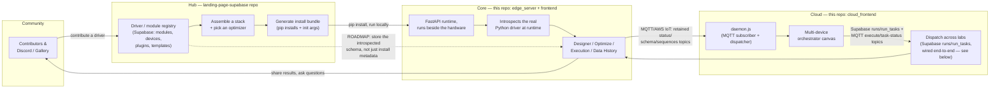

# IvoryOS NextGen - Agent Guidelines

## 0. Product Line Overview (read this first)

IvoryOS is four pieces across **two separate repos on disk**. If you're picking this up cold, orient here before diving into any one piece's implementation details.

| Piece | What it is | Lives in | Maturity (as of 2026-09) |
|---|---|---|---|
| **Hub** | Public web app: a driver/module/plugin/template registry (Supabase-backed) where people discover instrument drivers, assemble a stack, and generate an install bundle for Core. Also the marketing site. | `/Users/ivoryzhang/PycharmProjects/landing-page-supabase` (separate repo, Next.js + Supabase) | **Live.** Real DB-backed modules/devices/plugins/templates tables, real download flow (`ivoryos-hub.tsx` → `generateScripts` → zip). |
| **Core** | The execution engine: introspects a lab's real Python instrument drivers and reflects them into a browser UI — Designer (drag-drop sequences), Optimize (Bayesian loops), Execution/Configure (spreadsheet + batch runs), Data History, Instruments. Runs on a machine next to the hardware. | *this* repo — `edge_server/` (FastAPI backend) + `frontend/` (Next.js UI) | **Mature.** Single-lab execution, batch/optimizer/human-in-the-loop all working and tested (see sections 4-8 below). |
| **Cloud** | Meant to be: a dashboard that monitors and dispatches workflows across *multiple* Core instances (multiple physical labs) — the "connected lab" story. | *this* repo — `cloud_frontend/` | **Prototype / UI shell.** See the callout below — the polished orchestrator canvas does not yet actually reach a real Core instance. |
| **Community** | Discord, the public gallery of shared workflows, news posts, driver requests. | Discord (external) + pages inside the Hub repo (`app/hub/gallery`, `app/news`, `components/landing/community.tsx`) | **Live.** |

### The pipeline


```mermaid
flowchart LR
    subgraph COMM["Community"]
        C1["Contributors &<br/>Discord / Gallery"]
    end
    subgraph HUB["Hub — landing-page-supabase repo"]
        H1["Driver / module registry<br/>(Supabase: modules, devices,<br/>plugins, templates)"]
        H2["Assemble a stack<br/>+ pick an optimizer"]
        H3["Generate install bundle<br/>(pip installs + init args)"]
    end
    subgraph CORE["Core — this repo: edge_server + frontend"]
        K1["FastAPI runtime,<br/>runs beside the hardware"]
        K2["Introspects the real<br/>Python driver at runtime"]
        K3["Designer / Optimize /<br/>Execution / Data History"]
    end
    subgraph CLOUD["Cloud — this repo: cloud_frontend"]
        L0["daemon.js<br/>(MQTT subscriber + dispatcher)"]
        L1["Multi-device<br/>orchestrator canvas"]
        L2["Dispatch across labs<br/>(Supabase runs/run_tasks,<br/>wired end-to-end — see below)"]
    end

    C1 -->|contribute a driver| H1
    H1 --> H2
    H2 --> H3
    H3 -->|pip install, run locally| K1
    K1 --> K2
    K2 --> K3
    K3 -->|MQTT/AWS IoT: retained status/<br/>schema/sequences topics| L0
    L0 --> L1
    L1 -->|Supabase runs/run_tasks +<br/>MQTT execute/task-status topics| L2
    L2 --> K3
    K3 -->|share results, ask questions| C1
    H1 -.->|ROADMAP: store the introspected<br/>schema, not just install metadata| K3
```

The remaining dotted lines are the two open threads, in priority order:
1. **Cloud ↔ Core sync is wired end-to-end, both the read path and dispatch (write path).** A diagram-first walkthrough of both (topic map, workflow sync, job dispatch, failure handling) is in [`docs/edge_cloud_sync.md`](docs/edge_cloud_sync.md); the notes below are the detailed history of why each piece is the way it is. The transport is settled: MQTT / AWS IoT Core only, chosen because Core already fully implements it (`broker.py`'s `LocalMQTTBroker`/`AWSIoTBroker`, configured entirely from a base64 `CLOUD_TOKEN` env var — no self-hosted broker required, which matters since Cloud is meant to be a zero-setup SaaS). The old HTTP long-poll path (`api/edge/heartbeat`, `api/edge/complete`) has been deleted; it was never called by a real Core instance anyway.
   - **Topic shape** (`edge_server/ivoryos_edge/server.py`): `{prefix}/{device_id}/status` (retained, tiny `{online, busy, ts, session, quiet, interval}`; sent on connect, reconnect and change, **not** on a 5s timer any more — see **Presence** below), `.../schema` (retained, published once per connect — the instrument schema, its metadata, and the device's available optimizer backends; none of it changes without a restart, and it's the one payload big enough to matter for AWS IoT's 5KB-increment metering, which is exactly why it's *not* folded into the frequent status ping the way an earlier combined heartbeat design did it), `.../sequences/{name}` (retained, one message per saved workflow from `WORKFLOWS_DIR`, republished on every reconnect *and* immediately on `POST /api/workflows/{name}`), `.../execute` (Cloud → Core, one dispatched task — either `{block, runId, nodeId}` for a single step or `{run, runId, nodeId}` carrying a whole run, see section 15), `.../task-status` (Core → Cloud, a dedicated topic — *not* `.../status`, since that one is the plain `{online, ts}` device heartbeat and publishing a task update there was incorrectly flipping the device to "offline" in Supabase every time a cloud run started or finished). A Last Will and Testament (`set_will`, `broker.py`) publishes `{online: false}` if Core drops uncleanly. `.../presence` (retained `{session, ts}`, written on every connect by `watch_identity`) exists only so a second process using the same client id is noticed: the two evict each other about once a second and are almost never connected at once, so each learns of the other from the retained announcement replayed when it reconnects. `/api/cloud-settings` then reports `connection_state: "conflict"` (and the launcher's Cloud connection card says so) instead of the "connected" it set at first connect; an announcement older than this process is its own previous run and is ignored. Cloud never subscribes to it. The usual cause is two copies of one script sharing the `.env` pairing (`pairing_file` in the same response).
     - **Presence rests on the broker, not on a heartbeat** (`cloud_frontend/src/lib/presence.js`, edge `status_loop`; diagram in `docs/edge_cloud_sync.md`). The 5-second `status` was ~17,000 messages per device per day to say what MQTT already tracks. Now: keep-alive is 15s locally and 30s on AWS (its floor; `KEEPALIVE_S` in `broker.py`), the Last Will says "offline" when a connection dies, a clean stop or pause says it itself (`shutdown_event`), and the edge publishes `status` (QoS 1) on connect, on every reconnect (`_on_reconnected`), when `busy` changes, when Cloud pings, and every `IVORYOS_STATUS_INTERVAL_S` (300s) as a backstop. The status states that `interval`; the daemon calls a device stale after three of them. Three things are load-bearing:
       - **A replayed retained "online" is not believed.** The Last Will cannot be retained on AWS, so a daemon that was down when a device died finds the old "online". `packet.retain` marks it unconfirmed: nothing is dispatched, the store shows offline (`markDeviceOffline`, which leaves `last_seen` alone), and the daemon publishes `{prefix}/{id}/ping {nonce}`. The device's answer carries `pong: nonce`, which is what confirms it — a nonce rather than the retain flag of the answer, so it does not depend on how a broker flags a live copy of a retained publish. No answer in 10s: offline.
       - **The edge keeps the 5s heartbeat until Cloud pings** (`cloud_quiet`, reset per `setup_broker`; status carries `quiet: false` and no `interval` meanwhile). Only a daemon that follows these rules pings; an older one would call a quiet edge offline after 15s. An edge from before this sends no `quiet` and is judged by the old 15s rule. So either side can be updated first. Do not make the edge quiet unconditionally.
       - **`store.markStaleDevicesOffline` is no longer called**: a flat 15s for everyone would mark every quiet edge offline. The sweep is per device, in the daemon's memory (`presence.hasLapsed`).
     - **Which workflows go to Cloud is the edge's choice** (`CLOUD_SYNC_WORKFLOWS=always|manual` in `.env`, the Cloud Connect page, `POST /api/cloud-settings/sync-mode` and `/sync-now`). `manual` sends nothing on connect or save until Sync now. In either mode the schema is sent, a push from Cloud is echoed (the echo is its ack), and a delete clears Cloud's copy.
     - **Subscriptions are restored on every reconnect** (`_resubscribe`). paho uses a clean session and does not re-subscribe after its automatic reconnect, so before this any dropped connection left the edge online but no longer receiving `execute`/`sequences-push` until restarted.
     - **`set_will`'s Last Will is NOT retained (`retain=False`), and that's load-bearing, not an oversight**: AWS IoT Core silently refuses the *entire connection* if the Last Will has `retain=True` — no CONNACK, ever, no error reason given anywhere, the client just hangs until it times itself out. Confirmed by direct testing against a live AWS IoT endpoint: identical connect that succeeds instantly with `retain=False` hangs indefinitely with `retain=True`, reproduced 4/4 times, independent of QoS. A local Mosquitto-style broker has no such restriction (retained wills are standard MQTT), which is exactly why this passed earlier local-broker testing and only broke against real AWS IoT. Practical consequence: the will only reaches a subscriber that's already connected at the moment the device drops — anyone who (re)subscribes afterward won't see it via the will. `status_loop`'s periodic *retained* "online" publish plus `daemon.js`'s own staleness sweep (no update in 15s → mark offline) is what actually catches the general case; don't try to "fix" this by re-adding `retain=True` to the will.
     - **Retained publishing (`schema`/`sequences`/`status`) needs `iot:RetainPublish` granted alongside `iot:Publish` in the device's IoT policy** — see the resolved connection-instability writeup a few bullets down for why this bit for a while.
   - **Why this needs no explicit "sync" step**: MQTT retained messages replay to a new subscriber immediately, and to an *already-subscribed* one the instant the publisher reconnects — reconnecting after being offline is not a special case, it's the same retained-republish that already happens on every connect and every save. Cloud's subscriber (`daemon.js`) never polls or requests anything; it just always has the latest retained value for every topic once.
   - **Two deployment modes, one code path** (`cloud_frontend/src/lib/store/`). `local` is a lab on a LAN: a SQLite file (`ivoryos_cloud.db`) plus a local mosquitto, with no accounts, keys, Docker or internet. `cloud` is the hosted product: Supabase plus AWS IoT Core. The mode is inferred — **`SUPABASE_URL` set means cloud, unset means local** — so a fresh clone runs with nothing configured; `IVORYOS_CLOUD_MODE=local|cloud` overrides the inference where a silent fallback would be wrong (a real deploy should fail loudly, not quietly start writing to a local file). Cloud mode with only one of `SUPABASE_URL`/`SUPABASE_SERVICE_ROLE_KEY` is fatal by design. **The mode also decides the broker** (`store/index.js usesAwsIot()`): AWS IoT only in cloud mode with `AWS_IOT_ENDPOINT` set; a local Cloud always uses its own broker, even with AWS settings left in `.env.local`. Before, `AWS_IOT_ENDPOINT` alone won in the daemon, the embedded broker, pairing and device removal, so a "local" Cloud could be SQLite talking to AWS while handing devices the LAN address, and removing a LAN device could delete an AWS Thing with the same id.
     - `store/index.js` picks the backend and returns one shared instance per process; `store/sqlite.js` and `store/supabase.js` implement the same named operations. Nothing above this layer branches on the mode. The one real asymmetry is change notification: cloud mode uses a Supabase Realtime subscription, LAN mode polls every 400ms (`subscribePendingTasks`). Polling is only safe because dispatch **claims** a task with a compare-and-set *before* publishing — see `dispatchTask`; publishing first and recording after leaves a window where one task reaches a real instrument twice.
     - **`__dirname` and `process.cwd()` are both wrong for locating the LAN database**, and getting it wrong is silent — the daemon writes one file, the app reads another, and the UI shows zero devices while every check passes. Turbopack rewrites `__dirname` inside the Next bundle (observed: the app resolved `C:\ROOT\cloud_frontend\ivoryos_cloud.db`), and `cwd` differs by launch method (`npm --prefix cloud_frontend run daemon`, which `.claude/launch.json` uses, has cwd at the repo root; `npm run daemon` from inside `cloud_frontend/` does not). `localDbPath()` normalises both onto one file, `IVORYOS_LOCAL_DB` overrides it, and `/api/health` compares the app's path against the daemon's to make a mismatch impossible to miss.
     - `node:sqlite` must be reached via `process.getBuiltinModule('node:sqlite')`, not `require`: Turbopack has no externalization rule for that builtin and fails the route with "Unsupported external type Url for commonjs reference". It is also still experimental, so `npm run daemon` passes `--disable-warning=ExperimentalWarning`.
   - **Health check** (`GET /api/health`, polled by the Orchestrator header badge). An empty device list has four unrelated causes — daemon not running, broker unreachable, store misconfigured, or genuinely no devices yet — and all four used to render identically as "0 Edges Online". The frontend never touches MQTT (by design: a request-scoped route must not own a broker connection), so the daemon writes what it knows into `cloud_status` every 5s (`broker_connected`, `broker_url`, `mode`, `store_location`, `last_seen`) and the route reads it back, reporting each link separately plus a `problems[]` of human-readable causes. A heartbeat older than 15s (3x the interval) counts as down. The badge is one line with the full detail on hover, replacing the old "N Edges Online" + "Schema Engine Offline" pair that could disagree with each other.
   - **Workflow ownership: the edge owns its library; Cloud writes through to it.** The edge is the source of truth — it keeps working standalone if the network drops, which is the point of a bench instrument. Cloud is a replica that can *request* writes.
     - **Edge -> Cloud** is still retained MQTT, but the republish is now bounded. `status_loop` re-publishes schema/sequences at ticks {1,2,4,8,16,32} (~5s..160s after each connect) and then stops, instead of every 12th tick forever. The repeat exists for a real reproduced bug (AWS IoT dropping the one-shot connect-time publish — see `publish_schema`), but that is a *connect-time race*, so repeating past the settling window bought nothing: measured at 36KB every 60s on a 7-instrument device with 11 workflows, i.e. 50MB and ~20k messages per device per day of unchanged data, beside a `status` payload deliberately kept tiny for exactly that metering reason.
     - **Cloud -> Edge** is the `sequence_pushes` outbox plus a new `{prefix}/{device_id}/sequences-push` topic. Before it, a sequence authored in the Cloud editor was written to Cloud's database *and nowhere else*: the device resolves workflows against its own `WORKFLOWS_DIR`, so it could never run, and editing an existing one was silently reverted the next time the device republished its own copy over the same `{device_id, name}` key. The device applies a push through the same `wf.save_version` path a local save uses (a push is not a privileged back door) and echoes the result on its own retained `sequences/{name}` topic. **That echo is the acknowledgement**, correlated on step content — NOT on `body_hash`, which the device recomputes on save, so hash matching left every push unacknowledged forever. `sequences-push` is deliberately *not* retained (a retained push would be re-applied by any device reconnecting later), so anything below `acked` is re-sent until acknowledged.
     - **Sending a Cloud-saved workflow to its device is a choice at save time** (`push` on `POST /api/edge-sequences`, asked by the editor). Kept in Cloud only, the row's body is marked `cloud_only`: the daemon then does not replace it with the device's version of that name (nor delete it on the device's tombstone), the Library says "not on device", and a run or schedule using it is refused (`unsentWorkflows` in `src/lib/runSources.ts`), because the device would run its own version. Saving with "send" clears the mark.
     - **Deleting a workflow clears its retained topic** (an empty retained payload is MQTT's tombstone), and the daemon treats a zero-length message as a delete *before* `JSON.parse` sees it. Without both halves a deleted workflow was re-imported into Cloud forever from a body still sitting on the broker — observed with two workflows that were gone from the device's disk *and* its database while Cloud went on listing them.
   - **Broker host is chosen in `/settings`**, stored in `cloud_config`, and polled by the daemon (`watchBrokerConfig`, 3s) which reconnects on change — the API route cannot reach into the daemon, so the store is the mailbox. Env vars remain the fallback when no row is set, and AWS IoT ignores it since its credentials are cert-bound. The Settings UI reports **live** state from `/api/health`, not save state: a saved host that refuses connections must not look like success.
   - **Device pairing: the edge shows a code, a signed-in person approves it on Cloud** (`src/lib/pairing.js` explains the flow; Cloud `api/pair/start` + `api/pair/poll` for the edge, `api/pair/request` + the `/pair` page for the person; edge `ivoryos_edge/cloud_pairing.py`, `POST/DELETE /api/cloud-settings/pair`, and `ivoryos-edge pair` for a terminal). The edge starts a request and gets back an 8-character code to show (no I/O/0/1, 10 min) plus a 32-byte **secret it keeps** (Cloud stores only its SHA-256). A person enters the code on Cloud, sees the device's name and instruments, picks its name and workspace, and approves or answers "Not mine". The edge polls with its secret and, after approval, receives its credentials **once**; they are minted at that moment (on AWS a Thing + certificate) and never pass through a browser. `pairing_requests` status: `waiting -> approved -> provisioning -> redeemed`, or `denied`; every transition is a conditional UPDATE, so one approval can never mint two identities.
     - **Why it goes this way round** (it used to be Cloud making a code for the edge to redeem): the code is no longer a credential, only something to approve, so reading it off a screen gets nothing. And being tricked now costs little: approving someone else's code adds *their* device to *your* workspace (visible, removable, cannot move your hardware), whereas typing someone else's code into *your* edge used to put *your* instruments in *their* workspace. The approval page says as much.
     - **Before the flow there was a copied token.** The original flow had a person copy a base64 `CLOUD_TOKEN` between machines, and on AWS it wrapped the device's **private key**. `CLOUD_TOKEN` in `.env` remains the headless path for image- or config-managed deployments; `ivoryos-edge pair` covers a terminal without one.
     - **The desktop app pairs in one click** (`pairWithCloud` in `desktop/src/main.js`): it asks the running deck to start pairing, then approves the code through `/api/pair/request` with a Cloud session made from the app's own sign-in (`/api/auth/exchange`, now also returning `workspaces` so the app can ask which one), the same route a person uses. It never sees the token. Signed out, it opens the deck's Cloud Connect page with the code.
     - **Only this edge's own pages, the app, and local tools can start pairing or set the token.** Otherwise any website open in the person's browser could point the edge at a Cloud of its choosing, and so at a broker it controls, with the instruments behind it. This is the edge-wide rule in `origin_guard.py` (section 1), not a pairing special case.
     - **A Cloud URL is only needed on a LAN.** A hosted deployment is at a fixed address the edge ships with (`IVORYOS_CLOUD_URL`, default `https://cloud.ivoryos.ai`). The broker address handed back is `AWS_IOT_ENDPOINT` in cloud mode; on a LAN it is the broker set in Cloud's Settings, else the daemon's own `MQTT_BROKER_URL` (host *and port*: assuming 1883 once sent a test device to an unrelated mosquitto on this machine), with a loopback host replaced by the `Host` the device used to reach Cloud (`src/lib/provision.ts`).
     - **The edge never hands the token back out, and keeps it private on disk.** `GET /api/cloud-settings` returns `{paired, client_id, broker, connection_state, pairing}` (the code, never the secret or token). `.env` and the AWS certificate files are written byte for byte and mode 0600 (`cloud_pairing.write_private_file`; text mode rewrote PEM line endings on Windows), and a token without its certificates is refused with a reason rather than failing later as a TLS error.
     - **A LAN Cloud's broker admits each device by a secret from its pairing** (`src/lib/brokerAuth.js`, enforced in `embedded-broker.js`). The token a LAN edge collects carries `username` (its id) and a random `password` minted at approval; Cloud keeps only its SHA-256 (`broker_credentials`, migration 0015), pairing again replaces it, removal deletes it (and the daemon ends a removed device's live session). Nobody sees or types it: the edge passes it to paho (`LocalMQTTBroker`), and a refused login says "pair it again" (`_wait_connected`). Each device may publish only what an edge publishes and subscribe only to what Cloud sends it, both under its own id, so no device can send an `execute` (only the daemon can); this is the AWS policy's rule, applied to the built-in broker. The daemon signs in with a secret made fresh per run that exists only in its memory. Before this, any client on the network could connect under any id and drive any device. `IVORYOS_BROKER_AUTH=off` opens the broker again (development, or a closed network). `MQTT_USERNAME`/`MQTT_PASSWORD` are the daemon's login for an external broker (a mosquitto with a password file).
     - **A device's identity is its lasting id, not its name.** The edge makes `CLOUD_DEVICE_ID` once (`my-deck-7k4m2q`, `cloud_pairing.ensure_device_id`; a device paired before ids adopts its token's client id) and keeps it in `.env` beside the pairing, including after it is removed. The id is the MQTT client id and the AWS Thing name; the name is only a label, so two "My deck"s coexist. Pairing sends the id (`device_id` to `/api/pair/start`; Cloud makes one for an older edge), and approval decides by it (`pairing.js identityDecision`): **new**, **reattach** (the same device again, into one of the approver's workspaces: same record, history and id; on AWS a new certificate for the same Thing and the old ones revoked, `awsThings.js issueCertificate`), or **foreign** (someone else's workspace: refused, and the lookup reveals nothing about it). **The name is unique within a workspace** (compared ignoring case and runs of spaces; `pairing.js nameConflict`, gathered by `src/lib/deviceNaming.ts` from the workspace's devices plus approvals not yet collected), checked when a pairing is approved (409, the approval page asks again) and when a device is renamed (`PATCH /api/devices/[id]`, the pencil on its Devices card; only the label changes, the id and everything keyed by it stay). A device coming back keeps its own name. Names containing `/`, `+`, `#` or control characters are still refused. **Cloud shows the name, never the raw id**, with the id in a tooltip: the toolbox, canvas nodes, the run panel, Results, attention popups (`src/lib/deviceNames.ts` `useDeviceName()` for pages that hold only ids).
     - **Pause, resume, remove** (edge `POST /api/cloud-settings/pause|resume|remove`; the Cloud Connect page and the launcher's Cloud card). *Pause* keeps the pairing (`CLOUD_PAUSED=1` in `.env`, so a restart stays off Cloud), publishes a retained `{online:false, paused:true}` status that the daemon stores as `paused` (the staleness sweep only touches `online`, so it stays paused), then disconnects; *resume* reconnects with no pairing. *Remove* says goodbye over the live connection or a brief one made for it: it clears what the device left retained (`status`, `schema`, `presence`, `sequences/*`), publishes `{prefix}/{id}/leave`, and closes that connection (leaving it open kept a zombie client fighting every later one for the id), then forgets the token and certificates but keeps the id. `told_cloud: false` means Cloud could not be reached; the pairing is forgotten anyway.
     - **A removed device's workflows are kept as a record.** `store.archiveDevice` moves them to `<id>~removed-<yyyymmddhhmmss>` with a device row of status `removed` holding the name and the schema they were written against, owned by the same workspace; the live id is freed completely (pair it again anywhere and it is a new device, and nothing it publishes touches the record). `listDevices()` leaves `removed` rows out unless `{includeRemoved: true}` (`/api/devices?removed=1`: only the Library and the sequence viewer ask). `cleanDeviceId` refuses the archive id shape, so no edge can pair or publish under one. The edge publishes `leave` **before** clearing its retained topics (the reverse order made Cloud delete every workflow, as tombstones, before it knew the device was leaving), and the daemon ignores sequence tombstones from a removed id.
     - **Removal on Cloud** (`src/lib/deviceRemoval.js`, used by the Devices page's Remove and by daemon.js on `leave`): the id goes in `removed_devices` first, then the live device record and its ownership are deleted (its mirrored workflows are archived, see above), and on AWS its certificates are revoked (INACTIVE first) and its Thing deleted. The daemon ignores everything from a removed id, tells a still-running one to forget its pairing (`{prefix}/{id}/removed`, which the edge obeys), and deletes the record again when it first sees an id newly removed (a heartbeat in the gap re-creates it). Its removed-list is a 3 s cache, so it re-checks the store before acting on it: a device paired again in that window was otherwise told it was removed and forgot its brand-new pairing. Pairing clears the id from `removed_devices`. Runs and results are never deleted.
     - The old `POST /api/devices/provision` ("Generate Token") is gone: it returned a device's private key to the browser.
     - Rate limits are **in memory, per Next instance** (`src/lib/rateLimit.ts`: start 10/min and poll 60/min per address, lookups and approvals 20/min per session), adequate for a LAN or a single server, not a substitute for a shared limiter once Cloud runs more than one instance. `/api/pair/start` and `/poll` are open (the edge has no account; the secret is its proof); everything a person does needs a session.
   - **Running Cloud = web app + daemon, always together.** `npm run dev:all` / `npm run start:all` in `cloud_frontend/` (`scripts/run-all.js`) run both as one unit: either exiting stops the other (Windows: as whole process trees, since `next dev` keeps its server in a worker), Ctrl+C/SIGTERM stops both, and it stops itself if its parent disappears. `.claude/launch.json` runs it. Deployment is `deploy/cloud/` (Docker Compose: one image, `web` + `daemon` services, `restart: unless-stopped`, LAN SQLite on a shared volume, updates are `git pull && docker compose -f deploy/cloud/docker-compose.yml up -d --build`; see its README). Before this, starting the web app never started the daemon, and one was found still running days-old code. Two traps met on the way: the Desktop app's preview *stop* does not terminate the launched process tree on Windows (clean up the leftovers yourself), and a lockfile written on Windows omits Tailwind's Linux native binary (npm/cli#4828), which the Dockerfile installs explicitly -- the edge frontend's Windows-only native packages are `optionalDependencies` for the same reason.
   - **`daemon.js`** is a standalone Node process (`npm run daemon`, run separately from `next dev`/`next start` — a Next.js API route is request-scoped and shouldn't own a long-lived broker connection) that subscribes to `+/status`, `+/schema`, `+/sequences/+`, `+/task-status` and upserts into **Cloud's own Supabase project** (`supabase/migrations/0001_devices_and_edge_sequences.sql` and `0002_runs_and_run_tasks.sql` — deliberately a *separate* project from the Hub's, not shared) via the service-role key. `api/devices` reads from that same table instead of the old in-memory `orchestrator.ts` Map (deleted), and `api/edge-sequences` reads/writes `edge_sequences` directly (a sequence authored in Cloud's own edge-sequence editor writes here too, alongside what the daemon mirrors from each device — same `{device_id, name, description, body}` shape either way). It loads `cloud_frontend/.env.local` itself via `dotenv` (a plain `node daemon.js` process gets none of Next.js's automatic env loading — without this, every var below is silently `undefined`).
     - **Dispatch loop** (also in `daemon.js`): `POST /api/cloud-workflows/runs` validates the graph, then inserts a `runs` row plus one `run_tasks` row per dispatchable node (`pending` if it has no dependencies, else `blocked`). A Supabase Realtime subscription on `run_tasks` (filtered to `status=eq.pending`) is what actually publishes: `dispatchTask()` sends `{block, runId, nodeId}` to `{prefix}/{device_id}/execute` (QoS 1) and flips the row to `queued`. A one-time startup scan re-dispatches any row still `pending` from before the daemon's last restart, since Realtime only streams changes going forward and won't replay rows that were already pending when the subscription opened. On the way back, `handleTaskStatus()` (fed by the `.../task-status` topic, itself published from `edge_server/ivoryos_edge/queue.py` when a cloud-originated run changes state) updates `run_tasks.status` and, on `completed` *or* `error`, calls `advanceRun()`; a terminal-status guard (`.not('status', 'in', ...)`) stops a stale, out-of-order "running" update (MQTT QoS 1 guarantees in-order delivery only per publisher *connection* — a reconnect can let a late "running" arrive after "completed") from moving a finished task backwards. `GET /api/cloud-workflows/status` just reads `run_tasks` back out for the Orchestrator canvas to poll.
     - **The DAG rules live in one place: `cloud_frontend/src/lib/dag.js`** (plain CommonJS precisely so the build-step-free `daemon.js` can `require` it *and* the Next app can import it; `npm test` in `cloud_frontend/` runs its `node --test` suite). `planRun()` classifies each node at submit time, `computeAdvance()` decides what a finished task releases and whether the run is over, and `validateGraph()` is the gate. They used to be two hand-written copies — one in the run route, one in `advanceRun()` — that had already drifted, which is the AGENTS.md section 3 failure mode. Two rules define the semantics:
       - **A Flow Control node is *transparent*, not *satisfied*.** It gets no `run_tasks` row, so both old copies treated it as an already-met dependency — which silently deleted ordering: in `A -> Sleep -> B`, B's only dependency was the Sleep node, "satisfied", so B dispatched at the same instant as A. On real hardware that is two instruments moving at once in a graph that says they must not. `effectiveDependencies()` instead contracts Flow Control nodes out of the graph so dependents inherit *their* dependencies. The seeded `Start` node is the degenerate case and keeps working (no predecessors → its children inherit an empty set → they go first). Both spellings (`Flow Control`, `Flow_Control`) count, matching `packages/shared-ui/src/flowControl.ts`. **Exception: Cloud Logic** (`CLOUD_LOGIC` in `dag.js`: `Wait`, `User_Input`, `If`) are real steps. They get a `run_tasks` row on the pseudo-device `@cloud` (`CLOUD_DEVICE_ID`), and `daemon.js`'s `stepCloudTask` runs them instead of publishing anything. It is idempotent and reads only the stored row, so a restart mid-Wait resumes. A Wait holds its branch, a User_Input holds it until `POST /api/cloud-workflows/input` records an answer (first answer wins; the daemon, not the route, completes the step), and an If tests a value from `runContext` (`src/lib/cloudLogic.js`: named outputs from finished tasks' synced results plus saved answers) and records `progress.branch`. Edges out of an If carry `sourceHandle: 'true'|'false'`; `computeAdvance` ends a step `skipped` when no finished dependency leads to it live, propagating down the branch, and a join fed by both branches runs once the taken one arrives. `skipped` is terminal and not a failure, and it must stay in every "is this device busy" exclusion list, or a skipped step holds its device forever.
       - **Tidy up wraps a tall graph into columns** (`tidyLayout(nodes, edges, { maxHeight })`, `wrapColumns` in `src/lib/canvasLayout.ts`). The editor passes the visible canvas height at 80% zoom; rows are laid out as before, then cut into balanced columns read left to right, each starting at Start's height. A cut moves up to just above a single step when one is near, so a branch row is never the top of a column, and the edge crossing to the next column runs up the gap between them. Positions only. Tested in `canvasLayout.test.js`, which imports the `.ts` directly (Node strips the types).
- **The canvas warns, it does not block, about same-device parallel branches** (`src/lib/canvasChecks.js`). The daemon sends a device one task at a time, so two branches on one device run one after the other, whatever the drawing suggests. Both sides of an If are exclusive and are not flagged.
       - **A run is refused while any device it targets is offline** (409 from the run route; the page checks first so the answer is immediate). Accepting it meant a run recorded as started with its steps held in Cloud indefinitely. Schedules are not checked: a device down at creation says nothing about when a schedule next fires.
       - **"Unsaved" on the Orchestrator is a content signature** (`src/lib/graphSignature.ts`), the same rule as the edge Designer: it compares against the signature captured at the last save or Library load, persisted in `cloud_workflow.savedSignature`, and leaves out what the canvas writes while only *showing* a graph (position, selection, collapse, last task status). The Library reads the same value before replacing the canvas.
       - **An invalid graph is rejected at submit, not discovered at runtime.** `validateGraph()` returns *every* problem (cycles — named by node, via Kahn's algorithm — plus self-loops, dangling edges, duplicate node ids, steps unreachable from `Start`, and missing target devices) and the route answers 400. The canvas's `isValidConnection` only stops a cycle being *drawn*; a graph restored from `localStorage`, loaded from the Library, or POSTed directly never passes through it. Before this, such a graph didn't fail — it **hung**: every node in the cycle stayed `blocked` forever and the run sat at `running` forever with nothing explaining why. An unreachable step is an error rather than a warning because an unwired node has an empty dependency set, which reads as "ready", so it would fire instantly and concurrently in a graph whose edges say nothing about it.
     - **Failure propagates.** A task that errors now cancels everything downstream of it (`cancelled`) rather than leaving it `blocked` forever, and the run reaches a terminal `completed`/`error` instead of parking at `running`. `computeAdvance()` also flags a *stall* (blocked tasks remain but nothing is pending/queued/running) and errors the run loudly — validation should make that unreachable, so hitting it means a bad graph got past the gate.
     - **The daemon needs its *own* AWS IoT Thing + certificate, with a *different*, broader policy** than the per-device one below — it has to subscribe across every device's topics, not just its own. Create it once, by hand: a policy (e.g. `ivoryos-cloud-daemon-policy`) allowing `iot:Connect` (still `${iot:Connection.Thing.ThingName}`-scoped) plus `iot:Subscribe`/`iot:Receive` on `arn:aws:iot:REGION:*:topicfilter|topic/ivoryos/edge/*` (no ThingName restriction on the topic side), then a Thing (e.g. `ivoryos-cloud-daemon`) with a cert attached to that policy. `AWS_IOT_CA_PATH`/`AWS_IOT_CERT_PATH`/`AWS_IOT_KEY_PATH` point at that cert; `MQTT_CLIENT_ID` **must exactly equal the Thing name** the cert is attached to.
     - **Getting `MQTT_CLIENT_ID` wrong (or leaving it unset) reproduces the exact same silent-hang failure mode as the retained-Will bug above, for the exact same underlying reason**: the policy's `iot:Connect` permission is scoped to `${iot:Connection.Thing.ThingName}`, so a connecting client ID that doesn't match any Thing the certificate is attached to gets refused at the MQTT protocol level — TLS still succeeds (the cert itself is valid and registered), so `mqtt.js`'s `connect()` call returns normally and the process just sits there, `on('connect')` never firing, no error anywhere. Confirmed the same way as the Will bug: inspecting the process's open sockets directly (`lsof -p <pid> -i`) showed a genuinely `ESTABLISHED` TCP connection to port 8883 while the daemon had logged nothing past its startup line. If `npm run daemon` connects to AWS IoT and then goes silent forever, check this first.
   - **RESOLVED (as of 2026-09-10): the recurring connect→disconnect→reconnect cycling (roughly every 1-1.5s, reproduced continuously across an 8+ hour span on at least one dev machine) was a missing `iot:RetainPublish` grant on the device's IoT policy — see the `publish_schema`/`set_will` callout above.** A plain `iot:Publish` allow does not cover retained publishes; AWS IoT silently denies each one with `AUTHORIZATION_FAILURE` and disconnects the client, and since these are QoS-1 and auto-retried on reconnect, the retry gets denied and disconnected again in a tight loop — indistinguishable, from the client side, from a transport-level flake. Before this was found, a long diagnostic chain ruled out (each with a dedicated isolated test) an application-level disconnect (a print at the top of `LocalMQTTBroker.disconnect()` never fired during the cycling — confirming the disconnects originated in paho-mqtt's own reconnect internals, i.e. server-initiated, not client-initiated), a client-ID collision, a specific bad Thing/certificate, the MQTT5-vs-3.1.1 protocol version, AWS-side rate throttling, an outdated TLS stack, and a raised-then-disproven VPN/tunnel theory (six active `utun` interfaces on the affected machine turned out to belong to nothing running). **If this resurfaces on a new device/policy, check `iot:RetainPublish` first** — the AUTHORIZATION_FAILURE reason is visible in AWS IoT Core's CloudWatch/console connection logs, which would have shortened this considerably. Practical consequence while a device's policy is missing this grant: `schema`/`sequences`/`status` (all retained) never land — `status` looked closer to "working" than it was, since a device would flip online→offline→online every cycle rather than staying visibly stuck.
   - **Fix landed regardless, and it's the right shape either way**: `publish_schema`/`publish_sequences` used to be one-shot QoS-1 calls, fired once right after connect, with no retry — fragile against exactly this kind of connection churn, and confirmed to actually lose messages this way (284 `status` messages reached the daemon in one test session; zero `schema` or `sequences` ones, from the same connection). `status` itself never showed a symptom because it's QoS-0 and re-sent every 5s regardless of any single failure. `status_loop` now also re-publishes schema/sequences every 12th tick (~60s) — folding them into the loop that was already self-healing, rather than trying to make the one-shot call race-proof.
   - **Multi-tenancy model**: one AWS account, one AWS IoT Core endpoint, every customer's device connects to the same endpoint — isolation is enforced per-certificate, not per-account. Every device gets its own AWS IoT Thing + X.509 certificate, and the *same* IoT policy is attached to all of them, scoped with the `${iot:Connection.Thing.ThingName}` policy variable so a device can only publish/subscribe under its own `ivoryos/edge/{its-own-thing-name}/*` namespace — AWS enforces this at the broker level, not application code. That shared policy is created **once**, by hand, in the AWS console (not by any code in this repo):
     ```json
     {
       "Version": "2012-10-17",
       "Statement": [
         { "Effect": "Allow", "Action": "iot:Connect",
           "Resource": "arn:aws:iot:REGION:*:client/${iot:Connection.Thing.ThingName}" },
         { "Effect": "Allow", "Action": ["iot:Publish", "iot:Receive", "iot:RetainPublish"],
           "Resource": "arn:aws:iot:REGION:*:topic/ivoryos/edge/${iot:Connection.Thing.ThingName}/*" },
         { "Effect": "Allow", "Action": "iot:Subscribe",
           "Resource": "arn:aws:iot:REGION:*:topicfilter/ivoryos/edge/${iot:Connection.Thing.ThingName}/*" }
       ]
     }
     ```
     Its name goes in `AWS_IOT_POLICY_NAME`. The daemon's own Thing (for cross-device subscribe) needs a *separate*, broader policy — it's a privileged backend identity, not a tenant device.
   - **Token minting is automated** (`cloud_frontend/src/lib/aws-iot.ts`'s `provisionDevice()`, called from `POST /api/devices/provision`, wired to the "Generate Token" button on `/settings` when Broker Type = AWS IoT): calls `CreateThing` → `CreateKeysAndCertificate` → `AttachPolicy` (the shared policy above) → `AttachThingPrincipal`, packages the result into a ready-to-paste `CLOUD_TOKEN`, and creates a placeholder `devices` row. Needs a dedicated IAM user (env vars in `.env.local.example`) scoped to just those five actions plus `UpdateCertificate`/`DeleteCertificate`/`DeleteThing` (used for best-effort cleanup if a provision call fails partway through) — not an admin credential. `AMAZON_ROOT_CA1` is embedded as a literal constant, downloaded and fingerprint-verified directly from amazontrust.com rather than hand-transcribed. **This endpoint has no auth and no rate limit** — anyone who can reach the Next.js app can mint real, billable AWS IoT resources today. Fine while this is unpublished; a hard blocker before any real public launch (needs at minimum a logged-in-user check once Cloud has auth, ideally per-user rate limiting too).
   - **Sign-in and workspaces** (`src/lib/auth.ts`, `src/lib/workspace.ts`, `src/proxy.ts`, `supabase/migrations/0011`). Cloud signs people in with their **IvoryOS account** (the Hub's Supabase Auth; `IVORYOS_AUTH_URL`/`IVORYOS_AUTH_ANON_KEY` override it) and keeps no users of its own; registering on Cloud registers an IvoryOS account. It keeps a **session** (store `sessions`): the IvoryOS tokens, the current workspace and the ones it may switch to. The browser holds only a random id in an http-only cookie. Signing in needs the account service; staying signed in does not, so a self-hosted Cloud keeps working offline and only re-reads organizations (every 10 min) when it can. A workspace is `user:<id>` or `org:<id>` (Hub `organization_members`; absent until the Hub's private-hub migration, which yields the personal one only). `proxy.ts` is only the optimistic cookie check Next 16 recommends (pages redirect to `/login`, APIs 401); **every route calls `authorize()` and scopes itself** -- the proxy never decides what a session may see. Open without a session: `/login`, `/api/auth/*`, `/api/health` (the desktop app probes it), `/api/pair/start` and `/api/pair/poll` (the edge proves itself with the secret it kept).
     - **Ownership is its own table** (`ownership(kind, key, workspace_id)`: device, run, workflow, schedule, pairing), not a column on each, so `daemon.js` -- which dispatches every workspace's tasks alike -- is unchanged. Routes filter lists by it and refuse what is not theirs; a run or schedule may only target this workspace's devices (403). Library workflow names are unique per workspace, so they are stored as `<workspace>/<name>` and the prefix never leaves the library route.
     - **Pairing places the device**: approving a request (`/api/pair/request`, needs a session) records the workspace chosen there, and the device the request becomes belongs to it. An AWS Thing is only ever minted for an approved request.
     - **Devices paired before sign-in** belong to no workspace and appear in none. `/api/devices/claim` lets a signed-in person take them into their workspace **only in LAN mode** (or with `IVORYOS_ALLOW_CLAIM=1`): on the hosted Cloud it would let anyone take anyone's device.
     - **Platforms** (`edge_platforms`, `/api/platforms`, the Devices page) are named groups of a workspace's edges ("Flow rig" = pump + collector); organization only, a device is in at most one.
     - **OAuth** (`/api/auth/oauth` -> `/api/auth/callback`, PKCE) needs each Cloud's `/api/auth/callback` allowed as a redirect URL in the IvoryOS Supabase project, or the browser lands on the Hub. The desktop app never uses it: it signs its Cloud tab in with the app's own session through `POST /api/auth/exchange` (main process only, https or local network only; `signInCloudTab` in `desktop/src/main.js`).
   - **What's still missing, in priority order**: (1) ~~No device ownership or auth~~ -- closed by sign-in and workspaces above; apply migration `0011` to a hosted Cloud's Supabase project before deploying it. (2) ~~Dispatch has no stuck-task timeout~~ -- closed: a `queued` task on a device that has reported idle for 20s (and was sent over 30s ago) is failed as never delivered (`failLostTasks` in `daemon.js`, section 15). It is failed, not re-sent, because a lost *report* is indistinguishable from a lost *task* and re-sending could move hardware twice.
2. **Hub doesn't yet store the introspected method schema**, only install metadata (package name, constructor args) — see `landing-page-supabase/AGENTS.md` and the Roadmap section of `/technical` on the Hub site for the full shape of this. Once it does, picking a stack in the Hub can open a fully-populated Designer in the browser before Core is even installed. **The hard part of this — safely running introspection against an arbitrary, user-submitted package — already has a working, hardened prototype**: `schema_worker/` in this repo (a standalone FastAPI service, own `Dockerfile`). It is **not yet wired into the Hub's contribute flow** (the Hub's `init_args` field is still hand-typed by contributors) — that wiring, plus a job-status flow (the `modules.status` column already exists in Supabase but isn't used yet: `pending` → `extracting` → `ready`/`failed`, Hub UI polls or subscribes via Supabase realtime), is the remaining work.

   **How `schema_worker` stays safe to point at arbitrary input**: the FastAPI process itself (`main.py`) never pip-installs or imports anything — it only shells out to `docker run --rm` per request, launching a disposable, resource-capped sandbox (`--memory 256m`, `--pids-limit 128`, `--read-only` root filesystem with only a `/tmp` tmpfs writable, `--user 1000:1000`, `--cap-drop ALL`) built from the *same* image. `sandbox_entrypoint.py` — which runs *inside* that disposable container, never in the worker — does the actual `pip install --target /tmp/pkgs <package>` (into the writable scratch dir, since the root fs is read-only) and then runs `extract_cli.py`'s class-level introspection (`inspect_class()` in `schema_worker/introspection.py` — deliberately never instantiates the class, so a driver whose `__init__` needs a real serial port or IP address doesn't hang or crash the extraction). A hard wall-clock timeout plus an explicit `docker kill` on timeout guards against a hung/malicious package tying up the worker. **Known, explicitly deferred hardening**: network egress from inside the sandbox is currently unrestricted (a `TODO(v2)` in `main.py` — the fix is a proxy container the sandbox is forced through, only allowlisting pypi.org/files.pythonhosted.org/github.com, not the default bridge network it uses today).

   `schema_worker/introspection.py` is a **third, deliberately-diverged copy** of `edge_server/ivoryos_edge/introspection.py`'s type-extraction logic (class-level `inspect_class()` vs. Core's instance-level `inspect_device_module()`) — nothing keeps them in sync automatically, and they currently *are* out of sync in a way worth fixing. See section 12 below for exactly what each one can and can't do today.

   **Deployment reality check — this matters if the Hub ever calls this service**: `schema_worker`'s original `/extract` needs `docker run` on PATH with a reachable daemon, which **does not exist on Vercel or most serverless/PaaS hosts** — there is no Docker Engine access there at all. If `schema_worker` itself needs to be reachable from a Vercel-hosted Hub without standing up a separate VM, use **`POST /extract/async`** instead (`fly_launcher.py`): it makes a plain HTTPS call to Fly.io's Machines API, which boots a disposable Firecracker micro-VM from the *same* sandbox image — no Docker daemon needed on the caller's side at all. It's fire-and-forget: returns `{job_id, machine_id, status: "started"}` immediately, and the sandbox POSTs its actual result to a caller-supplied `callback_url` when done (`sandbox_entrypoint.py`'s `report()`) — `schema_worker` itself stores nothing and knows nothing about Hub/Supabase; whoever calls `/extract/async` owns turning that callback into a `modules` row update. The callback mechanism itself is verified end-to-end (a real hardened container POSTing its result to a real external HTTP server) — the Fly Machines API call shape in `fly_launcher.py` is written from documented behavior but **has not been exercised against a live Fly account/token**; run one real launch by hand before depending on it in production, and fix anything the real API rejects.

---

## 1. Overall System Architecture

This repository is an npm workspaces monorepo (`workspaces: ["frontend", "cloud_frontend", "packages/*"]`) with a distributed edge-to-cloud architecture:

### `edge_server/` (The Python Backend)
- **Role:** The core execution engine running locally on edge devices (lab instruments / local controllers).
- **Tech Stack:** Python (`ivoryos_edge` package), FastAPI, SQLAlchemy async (aiosqlite).
- **Persistence:** Local SQLite database (`ivoryos_edge.db`).
- **Execution model:** A single-process `WorkflowQueueManager` (`ivoryos_edge/queue.py`) processes one `WorkflowRun` at a time from a DB-backed queue (`_execution_loop`). `type == "Optimization"` runs go through a separate `_execute_optimization_run` path that dynamically generates trial steps each iteration.
- **Demo deck:** `example/demo.py` runs a simulated Suzuki-Miyaura coupling screen (`example/lab_drivers.py`) with a real, integrated reaction model — not decorative, an optimization run over temperature/catalyst/time converges on a genuine interior optimum (~65-70°C, ~2.5 mol% Pd). A ready-made "Suzuki coupling screen" workflow ships with it. The old synthetic type-testing fixtures (`example/dummy_driver.py` — enums, nested dataclasses, deliberately-failing methods) are opt-in via `IVORYOS_DEMO_TEST_DRIVERS=1`, kept out of the default deck so screenshots/demos stay realistic. See `docs/development.md` for the full description. `README.md` is the user-facing landing page (install, try the example, bring your own instruments); developer setup lives in `docs/development.md`.
- **Other websites cannot drive the edge** (`ivoryos_edge/origin_guard.py`, an ASGI middleware in front of every route, plugins included). A page open in the person's browser can send requests to the edge on their machine, and CORS only hides the *answer*: the pump still moves. So (1) anything but GET/HEAD/OPTIONS, and every WebSocket, is refused (403 / close 1008) unless its `Origin` is absent (the desktop app's main process, curl, the CLI, the MCP server), the edge's own origin, `ivoryos-app://` (the launcher), or a page on this computer (`localhost`/`127.0.0.1`/`[::1]`, i.e. `next dev` on another port); and (2) a `Host` that is not this machine's is refused outright, reads included, which is what stops DNS rebinding (an attacker's domain re-pointed at 127.0.0.1 looks same-origin). Allowed hosts: IP literals, `localhost`, `*.localhost`, `*.local`, this computer's name, plus `IVORYOS_ALLOWED_HOSTS` (comma separated; `*` disables the check for an edge behind a reverse proxy). CORS is no longer `*`: only the launcher and local pages may read cross-origin (`CORS_ORIGIN_REGEX`). **An edge reached through a DNS name** (a lab hostname, a reverse proxy) **needs that name in `IVORYOS_ALLOWED_HOSTS`**, or every page answers 403 with a message saying exactly that. The in-process test clients use `test`/`testserver`, declared in `tests/automated/conftest.py`. A static plugin registered with a full external `url` can no longer call the edge API from its own origin.
- **Timestamps are naive UTC.** Run and step times come from `datetime.utcnow().isoformat()` with no offset, and JavaScript reads an offset-less date-time as *local* time, so shown raw every time is off by the UTC offset (Data History showed a run started at 11:52 PM Pacific as 6:52 AM). Parse them with `parseServerTime` / `serverDate` from `packages/shared-ui/src/serverTime.ts`, never `new Date(str)`.
- **Dev note:** the demo server (`example/demo.py`, port 8080) runs with `reload=False` — backend Python edits need a manual restart to take effect. Static frontend files under `frontend/out/` are served straight from disk and picked up immediately, no restart needed.

### `frontend/` (The Edge Server Frontend)
- **Role:** The local UI for a specific edge device — design, optimize, configure, and execute sequences directly on the machine.
- **Navigation is a sidebar or a top bar** (`packages/shared-ui/src/navPlacement.tsx`). **Inside the desktop app it is always the top bar**, with no choice offered: the launcher already has a sidebar. In a browser it is chosen on each app's Settings page (sidebar by default), stored per browser. In the app the edge's Settings gear is hidden (its only settings, theme and layout, follow the app); Cloud keeps its gear for the broker and agent tokens. Every page file frames itself as `flex` row of `<Sidebar />` and the page; the placement is written to `<html data-ivoryos-nav>` and one rule in each app's `globals.css` (`:has(> [data-ivoryos-nav-bar])`) turns that row into a column, so no page needed editing. Cloud's `AppShell` does the same. Keep new pages on that frame shape. **The top bar is one component for both apps** (`packages/shared-ui/src/TopNav.tsx`: `TopNavBar`, `TopNavItem`, ...; each app passes its own `next/link`): icon-and-label pills, icons alone on a narrow window, groups split by dividers. Do not restyle it in one app only. Only its page list may scroll sideways, and a dropdown on it goes through `TopNavMenu`, which portals the menu to `<body>` at fixed coordinates: Cloud's workspace menu was first clipped by an `overflow` on the bar, then drawn over by page headers that sit at z-50 (raising the bar instead would lift it over modals). Cloud's top bar has no Edge Sequence entry; that editor opens from a device (its card on Devices, or a workflow in the Library), and Devices stays lit while it is open.
- **A run is watched where it was started, and the queue is a drawer, not a page.** `components/LiveRun.tsx` sits at the bottom of the Once, Iterate and Optimize pages, **below the page's scrolling area rather than inside it**, so it is pinned by construction and never a scroll away. It **is the idle chip**: idle it reads "Idle", "N queued" or "Queue paused" and opens the queue; when a run starts the same element widens to the full width (`interpolate-size: allow-keywords`, a width transition from fit-content; without support it switches without the animation) and becomes the run bar, and shrinks back when the run is over. It used to be a separate panel at the top while the chip vanished from the bottom, two places for one thing. `GlobalQueueBar` draws nothing on those pages. The bar is one row (what is running, icon controls, then the queue and steps buttons, each always in the same place) under **exactly one progress bar** (the strip along its top; the opened body is `RunProgress` with `hideOverall`). Opened, the steps live in a box above the row (its height dragged with the handle along its top, remembered in `ivoryos_liverun_height`, double-click to reset) that scrolls instead of the page; `RunProgress`'s `pinSummary` keeps the elapsed line and the sample / batch / iteration badges at the top of that box, and the box follows the running step (rows carry `data-run-active`) unless the person scrolled it themselves in the last five seconds. `components/QueueDrawer.tsx` is mounted once in the root layout and opened with `openQueue()` from anywhere (the chip, the bar's queue button, the queue button on `GlobalQueueBar`'s floating run card); neither the sidebar nor the top bar has a Queue entry: what waits behind the live run, with rename / sooner / later / remove / change settings. Nothing in the app links to `/queue` any more (the page still exists by URL); do not add a link back to it, and do not navigate away after starting a run.
- **The Run page has three tabs, Once, Iterate and Optimize** (`components/RunTabs.tsx`, Cloud's run modes on the bench), **and Stages** (section 8a), which gives each saved workflow in a design its own one of the three. Once (`/once`) and Iterate (`/execution`, formerly Configure, key `configure` kept) are one component, `components/RunWorkflowPage.tsx`, in two modes: Iterate is the spreadsheet, Once is the same walk with one row drawn as a form, so a workflow can be run a single time from the Run page with its values filled in and both go through `expandSpreadsheet`. **Every page that starts a run asks before queueing behind another** with one check, `useQueueBusy` (`frontend/src/queueBusy.ts`: anything pending, running, paused or waiting for input); the Optimize page had none, and the copies elsewhere missed a run waiting at a User input. **The queue describes a run in its own unit** (`frontend/src/runSize.ts`): an optimization by iterations (its steps are made trial by trial, so a queued one read "0 steps"), a spreadsheet by steps and rows.
- **The Home page is hidden, not deleted** (2026-10, `frontend/src/homePage.ts`). As a dashboard it did not help much: each card repeated a page that acts on the same thing (Instruments, the queue, Library, Data). It has no nav entry in either placement, the brand mark points at `LANDING_PAGE`, and `/` (where a deck opens, in the desktop app and a browser) replaces itself with `LANDING_PAGE` (the Designer). Its dashboard code stays in `app/page.tsx` (`HomeDashboard`); `HOME_PAGE_SHOWN = true` brings it back. Link to `HOME_HREF`, never to `/`.
- **Tech Stack:** Next.js (App Router, static export via `output: 'export'`), Tailwind CSS v4.
- **Served by the edge server:** `server.py` mounts `frontend/out` as static files at `/`. Run `npm run build` in `frontend/` after any change so the Python server serves the latest bundle.

### `cloud_frontend/` (The Cloud Hub Frontend)
- **Role:** A central orchestration dashboard meant to run in the cloud — monitors, connects to, and dispatches workflows to multiple edge devices.
- **Tech Stack:** Next.js (App Router), React Flow.
- **Design system:** Contains a legacy "glassmorphism" CSS layer (`cloud_frontend/src/globals.css`), wrapped in `@layer base`/`@layer components` so it doesn't fight standard Tailwind utilities used in shared/copied components.

### `packages/shared-ui/` (`@ivoryos/shared-ui`)
- **Role:** Code shared between `frontend/` and `cloud_frontend/`, consumed via Next's `transpilePackages: ['@ivoryos/shared-ui']` (source-level transpilation — no separate build step needed during dev).
- **Currently contains:** `WorkflowEditor` (the drag/drop sequence builder canvas + toolbox), `PythonCodeView` (theme-aware syntax-highlighted Python preview with a download button), `generatePythonCode` (codegen for the `prep()`/`main()`/`cleanup()` script), `buildRunName` (experiment-name / run-naming helper), `workflowSignature` (content-hash of a canvas, used to tell a genuinely-edited workflow apart from an untouched one — see the legacy-UX note just below).
- History note: an earlier version of this document said not to attempt this and to keep `WorkflowEditor.tsx` duplicated between the two frontends. That guidance is superseded — the shared package works fine with Turbopack. Don't resurrect the duplicated-file approach.

**One step is open for editing at a time, and a click anywhere outside it closes it** (`openStep` in `WorkflowEditor`, editor state rather than the old per-step `isExpanded` flag, which let any number stay open and left a step with only an output, such as `Balance.tare`, no way to close). Escape closes it too; a suggestion list or a dialog opened from the step counts as inside. A step dropped from the toolbox opens ready to fill in. There is no expand/collapse-all: every step already shows its whole call.

**No `<datalist>`, and no browser field history, anywhere in the apps: use `SuggestInput`** (`packages/shared-ui/src/SuggestInput.tsx`). Those popups are drawn by the browser shell, not the page, and inside the desktop app the page sits in a view offset by the launcher's sidebar and tab bar, so they opened over the toolbox instead of under the field. `SuggestInput` draws its list in the page, pinned under the field, sets `autoComplete="off"`, and hands a pick to the caller's `onChange` as a real input event. `mode="word"` completes the name at the end of an expression (an If condition).

**A step's arguments are never behind a click either.** A step is one line that reads like its call: an instrument tag as wide as its text, the method, and, folded, `name=value` for every argument (a `#variable` in indigo, a default in grey, an unset required one as an amber `?`) with what it saves after an arrow (`→ var_1`); any of them opens the card on that field. Open, the same `name = [value]` and `→ [name]` are edited in place. Folded cards used to show nothing, so a step still needing configuration looked finished. Compact here means no dead space (no fixed-width tag, no minimum-width name column, icon-only controls apart from the purple Batch), not smaller type. Built-in steps show their name as a coloured tag where an instrument step shows its instrument.

**A step's warnings are never behind a click.** `blockWarnings` (method no longer exists, missing required parameter, a number field holding text) render above the block body, not inside it. They used to live inside the expandable body, and a block is only expandable when it has parameters — so on a method that takes *no arguments*, which is exactly the shape of a deleted `stop()` or a property getter, the message had nowhere to render at all and survived only as a `title` tooltip on the warning triangle. The Library's compatibility badge points people at these steps, so the explanation has to be there when they arrive.

**Legacy operator-UX parity**: three years of the pre-nextgen IvoryOS accumulated small, hard-won operator affordances — see `docs/legacy-ux-backlog.md` for the full list of what's ported vs. still outstanding. Already ported (don't re-implement): step duplication in the Designer (whole If/While constructs duplicate together, never leaving an unmatched `End_If`); `#variable` autocomplete on parameter fields, scoped to variables produced *before* that step; `User_Input` steps carry a real `input_type` (str/int/float/bool) so the prompt renders the right form control and the edge server casts the value; Queue supports rename/reorder/delete on pending runs (order lives in `queue_position` inside the run's existing `parameters` JSON — no schema migration); Instruments has a method search box and a busy-guard confirmation before a manual action bypasses the queue and drives hardware directly mid-run; Enum/Literal parameters show their accepted values; the Library warns before discarding unsaved canvas changes, using `workflowSignature` (a content hash) rather than a flag that used to go true on every page load regardless of actual edits; the status bar stays visible when idle instead of disappearing (which made "idle" indistinguishable from "still loading"), and `waiting_input` is its own distinct state rather than a generic pulse.

---

## 2. Tailwind v4 + shared-ui gotcha

Tailwind v4 (CSS-first config, no `content` array) only scans files it's told about. Because `packages/shared-ui/src` lives outside `frontend/src` and `cloud_frontend/src`, **both** `frontend/src/app/globals.css` and `cloud_frontend/src/globals.css` need an `@source` directive pointing at it, or every class used only inside shared-ui silently produces no CSS (this exact regression happened once — fonts/spacing/colors looked "randomly" broken after the shared-ui extraction, with no console error).

```css
@import "tailwindcss";
@source "../../../packages/shared-ui/src"; /* path relative to each app's globals.css */
```

If you add a new shared-ui-only Tailwind class and it doesn't render in one app but works in the other, check this first.

---

## 3. Known drift risk: logic not yet extracted into shared-ui

Shared: `Toolbox.tsx` (the toolbox chip, group headings, `#auto` switch and Logic step looks: the edge Designer and Cloud's Orchestrator draw one palette from it, Logic, then workflows, then each instrument's methods), `FLOW_CONTROL_PALETTE` in `flowControl.ts` (the built-in steps both designers offer; Cloud's Edge Sequence copy had lost User input and Comment), `WorkflowEditor`, `PythonCodeView`, `generatePythonCode`, `buildRunName`, `WorkflowMap`, `runConfig.ts` (the one `#var` resolution walker, which replaced three drifted copies), `spreadsheetRun.ts` + `SpreadsheetTable` (the per-sample/batch walk and the table that draws its groups from it), `optimizerConfig.ts` (search space -> run `parameters`), and `workflowBody.ts` (saved-JSON <-> `SequenceBlock` conversion, `#var` scanning, and the copy/link reuse helpers — this replaced the `formatBlocks`/`migrateBlocks`/`mapScriptToBlocks` triplication across the Designer, the Cloud sequence editor, and the Library page). `runRecord.ts` + `RunDataTable` (a run record as its flattened datasheet -- Data History and Cloud's `/results` both read runs through it). Everything else Designer-adjacent is still **duplicated per app** and has already drifted out of sync at least twice this project (validation logic, codegen). Before adding a new Designer-related feature to only one app, check whether the same logic exists in the other:

- `validateSequence()` — the actual Run/Configure-blocking gate — exists separately in `frontend/src/app/designer/page.tsx` and `cloud_frontend/src/app/edge-sequence/page.tsx`.
- `findEmptyHashName()` (bare-`#`-name check) — same, duplicated.
- Numeric-type (`int`/`float`) validation inside `validateSequence` — same.

If a fix or feature belongs in one of these, grep for the same function name in the other app before considering the change done.

**Do not re-implement workflow expansion client-side.** The flattening of `Library Workflows` blocks
lives only in `expand_workflow_blocks` (Python). Both the live dispatch path and the preview panel
call it, the latter through `POST /api/workflows/expand`. A TypeScript mirror would be the same drift
trap as above, except a drifted copy would mean the safety preview lies about what the hardware is
about to do. See section 13.

---

## 4. The `#variable` convention

`#name` anywhere in a block's params means "resolve this dynamically." There are two independent resolution mechanisms — don't conflate them:

- **`substitute_workflow_vars(obj, context)`** (`edge_server/ivoryos_edge/queue.py`) — whole-value substitution only. A param value that IS exactly `#name` gets replaced with `context[name]`; raises if unresolved. Used for real (non-optimization) live-run steps and for If/While condition evaluation.
- **`interpolate_message(text, context)`** (same file) — regex-based (`#(\w+)` → value) **substring** interpolation for free text, e.g. a `Comment` message or a `User_Input` prompt containing `"flow rate is #flow_rate"`. Leaves unmatched `#name` as literal text rather than raising. This is also mirrored client-side in codegen (`generatePythonCode`'s `pyTextLiteral`) to turn such text into an f-string in the generated Python.

`workflow_context` (the dict both mechanisms read from) is populated by prior steps' return-vars and by `User_Input` step values.

**A `#name` that only ever follows a step saving `name` is a reference, not an input.** It reads that value when its step runs, the way the generated Python reads a variable, so nothing asks for it: the Designer offers Run rather than Configure, Configure shows no column for it, and Optimize leaves it out of the search space. One rule decides this for all three, `runtimeVarNames(prep, main, cleanup)` in `workflowBody.ts`: names a User input step or any step's outputs produce (a linked workflow's included), minus any read *before* something produces them (`#temperature` set, then the temperature read back as `temperature`, keeps `temperature` an input). Prep/cleanup resolution leaves such names for the edge too (`resolveFixedBlock`'s `skip`). The edge substitutes them in a normal run (`substitute_workflow_vars`) and, since this rule, in an optimization run as well: one context runs through prep, then each trial on top of it (a trial does not see the previous trial's values). That loop used to pass `#name` to the driver as text, and its prep/cleanup executor `return`ed at the first step that saved anything, so every later prep step silently never ran.

**A run whose `#name` nothing before it saves is refused before anything moves** (`unproduced_references` in `queue.py`, called by `start_run` for every run but an optimization, which fills names per trial). It checks exactly what the queue substitutes, an instrument step's whole-value `#name` arguments, against what the steps before it bind (`step_saved_names`: `_return_var`, `_return_bindings`, a link's `_return_aliases`, a User input's `variable_name`); free text and conditions are not checked. Before it, such a run failed when it reached that step, after every step before it had run (two pumps dispensed, then "'#test' is not available yet"). That run also exposed the cause: **the Designer's Run sent each step's arguments but not what it saves** (`blockToPayload`), so nothing was ever bound; Configure and Optimize always sent `returnVar`/`returnBindings`. Any new way of submitting a run must send them too.

For an **Optimization** run specifically, `#name` in `sequence_template` is resolved per-trial from the optimizer's `suggest()` output — see the Optimizer section below. A `#name` that should NOT be optimized (e.g. a "vial index" that's dynamic but constant across trials) must be resolved client-side into a literal **before** the sequence template is sent to the backend — see "Search Space exclusion" below.

---

## 5. Human-in-the-loop (`User_Input`) and `Comment` Flow Control blocks

- Backend: `WorkflowRun`/`WorkflowStep.status = "waiting_input"` + an `asyncio.Event` per run (`pending_input_event`/`pending_input_value` dicts in `WorkflowQueueManager`, keyed by run_id). Resume via `POST /api/queue/runs/{run_id}/input` → `submit_input(run_id, value)`.
- Frontend: a global WebSocket-driven modal lives in `frontend/src/components/Sidebar.tsx` (not on any specific page) so it surfaces regardless of which page the user is on when a run pauses.
- `Comment` just interpolates its message (see `interpolate_message` above) and prints it — no pause.
- **A `User_Input` with no `variable_name` is a pause** (the original IvoryOS's `pause`, which is also what the launcher's Hub template conversion now produces): the edge records `input_type: "none"`, the pop-up shows the message and only Continue, nothing is cast or saved, the step finishes with `acknowledged: true`, and notifications say "Paused for you". The name is optional in every schema (`flowControl.ts`, `agent/deck.py`), the Designer shows no `type` for it, and codegen emits a bare `input(...)`. Kept as one step rather than a separate Pause: the only difference is whether an answer is kept.
- **A failed step waits for a person, in every kind of run** (`_wait_for_error_decision` in `queue.py`): the step records its error, the run and the queue pause, and nothing happens until someone chooses retry (the step again), skip (on without it), **stop and run cleanup** (offered when a cleanup is still ahead; the rest of prep and main reads "not run", `skip_to_cleanup`) or stop. **Plain stop leaves the cleanup out**: a failed instrument may have left the deck in a state cleanup should not walk into, so running it is the person's call. A pop-up says so on any page (`components/RunDecision.tsx`, mounted by the Sidebar beside the User input prompt; `status.awaiting_decision` names the run). **Every pause for a decision goes through one wait, `_await_choice`**, which publishes `status.decision` (`{run_id, kind, title, error, choices, key}`; kind `step`, `suggest`, `observe` or `no_result`, section 6): the pop-up, the run panel and the floating run card draw only the `choices` it lists (`choicesFor`/`choiceWords` in `runControl.ts`), `/resolve` refuses any other with 400, and Cloud sees a run-level decision as an `error:` pause (`run_progress_summary(run, decision)`) whose retry or skip it ignores when not offered. Optimizations used to follow an `error_recovery` setting that could skip or "retry" a failed trial unattended; it is gone from the Optimize page and ignored by the edge, because an automatic skip or retry on real hardware is the risky choice. A skipped step in a trial leaves that trial without its objective, and the adapter marks it failed.
- **A failed step ends when a person ends it** (skip or stop sets its `end_time` to that moment; when it failed stays in `outputs.attempts`, with `resolved_time`). Left ending at the failure, the wait for a decision belonged to no step, and Data History drew the rows either side as slivers around an unexplained gap. A retry starts the step afresh, as before, and must: `pause_summary` keys a failure on the step's start time, which is what makes a decision re-sent from Cloud safe; the timeline draws a retried step from its first recorded attempt instead. **A step that failed and was skipped is not "completed"**: `failedThenSkipped` in `runRecord.ts` gives its row, trial or group the status `failed`, drawn amber (dot, table row, timeline band and bar) like a run that completed with issues. It used to show green beside an empty result cell.
- **Stop, and stopping a failed run, hold the queue** (`_hold_queue_after`): what was waiting does not start until **Resume queue** (`POST /api/queue/resume`; the queue drawer's bar). Stop used to let the next queued run start at once. A run submitted while nothing else waits starts anyway (`submit_sequence`), so a person pressing Run after a stop is not left waiting, and Cloud's next task still goes. A Sleep is waited in half-second slices so Stop ends it at once; one long sleep left a stopped run "cancelling" until it ran out.
- **Graceful stop** (`POST /api/queue/runs/{id}/graceful-stop {cleanup, continue_queue}`; the flag button on the run panel, `runControl.ts stopGracefully` asks both questions): the run finishes the iteration it is on and stops. The iteration is a spreadsheet row, or its batch when rows run in batches (`graceful_stop_here`), an optimization trial, or for a plain run the current step; prep is always finished. The rest of main is marked skipped, the cleanup runs or is skipped as asked, the run ends "completed" with `_issues.stopped_early`, and the queue goes on or is held as asked. **What it never ran reads "not run"**, not done: `neverRan` in `runRecord.ts` (every step skipped with no error of its own; a step skipped after failing keeps its error) gives such a row, trial or cleanup the status `not_run`, drawn as a hollow grey ring and dimmed in Data History and `RunDataTable`. Counted as completed, it showed green, as if those samples had been measured.
- **A queued run can be changed until it starts** (`PUT /api/queue/runs/{id}`, the same body as POST and checked by the same `prepare_run`; `replace_pending_run` keeps its name and `queue_position`). Every run made by the Once, Iterate or Optimize page carries `parameters._source`, what its page needs to show it again that the run does not already hold (the workflow as the page had it, fixed values; for an optimization its settings and existing-data choices); the queue drawer's settings button opens `<page>?edit=<id>`, the page loads that run instead of the Designer's workflow, saves nothing over the person's own spreadsheet or settings while it does, and Run becomes **Save changes** (`frontend/src/queuedEdit.ts`). A run without `_source` (from Cloud, or queued before this) has no settings button.

---

## 6. Optimizer wiring (`edge_server/ivoryos_edge/optimizer/`)

- `OptimizerBase` subclasses (`AxOptimizer`, `BaybeOptimizer`, `NIMOOptimizer`) are registered in `OPTIMIZER_REGISTRY` (`registry.py`). A backend whose package is installed but whose adapter will not import (two backends wanting different versions of botorch, say) is left out of `GET /api/optimizers` but **not silently**: the reason is kept in `OPTIMIZER_ERRORS` and printed at startup as `[optimizer] <name> is installed but could not be loaded: ...`, so it is in the deck log and in any report sent from it. If an optimizer is missing from the Optimize page dropdown, read that line first.
- `suggest(n)` returns a **list** of per-trial param dicts. `observe(results)` expects a **list** of per-trial result dicts, matching `suggest`'s batch shape. Passing a bare dict here was a real, previously-shipped bug (`'str' object has no attribute 'items'`).
- **`observe()` gets one entry per suggested trial, in suggestion order, holding the parameters it ran with and, unless it failed, its objectives** (`observations` in `_execute_optimization_run`). Two shipped faults made this the contract: BayBE records a measurement as parameter values plus targets, so objectives alone were refused on every round, and since `observe` errors are caught and printed (`Optimizer observe error`), a BayBE run completed with its model never having seen a result; and Ax and NIMO pair results with trials by position, so dropping a failed trial shifted every later result onto the wrong trial. A failed trial now arrives without objectives, and an objective that is absent, None or NaN counts as missing in every adapter (`OptimizerBase.missing_objectives`): Ax marks the trial failed and carries on (it used to stop the run on None and record NaN as a result), BayBE leaves it out, NIMO leaves its candidate unmeasured. **The optimizer failing waits for a person, as a failed step does** (`decide` in `_execute_optimization_run`, kept on the run as `parameters._decisions`): a `suggest` error offers retry, stop and run cleanup, or stop (nothing to skip); an `observe` error offers retry, skip (go on without the round: what it used to do unasked, printing the error while the optimizer went on without that round), stop and run cleanup, or stop. A `suggest` error used to end the run on the spot and an `observe` error to be printed and passed over. **A trial that gave no result** is left out by default (each adapter's own handling above); with `parameters.on_missing_result: "ask"` (the Optimize page's "Pause and ask me when a trial gives no result", `askOnMissingResult` in `optimizerConfig.ts`) the run pauses after that trial, kind `no_result`: leave it out, stop and run cleanup, or stop. Either way it counts towards the budget, and BayBE's random start counts only results on record, so it runs on past a failed random trial. Cleanup after any of these runs only when chosen (`end_run`). What each backend does is written up for users in [`docs/optimizer_behavior.md`](docs/optimizer_behavior.md). NIMO's candidates must be numeric: a string `choice` reaches PHYSBO as NaN.
- **Ax cuts a batch short at every node change, and `AxOptimizer.suggest` asks again for the rest.** `GenerationStrategy.gen` caps the batch by the trial limit of the node it is *leaving*, read once before generating (Ax 1.2 and 1.3, default strategy and `GenerationStep`s alike): with Sobol at 4 of 5 trials, `get_next_trials(3)` returns 1, and the first model batch is cut the same way. Reproduced for both strategies; the loop (ported from the legacy `ivoryos` repo) fills the batch across the change, and stops short only when the next node cannot generate yet (a model step with no results). The BayBE adapter's `TwoPhaseMetaRecommender` has no such cap: a whole batch comes from one recommender, and `switch_after` (step_1's `num_samples`) counts measurements on record. **A failed trial is left out of BayBE's model and says so on stderr**: BayBE has no failed status (a missing target is refused as an incomplete measurement), and that is what Ax's `mark_trial_failed` amounts to too, since neither model learns from it and neither re-offers the point in a discrete space. The two adapter copies live in both repos (`ivoryos/optimizer/` in the legacy `ivoryos` checkout, `edge_server/ivoryos_edge/optimizer/` here) and are kept in step by hand; the module path in the import line is the intended difference.
- **Batch size (`parameters.batch_size`, default 1):** the Optimize page's General Settings has a "Batch Size" field alongside Evaluation Budget, wired straight through to `optimizer.suggest(n=batch_size)` — one "round" runs `n` trials, then reports them together via one `optimizer.observe(round_results)` call instead of one at a time. `_execute_optimization_run`'s budget loop is `while completed < budget`, requesting `min(batch_size, budget - completed)` trials per round (so the last round is truncated to fit, never overshoots `budget`). `batch_size=1` reduces to the old one-trial-at-a-time behavior exactly. A trial that fails inside a round (per `error_recovery`) is simply dropped from that round's `observe()` call — a "stop" recovery still aborts the whole run.
- **Existing data (`parameters.existing_data`, a list of `{param_or_objective_name: value}` row dicts):** seeds the optimizer with prior results *before* the first `suggest()` call, via `optimizer.append_existing_data(pd.DataFrame(existing_data))` — already fully implemented in all three backends (Ax: `attach_trial`+`complete_trial` per row; BayBE: `experiment.add_measurements`; NIMO: needs a real `file_path`, not just the DataFrame — an asymmetry not yet special-cased anywhere). On the Optimize page, the "Existing Data" card (below Objectives) offers two sources, combined into one `existing_data` array: (1) checkboxes over past Data-History runs whose `parameter_space`/`objective_config` names exactly match the currently-configured search space and objectives — `sameNameSet` in `optimize/page.tsx` is the compatibility check, since `append_existing_data` feeds a DataFrame straight to the optimizer and mismatched columns would silently corrupt it; rows are extracted per-run by replaying the same iteration-chunking logic as `data/page.tsx`'s Optimization branch, skipping any non-`completed` iteration; (2) a CSV upload, parsed client-side, rejected up front if it's missing a required parameter/objective column. The Data History list is folded into one line ("3 of 12 runs selected · 40 points") until opened, and a run that would add no point (no completed trial) is not listed at all: twenty matching runs as twenty rows buried the page. A run's `parameters.parameter_space`/`objective_config` (not the sequence template) are the only fields ever consulted for compatibility — a workflow-identity ("same workflow") badge is shown for UI context only and does not gate selection.
- `_execute_optimization_run` runs Prep once, then existing-data seeding (if any) once, then the budget loop (suggest → build steps from `sequence_template` → execute → observe), then Cleanup once, mirroring Prep/Main/Cleanup in the Designer.
- **Flow Control runs the same in an optimization as in a normal run.** `_flow_control_step` (`queue.py`) is the one implementation of Sleep, Comment, User input, If/Else/End_If and While/End_While; the normal run loop calls it, and so does the optimization's `run_steps`, which walks prep, each trial and cleanup alike. The optimization loop used to treat every step as an instrument, so any of these in an optimized workflow stopped it with "Instrument Flow_Control not found" (after the trial's earlier steps had run). A step a loop repeats is one row in the record, run again each pass.
- **A run's prep and cleanup arrive top level** (`prep`, `cleanup`, as the Optimize page sends them); `start_run` writes them into `parameters.prep_template`/`cleanup_template`, overwriting anything sent there. A test that put its prep inside `parameters` never ran it and still passed by coincidence.
- **Early stop:** `parameters["early_stop"] = {"mode": "any"|"all", "criteria": [{"metric": ..., "threshold": ...}, ...]}` (built from the Optimize page's per-objective "Stop early" checkboxes) — checked once per trial after each round's `observe()` call, so a batch round can still stop mid-round if an early trial in it meets the target; direction (`>=` vs `<=`) is derived from that objective's existing `minimize` flag in `objective_config`, not a separate field. Breaking out of the budget loop early still finishes the run as `"completed"`, not `"error"`.
- **Search Space exclusion — two independent controls per variable** in `optimize/page.tsx` (displayed without the `#` prefix, though the underlying param value is still `"#name"`):
  - **Optimize/Fixed toggle** (`getVarMode`/`setVarMode`, a pill button): Optimize (default) goes into `parameter_space`, resolved per-trial from the optimizer's `suggest()` output. Fixed gives it one value for the entire run, resolved to a literal **client-side** before the sequence template is even sent (`resolveFixedVarsInBlock`, mirroring the existing Prep/Cleanup global-value resolution) — the backend never knows this var existed; it just sees a literal instead of a `#name`.
  - **"Per-Iteration" checkbox** (`isPerIteration`/`setPerIteration`) — independent of, and takes priority over, the Optimize/Fixed toggle above (checking it hides that toggle for the variable). Pulls the variable into a **shared spreadsheet-style table** ("Per-Iteration Values", rendered right after the Search Space card, one column per per-iteration variable, one row per iteration up to the Evaluation Budget) rather than a per-variable widget — this deliberately reuses the same table/spreadsheet visual language as the Execution page instead of inventing a new compact pattern per card. This **cannot** be resolved client-side the way Fixed is — `sequence_template` is one shared template the backend's budget loop reuses every iteration, so a value that differs per iteration has to be resolved backend-side. The frontend sends `parameters.iteration_values = {var_name: [value_for_iter_0, value_for_iter_1, ...]}`; in `queue.py`'s `_execute_optimization_run`, the per-step `#name` resolution checks `iteration_values` first (indexed by the current `iteration`), falling back to the optimizer's `suggestion` dict otherwise. Casting to the real param type (e.g. the string `"10"` → `int(10)`) still happens later via the existing `cast_arguments(method, ...)` call at actual invocation time — the frontend and the `iteration_values` substitution both just pass strings through.
- **Plots:** `queue_manager.active_optimizer` / `active_optimizer_run_id` keep the most-recently-run optimizer instance reachable so `GET /api/queue/runs/{run_id}/plots?plot_type=...` can call `optimizer.get_plots(plot_type)`. **This only works for the single most-recently-completed optimization run in that server process's memory** — there's no persistence of the optimizer object per historical run. The Data History page's "Optimizer Plots" panel (`frontend/src/app/data/page.tsx`) calls this endpoint and shows a graceful explanatory message (not an error) when the requested run isn't the active one. Ax/BayBE return `{plot_name: html_fragment}` (Plotly `.to_html(include_plotlyjs=False)`, so the frontend renders each via an `<iframe srcDoc=...>` that loads its own `plotly.min.js` — `dangerouslySetInnerHTML` would not execute the `<script>` Plotly needs). NIMO's `get_plots` returns a local PNG file path instead, which the current frontend does not render (falls through to the "not viewable" message), or an error: it skips search spaces over 2,000 candidates (the diagram is quadratic and cannot be interrupted), and nimo 2.1.5's own plot fails on NumPy 2.4 and later.
- **These adapters are shared with legacy IvoryOS** (`ivoryos/ivoryos/optimizer/` in the separate `ivoryos` repo). Keep the two copies identical apart from the import path (`ivoryos_edge.optimizer` vs `ivoryos.optimizer`; the registry docstring also differs), and port a fix to both. They drifted once: plot and partial-batch fixes landed only in legacy, and the BayBE `observe` and `datapath` fixes only here.

- **Constraints, steps, substances, stopping rules and suggest-only campaigns: `docs/optimizers.md`** (with the list of what could be better). In short: constraints are one text form for every optimizer, read by `optimizer/constraints.py` (Python's parser, never evaluated) and checked per backend by each adapter's `check_constraints`, live from the Optimize page (`POST /api/optimizers/{name}/constraints`) and again in `prepare_run`, so a run is refused before it is queued. **Ax keeps an `=` by solving it for one parameter** (`AxOptimizer._plan_constraints`): that parameter leaves the search and is worked out for each suggestion; BayBE keeps `=` itself but cannot mix plain ranges with stepped/choice parameters in one constraint. A range's optional **step** makes a grid, whole numbers when min, max and step all are (Ax used to declare every stepped range a float). **Substances** are BayBE's `SubstanceParameter`, `bounds` being `{name: SMILES}`, and need `baybe[chem]` (`substance_available` in the schema; the desktop app offers `0.15.0[chem]` in a deck's Optimizers). **`stop_after_no_improvement`** (`NoImprovement` in `queue.py`) never counts the random start. **Campaigns** (`campaigns.py`, table `campaigns`, page `/campaign`) rebuild the optimizer from their results on every request (`add_pending` for suggestions still waiting; Ax's step 1 reduced by suggestions given out, BayBE's counted from results via `random_start_counts_results`), which is why they survive a restart. BayBE never re-suggests a measured point (`allow_recommending_already_measured=False`, which BayBE allows only for an all-discrete space).

---

## 7. Run naming (`buildRunName`, `packages/shared-ui/src/runNaming.ts`)

Every run-submission page (`designer/page.tsx`, `optimize/page.tsx`, `execution/page.tsx`) has an "Experiment name (optional)" input next to its Run/Start button. If filled in, it becomes the run's name verbatim. If left blank, `buildRunName` falls back to a **sequential counter** (`"<Prefix> Run #N"`, N = count of existing runs already sharing that prefix) — **never a random word or uuid**, so Data History entries stay human-distinguishable at a glance. Keep this convention if you add another run-triggering page.

---

## 8. Batch mode: per-sample vs batch steps (Configure/spreadsheet execution)

Every block in the Main Workflow (`WorkflowEditor`'s `listId === 'canvas'` only — not Prep/Cleanup, which already run once by definition) carries an optional `isBatchAction` flag, toggled via the purple "Batch" button next to each block (`WorkflowEditor.tsx`'s `toggleBatchAction`). This is the direct successor to the legacy engine's per-step `batch_action` flag (see any legacy-exported workflow JSON) — same idea, ported to the new Designer:

- **Per-sample step** (default, `isBatchAction` false/unset): repeats once per row, resolving its `#var`s from that row's values.
- **Batch step** (`isBatchAction: true`): runs once per **batch group** — a configurable number of consecutive rows (`execution/page.tsx`'s "Batch Size" input, next to the Experiment Name field at the bottom of the page so run-configuration inputs live in one place; shown whenever the sequence has spreadsheet columns, batch step or not, because within a group the walk is step-major and so batch size also decides whether rows interleave; **blank means 1** — each row runs start to finish, a batch step once per row. It used to mean "one group of every row", which silently interleaved every sample step by step and counted the table's empty trailing rows as part of the group). Its `#var`s are **still spreadsheet columns**, not a separate fixed-value input — `groupFirstRowValue()` reads it from the group's **first row, and only the first row** (a hard rule, not a best-effort scan — see below for why), so the user only has to fill it in once per group of N rows (e.g. one shared "target_temperature" for a group of 4 vials heated together) rather than repeating it on every row. This is unrelated to Prep/Cleanup's "Fixed Values" panel, which is still a true single value for the entire run.

  The table gives two visual hints for this, both purely cosmetic (they never change what gets submitted): a column with a batch var gets a small "1/batch" header badge, and every row in that column *except* the group's first row renders muted/greyed with an italic "not used for this row" placeholder — still a perfectly normal, editable, submittable input, just visually de-emphasized. A purple top border plus a small "Batch N" label marks where each new group starts. **Purple means "once per batch" and nothing else** (it was the batch colour in the original IvoryOS): the Designer toggle, the spreadsheet's group dividers and "1/batch" badges, the preview's "x1 per batch", live run progress, the run table and Data History all use it, and no other step kind may (the built-in steps' colours live in `Toolbox.tsx` `logicStepLook`: Wait teal, User input pink, If sky, While orange, Comment slate).

  Groups are chunked by **plain row position** (`idx % groupSize === 0` marks a group start), not by "which rows currently have data" — both the table's display and `executeSpreadsheet()`'s actual chunking do this identically. Rows within a group that turn out to be blank are just skipped when expanding per-sample steps (same leniency as always), and a group that's entirely blank end-to-end is dropped, but the group *boundaries* themselves never shift based on content. This matters concretely: with 5 rows and batch size 4, row 5 has to show as the start of batch 2 immediately, even on a completely empty, freshly-loaded spreadsheet — group boundaries can't wait until the user starts typing.

  **Why strictly the first row, not "whichever row has it," and why position-based, not content-based:** two real bugs already happened here from getting this cross-cutting rule wrong once each, so keep both hard rules if you touch this again. (1) An earlier version scanned the whole group for the first non-empty value; if the designated first row was left blank and a later (visually muted, "not used") row had a value, that value got used anyway, making the "not used" label a lie. (2) An earlier version computed group boundaries from an "active rows only" index (skipping blank rows before chunking); on a freshly-loaded, still-empty spreadsheet there are zero active rows, so no grouping ever displayed until the user started typing, even though "5 rows, batch size 4" already fully determines where the boundary belongs. Both bugs were the same underlying mistake: letting the visual promise and the actual resolution diverge under some input. Whenever you change how groups are read here, change the display's grouping logic identically in the same edit — never let them be computed two different ways.

All of this is a **client-side** concern, but no longer a *local* one: it moved to `packages/shared-ui/src/spreadsheetRun.ts` when the Cloud orchestrator gained spreadsheet dispatch (section 15), and `execution/page.tsx`'s `executeSpreadsheet()` now calls `expandSpreadsheet` rather than carrying its own copy. `SpreadsheetTable` draws its group boundaries from the same `groupSizeFor` the expansion uses, which is what structurally prevents the display and the behaviour from diverging again. Rows are chunked into groups of `batchSize`, and within each group the sequence is walked once (block-major, not row-major) — a per-sample block expands into one call per row in that group, a batch block into exactly one call for the group — then the next group repeats the same walk. E.g. 24 rows with batch size 4 runs the per-sample/batch walk 6 times, 4 rows each — not once for all 24, and not once per row.

Every submitted step also carries `_vars` (`{argument: name}`, from `dynamicArgumentsOf` in `runConfig.ts`; the optimizer loop in `queue.py` writes the same key) recording which of its arguments came from a `#name`. Values are substituted before a run is stored, so without it Data History cannot tell a spreadsheet-driven argument from a typed-in one — it is what colours those arguments there. `_`-prefixed, so `cast_arguments` never forwards it to a driver. The backend (`queue.py`) needs no changes for this; it just executes the already-flattened step list it always did.

**Which steps belong to which row is recorded, not re-derived.** Each submitted step carries
`_row` (and `_block`) via `toSubmittedStep`; `expand_workflow_blocks` propagates both onto every
step a link expands into, and Data History groups by `_row`, falling back to the old equal-chunk
slicing only for runs submitted before this existed. Two shipped bugs came from re-deriving it:

- Slicing assumes a **row-major** flattening, and the walk above is **block-major**. With 3 blocks
  and 2 rows the flat list is `A(r1) A(r2) B(r1) B(r2) C(r1) C(r2)`, so row 1 was displayed as
  `A(r1), A(r2), B(r1)` — two of those belong to another sample. Every step still read
  "completed", so the record looked healthy while attributing one sample's measurement to another.
- A Cloud-dispatched node sends **one `Library Workflows` block per row** and the device expands
  each into the whole body, so the submitter's template claimed one step per row for a run whose
  rows were fifteen steps each: 30 steps executed, 2 displayed, 28 silently dropped.

Position cannot be made to work here in general — a batch step contributes one call for a whole
group rather than one per row, and a link expands into however many steps its body holds. Do not
reintroduce a positional derivation. For the same reason `start_run` rebuilds
`parameters.sequence_template` from the **expanded** first row (`_per_row_template` in
`server.py`) rather than trusting the caller's: only the device knows what a link expands to, and
that template is what puts real result columns on the CSV export. A batch step appears only under its
group's first row, so rows differ in which steps they have; `formatRun` therefore aligns each
row's steps to the template by `_block` (plus the count within a block, for link expansions),
not by position. Reading by position shifted every output after a batch step by one on the other
rows of the group (a UV-Vis run showed a mass of `false` and a temperature of 0). A batch step's
own outputs read blank on those rows; spreading them across the group is the open question
noted below.

Round-trips through the legacy JSON format (`saveWorkflow`'s `formatBlocks` and the JSON-import `migrateBlocks`, in both `frontend/src/app/designer/page.tsx` and `cloud_frontend/src/app/edge-sequence/page.tsx`) map `isBatchAction` ↔️ `batch_action` directly — importing an old workflow restores each step's batch/per-sample designation correctly.

**If/While constructs are one unit of the walk, and variables are scoped per row.** Walked block by block like a plain step, a per-sample `If … End_If` over two rows became `If(r1) If(r2) … End_If(r1) End_If(r2)` — row 2's If nested inside row 1's. `sequenceSegments` keeps each construct whole: a per-sample construct runs through for each row in turn, a batch one (flag read from its opening step) once per group. And since the walk measures every row before any row's If runs, the queue records each output under its step's `_row` too (`scoped_context`/`bind_values` in `queue.py`); a step reads its own row's values over the run-wide ones, so row 1's If decides on row 1's measurement. Separately, `expandSpreadsheet` used to drop every step's `returnVar`, so no output was ever bound in a spreadsheet run and the first `If absorbance > 1.5` failed with "name 'absorbance' is not defined".

**One exception to the first-row rule, declared by the driver** (section 17b): a batch step's argument that takes one value per row (`takesRowList` in `labware.ts`: a `Wells` or `PerWell` parameter) receives every active row's value of its group as a list, in the one call. `rowListVariables` names those columns and the table draws them "each row · 1 call/batch" with no row muted; both come from `rowListArgumentsOf`, the same rule the walk uses. It is never inferred from a plain `List[...]` type: a batch step with an ordinary list argument still reads its first row.

**Still not implemented**: the legacy format's per-step `consolidate_batch_args` flag (every saved step carries it, always `false`). The exception above is keyed on the parameter, not on the step. If a driver that cannot be annotated ever needs "give this batch step the whole column", that flag is where it would go.

**A batch step's result goes back to the rows it covers** when the step was handed one value per row (`_rows` and `_per_row` on the submitted step). `spread_over_rows` in `queue.py`: a dict keyed by the values of one of those arguments (a plate read keyed by well) goes to each row by its own key, a list as long as the group goes by position, anything else stays one value for the group. Each row's share is bound in that row's context (a per-sample `If absorbance > 1` reads its own well) and recorded on the step as `outputs.by_row`, which `formatRun` reads before the positional lookup. **Still open** for a batch step with no per-row argument (the "sample the plate" step that takes nothing): its one result is still shown under the group's first row only.

---

## 8a. A design run in stages (`frontend/src/stages.ts`, the Run page's Stages tab)

A design whose steps are saved workflows is already an orchestration. Run from Once, Iterate or Optimize it has **one** configuration: every open value is a column of one table, so the solids a sample gets and the solvents it gets have to share rows. In **stages**, each linked workflow gets its own settings (Once, its own Iterate table of whatever length, or its own optimization), the way Cloud configures each node on its canvas, and the steps between them (a tare, a "swap the plate" prompt) run once in between. There is no canvas here and no new builder: one deck runs one thing at a time, so the Designer's list is the whole of it. (They were first called "parts"; "stage" is the word in the UI, the API and the code.)

- **Cutting** (`deriveStages`): each `Library Workflows` link in Main is a stage, each stretch of other steps between links is a stage, the design's Prep goes with the first stage and its Cleanup with the last. An If or While that wraps a link cannot be cut (its two ends would land in different runs); that is reported, and the design still runs as one.
- **Every stage is set up on the one page.** A stage opens in place (`app/stages/page.tsx`) and draws the same configurator its Run tab uses: `RunWorkflowPage` and `OptimizeRunPage` take a `stage` prop, which drops the page around them (sidebar, tabs, run bar, experiment name, and the Run button), loads that stage instead of the Designer's workflow, and touches none of the person's own spreadsheet or settings (`editingRef`, as when editing a queued run). Nothing new was written to configure a run. Ids inside a configurator carry the stage index, since several can be on the page at once. The Optimize tab's page file is now a thin wrapper around `components/OptimizeRunPage.tsx` for this reason (a page file may only export its page).
- **There is no Save: what is typed is kept as it is typed** (`stageKeeper`, 300 ms after the last change, into `localStorage.ivoryos_stages`). Each configurator has one function that makes its run (`buildBody`, which its own Run button also uses); the keeper stores the typed state together with that run, or, when it throws, with why (`problem`). So a stage's line reads "Not set up yet", "Not ready: Missing value for 'rate' in row 2", or "Iterate · 12 rows", and Run is offered when every stage is ready. **Each mode keeps its own settings** (`SavedStage.modes`), and the lit mode button is how the stage will run: trying Optimize does not cost the Iterate table. The keeper is told what was loaded, so opening a stage to look writes nothing.
- Settings are kept per stage (position + name) and dropped when the stage's steps change (`stageSignature`). An input a link gives no value for is open, written `#name` (`withOpenInputs`): a freshly dropped link has no arguments at all, and the Optimize configurator otherwise found nothing to search.
- **Each stage is queued as its own run, in order** (`POST /api/queue/groups`, body `{prefix, name, stages: [...]}`), tagged `parameters.group = {id, name, prefix, index, total, stage}` and named `<set> · <stage>`. Separate runs are the point: a stage that has not started is edited like any queued run (`PUT /api/queue/runs/{id}`; `replace_pending_run` keeps `group`), and each has its own record and table. **All stages are prepared, safety check included, before any is queued**; posted one by one, a third stage being refused would be found after the first had started.
- **It is still one experiment** (`_end_group_after` in `queue.py`): a stage that ends in error or is stopped cancels the stages still waiting, marks their steps skipped ("not run") and records `_issues.not_started`. Holding the queue is not enough: Resume queue would start the next stage. A stage stopped gracefully and told to let the queue go on leaves the rest alone.
- **Shown as one**: run summaries carry `group`; Data History puts a strip of the set's stages above a selected one and names the stage on each card; the queue drawer says "stage 2/3". A set is named `<prefix> #N` counting sets, not runs (`_next_group_name`).

Not done: nothing passes between stages (each stage's open values are its own, and a `#name` an earlier stage saved is asked for again); an If cannot decide whether a later stage runs; the stages' tables are not merged on a shared column; Cloud does not dispatch a set. Tests: `tests/automated/test_run_groups.py`.
- **Iterate's "Stop early"** (`parameters.early_stop = {mode: 'any'|'all', criteria: [{metric, op: '>='|'<=', threshold}]}`, the Iterate page's optional section, kept per browser): `queue.py` checks each sample's own results (`row_contexts`) against it once the sample's last main step is behind the run (`target_reached`), and when met ends the run the way a graceful stop does, between iterations, so a batch finishes first, with cleanup. It is a success, not a stop: the skipped rows carry no error and nothing is recorded under `_issues`. An optimization's `early_stop` is the same shape without `op`, the direction coming from each objective's goal.

## 9. Data History CSV exports (Spreadsheet runs)

A Spreadsheet-type run's persisted `parameters` used to only record `{variables, rows}` — the *input* columns the user typed in, with no record of which step produced "the" output. The on-screen expandable row view looked fine (it reads `step.outputs` live), but Data History's "Export Data" CSV built its header/rows purely from that persisted input config, so the output column silently never existed — a real, previously-shipped bug (an exported CSV for a completed run had no result column at all).

Fixed by also persisting a lightweight `parameters.sequence_template` (`[{instrument, method, returnVar}]`, one entry per block in one row's sequence — not full params/schema, just enough to tag which step is the output) when `execution/page.tsx` submits a Spreadsheet run, mirroring how Optimization runs already do this via their own `sequence_template`. `data/page.tsx`'s `formatRuns` then matches each row's steps back to `sequence_template` by position (every row repeats the same block sequence) to append real named output columns to both the on-screen row table and the CSV export. **Runs submitted before this change have no `sequence_template`** and permanently fall back to input-only columns for "Export Data" — their output is still visible per-row in the UI, and via "Export Log" (a separate, always-worked export that reads raw `step.outputs` directly, unaffected by this).

---

**Deleting runs on Data History**: each card has a trash icon that fades in on hover (it takes no space, so nothing moves) for one run; **Select** puts a checkbox on every card, with select-all and Delete, until **Done**. The checkboxes used to appear on hover, pushing the name aside as the pointer crossed the list. Both go through `deleteRuns`, which reports a run the edge refused (still going) rather than stopping the rest.

**Run history scales by paging, not by loading everything.** `GET /api/queue/history` (`list_run_summaries` in `queue.py`) returns one page of step-less summaries with a `total`, searchable (every word must match the name, the parameters JSON, or a step's instrument/method), sortable (newest/oldest/name/duration) and filterable by status; Data History opens a run's steps through `GET /api/queue/runs/{id}` only when it is selected. The global queue WebSocket carries `get_live_runs()` — every unfinished run plus the 10 newest — not the whole history: it is broadcast after *every step*, and it used to serialize every step of every run ever recorded each time, so a run's per-step overhead grew with the lab's history. `GET /api/queue/runs?recent=N` gives the same bounded list to status widgets; the unparameterized `GET /api/queue/runs` still returns everything (the Optimize page's seed-from-history and `buildRunName` read it).

## 10. Plugin System

Two kinds, both shown in an iframe. **Python plugins** (`edge_server/ivoryos_edge/plugins.py`, guide and legacy-Flask migration in `docs/plugins.md`) are a `Plugin` object: a page folder, an `APIRouter` mounted at `/plugins/<id>/`, a `placement` (`tab`, `panel-left`, `panel-right`), and the deck's **own** instrument objects (`plugin.instrument(name)`), plus `observe` (wrap one live object's methods, signatures kept) and `publish` (a per-plugin `events` websocket). Registered with `run(__name__, plugins=[plugin])` or a deck file's `"plugins": ["pkg.mod:plugin"]`; a plugin that fails to import or start is listed under `errors` in `GET /api/plugins`, never fatal. The invariant is that a plugin never constructs or imports instruments: a second copy reopens the hardware. `run()` registers a running script under its file name (`_alias_main_script`) so a legacy `import demo` inside a route returns the running module instead of re-executing it; `tests/automated/test_plugins.py` counts constructions to pin both paths. Panels are drawn by `frontend/src/components/PluginPanel.tsx`, mounted in the **root layout around the pages** (never inside a page) so client-side navigation keeps the iframe alive; it is **one fixed-position element in both sizes**, a window over the pages or full size over the page area, and only its style changes, so React keeps the same iframe and nothing reloads. **Neither size moves the page**: docking beside it (which padded the page wrapper) squeezed every page each time it opened, and minimizing showed the plugin scaled down past reading, so both were removed; a saved state with either opens as a window. Full size covers the area beside the nav, found by `[data-ivoryos-nav-bar]` and followed with a MutationObserver plus ResizeObserver (each page draws its own nav, sometimes a moment after the address changes), so the top bar or sidebar stays usable. The window is clamped inside the browser window while dragged: a negative x is how "not placed yet" is saved, and a window dragged past the left edge used to jump to the right. A nav entry opens or closes its plugin; right-click any plugin entry (`PluginMenu.tsx`) for window, full size or a page of its own. State is `frontend/src/pluginPanel.ts` (localStorage). Any full page load (a plain `<a href>` instead of `<Link>`) reloads the panel, so keep in-app navigation on `Link`. **Static plugins** are what the rest of this section describes: just files with an `index.html`, no backend contract.

- **Discovery/serving** (`edge_server/ivoryos_edge/server.py`'s `run()`): auto-discovers every subfolder of a `plugins/` directory sitting next to the launch script (e.g. `example/plugins/`), mounts each as `StaticFiles` at `/plugins/<folder_name>/`, and registers `{id: folder_name, name: Title Case of folder_name, url: "/plugins/<folder_name>/index.html"}` in `app.state.plugins`, served via `GET /api/plugins`. **Discovery only runs at process startup** — dropping in a new plugin folder needs a server restart to show up; editing files *inside* an already-discovered plugin folder does not (`StaticFiles` reads from disk per-request).
- **Rendering** (`frontend/src/app/plugin/page.tsx`): fetches `/api/plugins`, finds the matching id, and puts `plugin.url` straight into an `<iframe>`. **`plugin.url` is a bare path relative to the edge server's own origin, not the Next.js frontend's** — it must be prefixed with `API_BASE` before use as the iframe `src` (`plugin.url.startsWith('http') ? plugin.url : `${API_BASE}${plugin.url}``, since an explicitly-registered plugin can also pass a full external `url` instead of a local `path`). This was a real, previously-shipped bug that only manifested in a split-origin setup (frontend and edge server on different ports/hosts, e.g. local dev with `next dev` on a separate port) — it stayed invisible in production because Core mounts the built frontend and `/plugins/*` from the *same* origin, which happens to paper over a same-origin assumption that isn't actually true in general.
- **iframe sandbox**: `allow-scripts allow-same-origin allow-forms allow-popups allow-downloads`. If a plugin needs to trigger a file download (an `<a>` click on a blob/data URL, which is exactly how most "export/download" buttons work), `allow-downloads` is required — Chrome silently no-ops anchor-click downloads inside a sandboxed iframe without it.
- **Bundling a Vite/CRA-built SPA as a plugin**: the build must use relative asset paths, since it's served from a subpath (`/plugins/<id>/`), not the root the build tool assumes by default. For Vite: `base: './'` in `vite.config.ts`. That alone isn't sufficient if the app's own source code has any *hardcoded absolute* runtime paths (e.g. `fetch('/some-asset.json')`) — those bypass Vite's asset-path rewriting entirely and need to become `` `${import.meta.env.BASE_URL}some-asset.json` `` by hand. The nice property of `base: './'`: it's relative, so the exact same build artifact works both mounted at a plugin subpath *and* deployed standalone at a domain root (e.g. Vercel) — no separate build config needed for the two contexts.
- **Real example**: `example/plugins/arm_loc_helper/` — a built copy of the separate `arm-loc-helper` repo (a client-side-only Vite/React/Three.js tool that parses UR robot `.script` files, visualizes the arm in 3D, and generates a Python driver class). No backend changes were needed to wire it in beyond the two fixes above (the `API_BASE` prefix and `allow-downloads`) — it's a genuine "drop a `dist/` folder in, it just works" integration, which is the whole point of keeping the plugin contract this thin.

---

## 10a. Colour: Steel, and hues only for meanings

The accent is **Steel**, a muted bluish grey, defined once in `packages/shared-ui/src/accent.css` (imported by both apps' `globals.css`, so never redefine `--accent-*` in an app). Use its Tailwind names, never literal colours: a primary button is `bg-accent hover:bg-accent-hover text-on-accent`; a selected page, tab, row or option is `bg-accent-soft text-accent-fg` (plus `border-accent-tint` on a bordered card); a secondary action is the soft fill with a tint border; focus is `focus:border-accent` / `focus:ring-accent/50`; native checkboxes and radios are `accent-accent`; progress bars, running dots and text links use it too. Cloud's `.btn-primary` and canvas handles follow the same tokens, and `desktop/src/status.html` (no Tailwind) copies the two values. The accent flips in dark mode (light steel with dark text), so anything drawn on it takes `text-on-accent`, never `text-white`. Tooltips stay ink (`bg-gray-900 text-white`, inverted in dark), and headings and body text stay grey. History: indigo/blue, then near-black ink (2026-09), then Steel (2026-10), chosen from a palette mock-up because ink read as plain; **do not reintroduce indigo or blue as a highlight**. Hues are kept for things that mean something: purple once-per-batch, green online / Run / success, amber warnings, red errors, emerald linked workflows, and the built-in step kinds (`Toolbox.tsx`: Wait teal, User input pink, If sky, While orange, Comment slate). A `#variable` is a grey token, not a colour. A Cloud canvas node at rest has a neutral grey border (the ink sweep once made it black) and a selected one the accent; otherwise its border colour is for status. Names (devices, instruments) are shown as written, never uppercased; uppercase is for kind labels such as SEQUENCE.

### The mark

`desktop/build/logo.png` is the IvoryOS mark (the elephant), and `icon.png`/`icon-win.png` are the app icon made from it. The pages draw `BRAND_MARK` (`/ivoryos-mark.png`, in each app's `public/`) at its own aspect (`h-6 w-auto`, never a square box), and each app's `src/app/icon.png` plus a multi-size `favicon.ico` are the tab icon. They all used to draw the 32 px `favicon.ico` at 24 to 48 px, which made the elephant a blur. Regenerate all of them from `logo.png` if the mark changes.

## 10b. One theme for every page (`packages/shared-ui/src/theme.tsx`)

The launcher, each edge's UI and Cloud used to keep their own light/dark state per origin, with a toggle in each sidebar; in the desktop app those are three origins, so Cloud stayed dark inside a light app. Now **pages never choose a theme**. `ThemeSync` (in both apps' root layouts) puts `dark`/`light` on `<html>`, and components read it with `useDocumentTheme`. Inside the desktop app the choice is the app's (launcher Settings, stored in `profiles.json` `theme`, applied as Electron `nativeTheme.themeSource`), and every page it shows follows `prefers-color-scheme`; the app also sets Cloud's `theme` cookie before loading it so Cloud's server-rendered first paint matches. In a plain browser the preference is `ivoryos-theme` in that site's localStorage, set from its Settings page (edge `/settings`, Cloud `/settings`). Do not add a theme toggle to a page again.

## 11. Sidebar `isExpanded` hydration gotcha (and the pattern to avoid repeating)

`frontend/src/components/Sidebar.tsx`'s collapse/expand state used to read `localStorage` **inside its `useState` initializer**, guarded by `typeof window !== 'undefined'`. That guard doesn't do what it looks like it does: on the server that check is false (renders the default), but on the **client's first render — the one React hydrates against** — `window` already exists, so if the saved preference differed from the default, the client's very first paint disagreed with the server-rendered HTML. React's hydration-mismatch error pointed at a *child* several levels down (inside a `{isExpanded && (...)}` block), not at the element someone had already slapped `suppressHydrationWarning` on — because that attribute only silences a mismatch on the element's own attributes/text, never on its children's structure.

The fix, and the pattern to follow for any future localStorage-backed UI state: fixed default in `useState`, read `localStorage` inside a `useEffect` (client-only, runs *after* hydration), and let the value correct itself post-hydration. `theme` (same file, and every page) already did this correctly — copy that, not the old `isExpanded` code, if you add another persisted UI preference. Never read `localStorage`/`window`/`document` inside a `useState` initializer that render output depends on.

---

## 12. Instrument/Module Schema Introspection (`extract_type_info`)

Two independent copies of the same idea exist, and it's worth understanding the shared model once rather than re-deriving it from either file. Both walk a Python method's `inspect.signature()` and turn each parameter's type annotation into a JSON-serializable description the frontend uses to render a form field and later cast a submitted string/value back to the real Python type:

- **`edge_server/ivoryos_edge/introspection.py`** — `inspect_device_module(instance)`, called once per instrument at Core startup (`server.py`'s `startup_event`). **This is the one that actually matters day to day** — it's what the Designer, Instruments page, and every generated form are built from, for every real device connected to Core.
- **`schema_worker/introspection.py`** — `inspect_class(cls)`, class-level (never instantiates — see section 0's schema_worker subsection for why), used only by the Hub's not-yet-wired-in "extract a schema from a contributed package" flow. Lower real-world traffic today, but structurally identical in purpose.

Both center on `extract_type_info(annotation, default)`, which recognizes: plain classes (`float`, `int`, a dataclass — reported by clean `__name__`, not Python's `<class 'float'>` repr, which broke a real frontend check for `NoneType` return types before both copies were fixed the same way), `Enum` (→ a dropdown of `.value`s), `Literal[...]` (→ a dropdown of the literal values), `bool` (→ `["True", "False"]`), and dataclasses/Pydantic `BaseModel`s (→ `is_object: true` with a recursively-extracted `fields` dict, so a nested-object parameter renders as a nested form instead of a raw JSON textbox). `cast_value`/`cast_arguments` (edge_server only — schema_worker never executes anything) are the inverse operation at call time, and have to agree with whatever `extract_type_info` reported for the same annotation, since they're never invoked on the same object in the same request — a casting rule added to one without checking the other silently produces a runtime `TypeError` that a signature/schema mismatch, not a symptom, actually caused.

**Variadic parameters are excluded from `parameters`, keyed on `param.kind` and never on the name** (`*positions` is the same case as `*args`). A variadic is never required — that is what `*` and `**` mean — but `required` is computed as "has no default", and a variadic has no default to have, so it used to come out required and a form offered to fill it. Filling it is an error rather than a no-op: `def move(self, *positions)` called as `move(positions=[1,2])` raises `TypeError`, and a `**options` method quietly receives a key called `options`. Neither is an argument a caller can name, so neither is a parameter. A method taking `**` instead carries `accepts_kwargs: true`, which is what lets validation treat an unlisted argument as real rather than as a typo — without it, dropping them would turn every forwarded argument into a false error. `required` meaning exactly "has no default" is also why both validators check only that and nothing about defaults.

**Three neighbouring shapes are *not* variadics, and each was wrong in its own way before:**

- **Keyword-only parameters** (`def integrate(self, *, seconds: float, mode: str = "peak")`, or any parameter after `*args`) are ordinary parameters. The `*` in front of them is not what makes something variadic — `param.kind` is `KEYWORD_ONLY`, not `VAR_*` — so any rule phrased as "skip what follows a star" silently drops arguments the method requires.
- **Positional-only parameters** (before a `/`, which is what wrapping a C library normally produces — `zlib.crc32` is `(data, value=0, /)`) are real and required, but cannot be passed by name, and every call site invokes `method(**args)`. They stay in the schema carrying **`positional: true`**, and `resolve_callable` returns a shim (`_bind_positional_only`) that pops the leading run of supplied names back into positional order — async when the method is async, or the queue stops awaiting it. `generatePythonCode` reads the same flag and renders them without a keyword, since `read_channel(channel=2)` is not runnable Python either. Only the *leading* run is moved: after a gap the argument is missing, and Python's own error says that better.
- **A method with no readable signature at all** — a ctypes/pybind11 entry point, a builtin — makes `inspect.signature` raise. It used to vanish from the deck with one line on stderr; it is now described as `parameters: {}` with `accepts_kwargs: true`, which is precisely "parameters unknown" in the vocabulary the validator already speaks — plus **`signature_unavailable: true`**, because unlike a real `**kwargs` that flag is a *guess*. It is wrong for a whole family of compiled functions: one that takes only positional arguments answers `min(x=1)` with "expected at least 1 argument, got 0", and a deck that calls `method(**args)` cannot reach it at all. The form says which of the two it is rather than offering the same confident row editor for both, and a compiled method that must be driven positionally needs a readable signature (`zlib.crc32` has one, and its positional-only parameters are listed and bound by position) or a wrapper around it. `cast_arguments` has the same guard, since it calls `inspect.signature` too and would otherwise raise the moment such a method was executed.

**`cast_arguments` casts unlisted arguments with the `**kwargs` annotation.** Everything arrives as JSON — a form sends `"2.5"`, not `2.5` — so a `def tune(self, base_nm: float, **offsets: float)` gets its offsets cast the same way its named parameter is. An unannotated `**kwargs` has `Parameter.empty` and `cast_value` passes the value through, which is the right default: `"2"` may well be the string the vendor SDK wants. Internal metadata (`_return_bindings`, `_return_var`) is filtered by the leading underscore — without that rule a `**kwargs` method would receive the designer's bookkeeping as if it were instrument settings. An argument that is *not* destined for `**kwargs` and matches nothing in the signature is deliberately **not** filtered: it raises `TypeError` at the call, because dropping it would run the step with a quietly different meaning (a renamed parameter taking its default), and on real hardware that is the wrong reaction rather than a failed one.

**A `**kwargs` a driver declares is not un-enumerable (PEP 692).** `def measure(self, wavelength_nm: float, **options: Unpack[LampOptions])` with `LampOptions` a `TypedDict` says exactly what the keyword arguments are, so `_declared_kwargs_fields` expands them into ordinary listed parameters — typed field, enum dropdown, casting, the lot — and **`accepts_kwargs` goes back to `false`**, because once the set is written down an argument outside it is a typo again rather than something to forward in silence. Required-ness comes from the TypedDict's `__required_keys__`, not from "has no default": a TypedDict key has no value to default to, so the usual rule would call every one of them required. `NotRequired[...]` / `Required[...]` are stripped before the type is read. `cast_arguments` expands the same annotation, or the declared int would be promised by the schema and never applied at the call. A bare `**options: SomeTypedDict` (not what PEP 692 specifies) is read the same way, because the useful reading beats rendering nothing.

**A decorator that forgot `functools.wraps` is unwrapped where it can be identified.** This is the most common introspection failure there is — a method wrapped for retries, a device lock, unit conversion or logging, in lab code and vendor SDKs alike — and what reaches `inspect.signature` is the wrapper: `(*args, **kwargs)`, no docstring. The deck then published "no parameters, accepts anything" for a method taking two named ones, offered free-text kwargs rows for it, and every argument typed there came back as "unexpected keyword argument" from the function underneath, naming a signature nobody had been shown. `_unwrapped_for_description` recovers it from the wrapper's closure, under three conditions that keep a guess from becoming a lie: the signature is *exactly* `(*args, **kwargs)`, there is no `__wrapped__` (with one, `inspect.signature` already followed it), and the closure holds exactly one function whose `__name__` is the name the method is published under. Other things in the closure are fine — a decorator closes over its retry count too. Two decorators deep the inner name is the other wrapper's, and a registering decorator keeps the original in a table rather than the closure; both are refused and fall back to the opaque description.

Two consequences worth keeping straight: the recovered function is only ever *described* — `resolve_callable` still calls the wrapper through `_advertise_signature`, a shim wearing the recovered signature, because retrying or taking a lock is the reason the wrapper exists. And `is_coroutine` is read from the recovered function as well: a *sync* wrapper around an async method returns a coroutine, so the old answer (false) had the queue run it in a thread and record the coroutine object as the step's result.

**Undeclared `**kwargs` get name/value rows in the UI** (`packages/shared-ui/src/ExtraArguments.tsx`, used by the Designer via `WorkflowEditor` and by the Instruments page). Everything below the UI already carried unlisted arguments; with no way to type one in, a `**kwargs`-forwarding driver could only ever be called with nothing, which is not what its vendor manual says. Three things about it are load-bearing:

- **Rows hold their own state.** A row exists before it has a name, so deriving them from the step's params would make the key vanish from under the cursor the moment the name box was cleared. They are seeded from the params and re-seeded only when `idPrefix` (block + method) changes.
- **In the Designer, extras are not orphans.** A step's arguments outside the schema normally get an "unknown" field each (so a stale `test: 1` can't hide); on an `accepts_kwargs` method they are the point instead, and they are excluded from that sweep so they are not rendered twice. `hasBody` — not `hasParams` — decides whether the block body opens, since `configure(**settings)` lists nothing and still has something to fill in.
- **`coerceArgumentLiteral` types what the row says.** `**kwargs` is untyped by definition, so nothing server-side would cast `20` from a text box; a bare number becomes a number, `true`/`false` a bool, a `'#ref'` is left for the run to substitute, and quoting keeps it text. A driver that *does* annotate its `**kwargs` is still cast server-side, which is the authoritative pass.

`*args` deliberately has no equivalent: it is an ordered list with no names, and a step's args dict has no way to carry positional values. Supporting it means a reserved `_varargs` key through `cast_arguments`, the preview and the validator — worth doing when a real driver needs it, not before.

`example/variadic_driver.py` is the deck version of all of this — one method per shape, each returning what actually reached the driver, loaded by `IVORYOS_DEMO_TEST_DRIVERS=1`. `tests/automated/test_variadic_parameters.py` asserts every rule above against those same classes, including end-to-end through `/api/execute`.

**The two copies are now in sync** on the two things they used to disagree about, both closed in `edge_server/ivoryos_edge/introspection.py` (the copy real devices actually use) by porting `schema_worker`'s version:

1. **`Optional[X]` / `Union[X, None]` unwrapping** — a `Union` with exactly one non-`None` arm re-extracts on the inner type, so `Optional[MyEnum]` keeps its dropdown `options`, `Optional[MyDataclass]` keeps its expanded `fields`, and `-> Optional[MyResult]` keeps its return pointers.
2. **PEP 563 string annotations** (`from __future__ import annotations`) — `inspect_device_module` resolves `typing.get_type_hints(method)` first, falling back to the raw (possibly string) annotation only if resolution throws. Without it every `isinstance`/`issubclass` check silently fails and each parameter degrades to a free-text box with nothing to point at why. Dataclass *fields* get the same treatment via `_resolve_field_type`. Property entries already resolved theirs through `_resolve_hints`, which the method sweep now shares.

Both copies also cap object recursion (`MAX_OBJECT_DEPTH`) and break annotation cycles, so a self-referencing model (`parent: Optional[Node]`) no longer recurses until the stack blows. Both read `Annotated` markers with an `ivoryos_schema()` method (`_resolve_markers`, section 17b), so the schema the Hub stores marks wells and labware arguments as a running deck does; only the deck adds the labware names (`options`), which need a worktable. `test_the_hubs_class_level_schema_carries_the_same_markers` keeps them agreeing.

**Units are configuration, not something a driver has to say** (section 17a; `tests/automated/test_units.py`). A field's unit is chosen on the Safety page beside its bounds (a dropdown of common lab units, or typed under "other" and kept as written) and stored with the limit in `safety.json`; a limit may hold a unit alone. Nothing is asked of a driver, because the drivers labs run (vendor SDKs, pymeasure, Hub packages) will never carry an annotation, and reading `_ml`/`_c` off a parameter name was rejected: `temp`, `t` and `amount` say nothing, and `_c` is Celsius in one driver and a count in the next. It is a label for people, the record and the assistant, never a conversion: the number reaches the driver as typed. The optional other half is the driver's own `Annotated[float, Unit("°C")]` (`edge_server/ivoryos_edge/units.py`, one more `ivoryos_schema()` marker like the labware ones, so a package can define its own): it lands as `unit` on the parameter's schema entry and on each `return_paths` leaf (`_flatten_info`), and since it describes what the code does it takes precedence and the Limits row shows it fixed. Mechanically, `extract_type_info` reads `Annotated` itself (`_split_annotated`), which is what gets a unit onto a dataclass field (`_resolve_field_type` keeps extras), a Pydantic field (`FieldInfo.metadata`), a tuple element and a declared `**kwargs` key; returns are described from the extras-kept hint (`_resolve_hints(..., extras=True)`), a method's parameters still through `_resolve_markers`; `cast_value` strips the `Annotated` and casts the type underneath. Both copies. Wherever a value is shown, the unit comes from `unitOf(guards, declared)` (`safety.ts`: the schema's, else the limit's): the Designer's folded `volume_ml=2 mL` and open card, Instruments, the Iterate column header and Once form, the Optimize row (objectives read the return leaf's), the guard's refusals ("above the maximum of 120 µL"), and the agent (`describe_method`'s `limits`, `deck_brief`, the chat rules).

### Properties are steps, in both directions

Plenty of real drivers expose a setting as a `@property` rather than a method — `pump.speed = 5` is the only way to set it, and `pump.speed` the only way to read it. A property isn't callable, so an introspection pass that walks callables sees nothing at all, and the capability vanishes from the Designer with no error to explain it. Both copies therefore expand each public property into up to **two** schema entries, using the same convention as the original ivoryos designer so workflows read the same across both:

| Entry key | Shape | Present when |
| --- | --- | --- |
| `<prop>` | `parameters: {}`, `return_type` from the getter's annotation | the property has an `fget` |
| `<prop>_(setter)` | `parameters: {"value": …}`, `return_type: "None"` | the property has an `fset` |

Both carry `is_property: true`, `property_name`, and `property_access: "get" \| "set"`; the getter also carries `has_setter`. The setter's `value` type comes from `fset`'s own parameter annotation, falling back to the getter's return annotation — so an enum property still renders as a dropdown and a step's JSON `"750"` still casts to `int` at call time.

Three things follow from this and are easy to break:

- **Properties are read off the *class*, never the instance** (`_iter_class_properties`). `inspect.getmembers(instance, …)` reads every attribute, which *runs* every getter — on a real driver that means hardware traffic (or an exception, or a several-second blocking read) just to build a schema at startup. The method sweep walks `dir()` and checks `inspect.getattr_static` first for the same reason. `has_member` is likewise answerable without reading.
- **Execution goes through `resolve_callable(instance, name)`, not `getattr`.** Every call site in `queue.py` and `server.py`'s `/api/execute` expects a callable it can `inspect.signature()`, check with `iscoroutinefunction`, and invoke with `**kwargs`. `resolve_callable` wraps a setter as a one-argument function carrying the property's annotation as its `value` parameter (which is what makes `cast_arguments` work on it) and a getter as a zero-argument function. Plain methods pass straight through, unless they have positional-only parameters, which `method(**args)` cannot supply — see the variadics discussion in section 12. Using `getattr` at a new call site will `AttributeError` on `"speed_(setter)"` and silently return a *value* instead of a callable for a getter.
- **`generatePythonCode` renders a linked workflow as a function of the script's own** (`def uv_vis_linearity_check(wl):` holding its prep, body and cleanup and returning what it saves; the step calls it and unpacks into the names it saves them as). It used to emit `from hardware import Library Workflows` and `Library Workflows.<name>(...)`, a syntax error twice over. The editors pass the toolbox's saved bodies in `opts.workflows`.
- **`generatePythonCode` renders property steps as attribute access** — `reactor.stir_rate = 750`, `temp_c = reactor.temperature` — keyed off `schema.property_access`. Without that branch the preview shows `reactor.stir_rate_(setter)(value=750)`, which is not Python.

Properties inherited from a *framework* base class are filtered out (`FRAMEWORK_PROPERTY_PACKAGES`): pydantic's `model_extra` / `model_fields_set` describe the modelling library, not the instrument. Note that the equivalent *methods* from such bases (`model_dump`, `model_validate`, …) are **not** filtered and still show up — a pre-existing wart, not a decision.

### Return values: `return_paths` and return pointers

`extract_type_info` marks a leaf `numeric: true` for `int`/`float` (never `bool`), and `build_return_paths(annotation)` flattens a *return* annotation into the ordered list of leaves a variable can be bound to, published per method as `return_paths`:

```json
[{"path": "composition.yield_percent", "type": "float", "numeric": true},
 {"path": "method", "type": "str", "numeric": false}]
```

Dotted for nested dataclass/Pydantic fields, `"0"`/`"1"` for a fixed-length tuple (`Tuple[X, ...]` is variadic and stays one opaque leaf), `""` for a scalar — meaning "the result itself" — and `[]` for `-> None`.

This exists because a driver method rarely returns one number: it returns a rich object, and an optimizer can only take numbers. So a step binds **one variable per field** rather than one variable per call:

- The Designer writes `returnBindings: [{path, var}]` on each block (`WorkflowEditor`'s Outputs panel, shown in the expanded block whenever a return has >2 leaves or any nested one). `returnVar` stays alongside it as the flat comma-separated list of the same names in leaf order — still what Optimize's objective list, Data History's columns and codegen read, so nothing downstream had to learn a new shape.
- The backend resolves each pointer against the *serialized* result in `queue.py`'s `extract_return_values` (`_return_bindings` for live runs, `returnBindings` in an Optimization `sequence_template`), falling back to the legacy **positional** mapping when a sequence has no bindings. That positional mapping is precisely what pointers replace — it binds the wrong name to the wrong field the moment a driver reorders its return fields.
- A pointer whose path isn't in the actual result is skipped, not recorded as `None`; an objective value that isn't a number is dropped rather than failing the trial. The Optimize page only offers **numeric** leaves as objectives and lists the rest as "also saved, but not numeric".
- Reading a named output back out of a finished run (Data History columns/CSV, Optimize's seed-from-history) goes through `readNamedOutput` in `packages/shared-ui/src/returnValues.ts` — one implementation for all three, since each needs the same "resolve this name through that step's pointer" logic.

**A linked workflow step saves what the workflow saves.** The toolbox publishes each saved workflow's outputs as its `return_paths` (`workflowOutputs` in `workflowBody.ts`: every name its steps save, typed from the step that saves it), so a step linking it gets save fields through the same machinery as an instrument step, with `path` the name inside the workflow. An output is saved under its own name unless renamed on the step (an empty field means "the same name"; `linkOutputBindings` gives the names in effect, and Optimize, `#name` suggestions and the step summary read them). A rename travels as `_return_aliases` on the expanded steps (`expand_workflow_blocks`), and the queue binds the value under both names (`with_aliases`), so the workflow's own later steps still find it by its inner name. An optimization run also reads the expanded steps' `_return_var`/`_return_bindings`; it used to read only top-level `returnVar`/`returnBindings`, which expanded steps do not carry, so a linked workflow fed the optimizer nothing.

`example/lab_drivers.py`'s `HPLC.analyze() -> HPLCReport` is the demo deck's worked example of this shape (nested numeric fields plus non-numeric metadata).

---

## 13. Workflow reuse: copy vs link, versions, and the preview

Full design and rationale: `docs/workflow_reuse_and_versioning.md`. The parts you need before
touching any of this:

- **Copy is the default, link is opt-in.** Dragging a saved workflow out of the toolbox's
  "Library Workflows" section *inlines its blocks* (`reuseWorkflow(..., 'copy')` in
  `packages/shared-ui/src/workflowBody.ts`), with a `copiedFrom: {name, version}` breadcrumb on each
  block and no live dependency. Link mode instead leaves one `{instrument: "Library Workflows",
  method: <name>, ref: {...}}` block that resolves at run time. The toolbox has a Copy/Link toggle;
  the choice is persisted in `localStorage.ivoryos_reuse_mode`. This ordering is deliberate and came
  out of UX observation — people overwhelmingly mean "take a copy and edit it", and getting link
  semantics when you expected copy semantics is what made edits surprise other people.

- **Groups are organisation; links are version tracking. They are not two flavours of the same
  thing.** A *group* is consecutive blocks sharing a `group.id`: it exists so a run of steps reads
  as one thing, collapses, and moves and deletes together. It creates **no relationship** with
  anything — a group made by copying a saved workflow keeps `group.from` as a label, but carries no
  version badge and no update action, because it tracks nothing. A *link* (`ref`) is the opposite:
  one block, read-only steps, pinned to a version, with staleness and updates. Giving groups an
  update badge is what previously made copy and link look like the same feature.

  Groups are a general primitive, not a copy artefact: steps are selected with the checkbox on each
  card and grouped together (`groupSelection`), and membership then follows position — `groupAt` puts a dropped block in a group only when *both*
  neighbours are in it, so dragging a step out leaves it a plain step (not a one-step group of its
  own) and dropping one between two members takes it in. A group is a *consecutive* run, so
  grouping a scattered selection has to move the steps together — that changes execution order, so
  it is always behind an explicit confirm rather than done silently. A selection sitting flush
  against one group also offers "Add to <name>", which extends it without moving anything. Group members render indented behind a
  left rail with an "end of <name>" cap; collapsed, the group is a single draggable (see
  `buildDragRows`).

- **A link opens in a right-hand drawer (`WorkflowPeek`), not inline.** A copy's steps belong to
  this workflow, so they expand in place; a link's belong to a *different* workflow, so they are
  shown read-only beside the canvas, with the caller's `#var` values substituted so the numbers are
  the real ones. The drawer resolves the block's **pinned** version, not the cached head — the
  toolbox entry is only ever the head, so previewing that would show steps other than the ones the
  step will actually run.

- **Links are pinned by default.** `ref.mode` is `"pinned"` (resolves to exactly `ref.version`
  forever) or `"latest"` (resolves to head, rendered distinctly). A pinned ref to a version that no
  longer exists is a hard rejection at enqueue, never a silent fall back to head — the whole point of
  pinning is that the run is reproducible. Anything that turns a link into steps must honour the pin:
  Detach loads the pinned version via the `fetchWorkflowVersion` prop and refuses if it can't, rather
  than inlining the head.
  **Cloud is the exception: a workflow node there tracks the latest version** (`mode: 'latest'`).
  Pinning at drop time meant an edit saved on the edge never reached an existing Cloud node while
  the Cloud Library already showed the new version, and Cloud mirrors only the head body, so it
  could not even show what a pinned node would run. Clicking a Cloud workflow node opens
  `WorkflowPeek` with the steps it will run; an older node still pinned to an old version says so
  and offers the update.

- **Saving is append-only.** `workflows/{name}.json` stays the head (every old reader still works);
  each save also writes an immutable `workflows/.versions/{name}/{n}.json` (gitignored — local
  runtime state). Bodies are content-hashed with `id`/`uuid` stripped, because `toSavedBlock`
  regenerates a random `uuid` on every save and a byte comparison would call every save an edit.
  A workflow written before versioning existed is adopted as v1 lazily on first read
  (`ensure_versioned`), not by a migration step, so a file synced down from Cloud is handled the same
  way.

- **The link graph is validated server-side, on save.** `save_workflow` refuses a cycle (graph-wide:
  `A -> B -> C -> A`, not just self-reference) and refuses a dangling link, naming the path. Both
  frontends POST to the same endpoint, and client-only validation in this project has drifted twice
  (section 3). The Designer's "hide the currently-edited workflow from the toolbox" is a UX
  affordance only — the server check is the real gate. `DELETE /api/workflows/{name}` is likewise
  refused while anything links to it, unless forced.

- **Editing notifies at save time, not run time.** Before writing, the Designer calls
  `/api/workflows/{name}/dependents` and, if anything links to this workflow, offers
  *Save anyway* / *save under a different name*. Run time is too late: the user is already committed
  and will click through. Copies never appear in `dependents` — an inlined copy holds no reference.

- **Inner `batch_action` flags survive expansion**, so a copy and a link of the same protocol
  describe the same execution. The Configure page resolves links through `/api/workflows/expand`
  *before* its per-sample/batch walk (`expandLinkedBlocks` in `execution/page.tsx`), because that
  walk is block-by-block and an unexpanded link reads as exactly one block — which is how a linked
  subworkflow used to run as a single batch unit with its inner flags silently ignored. If you change
  either the walk or the expansion, keep them agreeing; see section 8 for the batch model itself.

- **A linked workflow used as a step runs its main steps only; its prep and cleanup run when it is the run** (on its own, or as a stage, section 8a). Prep and cleanup mean "once per run, around what repeats", and a call from the middle of another workflow is not a run. They used to run anyway, three different ways: in place around the step (the Designer's Run), hoisted to the two ends of the run (Once, Iterate, Optimize, so the same design run once gave two different orders), and whole on every row for a workflow linked inside a linked one. Now: the bench marks every link of a design run as one with `phases: ['script']` (`mainOnlyLink`/`mainOnlyLinks` in `workflowBody.ts`: the Designer's Run and its preview, Once, Iterate, Optimize), `expand_workflow_blocks` applies the same to any link it finds *inside* a linked workflow (`_depth >= 1`), the Python preview's function for a workflow holds its main steps only, and the link drawer shows Prep and Cleanup marked "not run as a step". The run tabs say so and point to Stages for the whole workflow. **A top-level link that names no phases is still the whole workflow**: that is what Cloud's "run this workflow" node and a stage with nothing to fill in send, and Cloud's iterating node still splits it prep once / body per row / cleanup once (`phaseLink`). A stage does the same (`splitRepeatedLinks`, now used only there). **Everything that rebuilds a step keeps a link's `ref` and `phases`** (`linkKeysOf` in `runConfig.ts`: `toWireBlock`, `resolveFixedBlock`, the optimization template); the template and `resolveFixedBlock` used to drop `ref`, so a pinned link in an optimization, or in any prep or cleanup, ran the newest saved version. A linked workflow's inputs still list every `#name` in its prep and cleanup too (`scanDynamicParams`): they are needed when it runs as a stage, and are simply unused when it runs as a step.
- **The preview panel (`WorkflowMap`) must never compute the step list itself.** It renders whatever
  `POST /api/workflows/expand` returns. That endpoint runs the same `expand_workflow_blocks` as
  dispatch, which is the only reason the preview can be trusted as a pre-run safety check. Note that
  the Designer posts the **saved** block shape (`action`/`args`) to that endpoint while a live run
  posts `method`/`params` — `expand_workflow_blocks` normalises both, including for plain
  non-library blocks. It did not at first, and the preview silently rendered every plain step with
  no method name and no arguments at all.

- **The preview's batch section is where per-sample vs batch becomes legible.** It chunks the main
  phase into groups exactly as `executeSpreadsheet` does and shows, per group, which steps fire once
  per row (`x N`) and which fire once for the whole batch. On the Configure page its batch-size
  input is bound to the page's real setting via `spreadsheet.onBatchSizeChange`, so the preview can
  never depict a different run than the configured one; in the Designer, where no spreadsheet
  exists, it falls back to clearly-labelled example numbers.

### Tags, not folders

Workflows are grouped with free-form tags (`PUT /api/workflows/{name}/tags`, filter chips on the
Library page), not a folder tree. Two reasons, both structural rather than cosmetic:

- A protocol genuinely belongs to several groupings at once ("screening" *and* "calibration"), and
  filtering is a query, not a location.
- The workflow's **name is its identity** — it is the path on disk, the `unique (device_id, name)`
  key on Cloud, the MQTT topic segment, and what every pinned `ref` points at. A folder would be a
  second identity for the same thing, and moving between folders would be a rename in disguise,
  breaking every reference. (Rename is still an open problem; see the design doc.)

Tags live in `workflows/.meta.json`, deliberately **outside** the versioned body: the body is
content-hashed to decide whether a save is a real edit, so folding tags in would make re-filing a
workflow burn a version, and a reference pinned to v3 would carry v3's tags forever. Tags are
deduped case-insensitively server-side, so compare them case-insensitively in the UI too — the
filter bar shows one chip for "screening"/"Screening", and an exact-match filter silently misses the
other spelling. Deleting a workflow drops its tag entry, so a later workflow reusing the name does
not inherit them.

Anything sweeping `workflows/*.json` must skip dot-prefixed entries (`wf.list_workflow_names` does)
— a raw listdir publishes `.meta` as if it were a saved workflow.

### Native dialogs do not exist here — use `dialogs.tsx`

`window.alert` / `confirm` / `prompt` are **unavailable in the desktop app's embedded webview**:
`confirm()` returns `false` immediately without showing anything, `prompt()` throws
"prompt() is not supported", and `alert()` is a silent no-op. Every confirm-gated action therefore
did nothing when clicked, every error message was invisible, and saving an unnamed workflow died on
an unhandled exception from `prompt()`. It looks exactly like a broken button.

Use `notify` / `confirmDialog` / `promptDialog` / `chooseDialog` from
`packages/shared-ui/src/dialogs.tsx` instead. They render a real modal, mount their own React root
on first use (nothing to wire into a page), and return Promises — so a handler that asks anything
becomes `async`, and so do its callers (`validateSequence` and its `onClick`s, for instance). Do not
reintroduce a native dialog anywhere in the app.

### Designer load/persist ordering (a trap worth knowing about)

`frontend/src/app/designer/page.tsx` persists its sequences to localStorage from an effect keyed on
them. That effect is gated on a `hasLoaded` **state** flag set by the mount effect, plus a content
comparison against what is already stored. Both guards are load-bearing and a mount-counter ref is
not sufficient: under React StrictMode (on by default in `next dev`) mount effects run twice, and a
ref-guarded version wrote the empty initial state over a sequence that "Load to Designer" had just
placed in localStorage, after which the second pass re-read the emptied value — so opening a saved
workflow landed on an empty canvas. The content comparison additionally stops an identical re-run
from marking an untouched workflow "Unsaved". The actual "Unsaved" flag itself is decided by a
`workflowSignature` comparison against the signature captured at the last save/load (`savedSignature`,
a ref) rather than by "did this effect fire at all" — so an edit that's undone back to the saved
state correctly clears the badge again instead of staying stuck dirty.

---

## 14. Agent in the loop (`edge_server/ivoryos_edge/agent/`)

Prose in, reviewable workflow out. Full setup and rationale in `docs/agent_in_the_loop.md`; the
parts worth knowing before touching any of it:

- **One tool layer, two surfaces.** `/api/agent/*` (`agent/routes.py`) is the whole contract.
  `agent/mcp_server.py` is a *thin stdio process that calls those endpoints over HTTP* — it
  holds no logic, so a tool's behaviour is never implemented twice. The assistant panel
  (`AssistantPanel.tsx`) calls the same endpoints. Adding a surface, or switching model, must not
  mean reimplementing what a tool does.
- **One assistant, on every page** (`frontend/src/components/AssistantPanel.tsx`, mounted once in
  the root layout; state in `frontend/src/assistant.ts`). Opened from the nav (both placements,
  with the count of proposals waiting) or the Designer's toolbox button; it overlays the page on
  the right below the nav (`usePageArea`) and never pushes it aside, and sets
  `--ivoryos-dock-right` so the queue chip moves out of its way. Three modes, each a `mode` of
  `/api/agent/chat`: **ask** (agent/ask.py: questions answered from the records; the model replies
  one JSON object, a lookup among `search_runs`/`run_table`/`compare_runs` or the answer, up to 5
  lookups; read-only), **workflow** (agent/chat.py, as before), **safety**
  (agent/safety_draft.py, filed as a proposal). A page sets the default mode and describes where
  the person is through `useAssistantPage` (the Designer also lends its canvas: `getBody`/`apply`),
  and the panel asks a page to act through `sendPageRequest` (`open-run` on Data History,
  `review-safety` on Safety), which travels as `?run=`/`?proposal=` when that page is not open.
  It used to be the Designer's own left-docked `AgentPanel`.
- **History tools read the datasheet Data History reads** (`agent/history.py`, `/api/agent/runs`,
  `/runs/{id}`, `POST /runs/compare`; MCP `search_runs`, `get_run_data`, `compare_runs`).
  `ivoryos_edge/datasheet.py` ports `runRecord.ts formatRun` literally (absent vs null included),
  and both are checked against `tests/fixtures/run_datasheets.json`, whose expected tables the
  TypeScript writes (`node packages/shared-ui/test/write-datasheet-fixtures.mjs`;
  `packages/shared-ui` `npm test` and `tests/automated/test_datasheet.py`). Change one reading,
  regenerate, make the other pass. Statistics are computed there, never by the model.
- **Safety additions are proposals** (kind `safety`: `POST /api/agent/propose-safety`, MCP
  `get_safety`/`propose_safety`, and the chat's safety mode). They are refused when they do not
  validate, opened on the Safety page laid over the configuration in force *now*
  (`GET /proposals/{id}/safety-draft`) as an unsaved draft with a banner, and accepted by that
  page's Save (`accept {save: false}`: the page saved what the person left) or rejected by its
  Discard. A direct accept re-merges the additions onto the configuration in force.
- **Nothing an agent posts takes effect.** Every write files an `AgentProposal` (kind
  `workflow`, `run` or `safety`) and stops; a person accepts it. Do not add an endpoint that lets an
  agent save or dispatch directly — the single human gate is the entire safety argument for
  letting a model near a deck that moves liquid. Accepting re-validates, because the deck can
  change between a model writing something and a person reading it.
- **`agent/validate.py` is the load-bearing piece**, not the prompt. It is what makes model
  output reviewable: unknown instrument/method (answered with the real list), missing or
  mistyped arguments, `"65 C"` where a float belongs, values outside an enum, `#variables`
  nothing produces, unbalanced If/While, return bindings naming fields that do not exist.
  `chat.py` feeds those errors back to the model and retries up to three times — which is why
  a small local model is usable here at all. Extend the validator when you add a step kind;
  a gap here shows up as a scientist reviewing a workflow that cannot run.
- **`compatibility.py` tells the Library page which saved workflows the deck has outgrown.** A stored step names an instrument, a method and arguments, and none of it is resolved until the workflow runs — so renaming a driver's parameter leaves every affected workflow looking fine until someone queues one and a reaction fails four steps in. `/api/workflows` already loads every body (for `linked_by`), so each one is run through `validate_body` in the same pass and the row carries its own verdict; no extra endpoint, no second notion of "valid". Two rules make it trustworthy rather than noisy: **only errors count** (the commonest warning — "reads #temperature, which no earlier step produces" — is exactly how a reusable workflow is *supposed* to look, and counting those would mark most of a working library broken), and **an empty workflow is not a deck problem**. The verdict is cached under `(body_hash, schema_fingerprint)`, which is a statement about when the answer can change rather than an optimization: `instrument_schemas` is written once in `startup_event` and never again, so a re-check is only possible after a save or a restart. The fingerprint digests the whole schema, not the method names, because a renamed parameter breaks a workflow as thoroughly as a deleted method.
- **`unbound_variables` gates run requests.** A saved workflow leaves values open for the
  spreadsheet or the optimizer; a one-shot run has neither, so a request without them is
  refused up front rather than approved and then failing mid-reaction.
- **`describe_deck` is deliberately lossy.** `/api/status`'s schema is right for building forms
  and far too large for a prompt. Keep what is needed to choose and call a method; drop what is
  only needed to draw a widget. If you add a field to the schema, decide which of those it is.
- **Cloud has the same assistant for the Orchestrator** (`cloud_frontend/src/lib/agent/`, `/api/agent/*`, `components/CloudAgentPanel.tsx`), a port of this design to Node rather than a proxy to an edge: `providers.js` (Ollama / OpenAI-compatible, settings in the `cloud_settings` table, migration 0013), `describe.js` (the chosen devices' instruments and saved workflows, lossy like `describe_deck`), `graphSpec.js` (the load-bearing validator: the model writes a flat *graph spec* of steps with `after` dependencies, which is checked against every device's real schema and then **materialized** into the exact `customCloudNode`/edge objects a drag-drop makes, and `validateGraph` is run on the result), `chat.js` (one JSON object, three attempts, errors fed back). Two things are Cloud's own: the **target** (all devices, one platform, one device) decides what the model is told, and saved workflows are presented as the preferred unit so a long single-device task is one node. Same human gate: "Put on canvas" is the only way a proposal reaches the canvas, and Run is still a person's click. Plain CommonJS, so `npm test` covers it (`agentGraph.test.js`). Proposals persist in `agent_proposals` (migration 0014) and an outside agent files them through `/api/agent/propose` with an **agent token** (`agent_tokens`, minted in Settings -> Agent access, `Authorization: Bearer ivc_...`, accepted by `authorize()` as a read-and-propose session for one workspace); `scripts/mcp-server.js` (`npm run mcp`) is the stdio MCP server over those routes.
- **`providers.py` is the only module that knows a model exists.** Ollama (default: no key, and
  protocol text never leaves the building), any OpenAI-compatible endpoint, and **Claude through
  Anthropic's own SDK** (`anthropic` provider, optional extra `ivoryos-edge[claude]`; default model
  `claude-opus-5-5`, server-side refusal fallback on, key optional since the SDK also reads
  `ANTHROPIC_API_KEY` or an `ant auth login` profile). Cloud's `providers.js` has the same three.
  The MCP server (`agent/mcp_server.py`) is the *other* way to use Claude: Claude Desktop or Claude
  Code is the agent and calls the tools; the in-panel provider is for the panel's own loop. No streaming and
  no tool-calling protocol on purpose — small local models are unreliable at tool calling and
  fine at emitting one JSON object, and the validate-and-retry loop gets the reliability without
  depending on a capability the model may not have.

---

## 15. Cloud orchestration: run modes, standalone tasks, and scheduling

The Orchestrator canvas used to be able to say exactly one thing to a device: *run this one step*. Everything Core can actually do — iterate a protocol over a spreadsheet, run a Bayesian campaign, run a whole linear protocol without stopping — was reachable only by standing at the bench. This section is how that gap closed, and the constraints that shaped it.

### The dispatch contract: one description of a run, two doors

**The edge accepts exactly one description of a run — the body `POST /api/queue/runs` takes — and the MQTT `execute` topic now accepts that same body.** `server.py`'s `start_run(name, parameters, prep, sequence, cleanup)` is the single entry point; the HTTP route and `handle_cloud_task` both call it. A Cloud-dispatched spreadsheet is *the same run* a person would have started from the Configure page, arriving by a different door — not a distributed run format that happens to resemble one.

Two payload shapes on `execute`, normalised to that one call:

| Shape | When | Why it still exists |
|---|---|---|
| `{block, runId, nodeId}` | a plain instrument step | The original wire shape. Wrapping every ordinary call in a run envelope grows the payload for nothing, and AWS IoT meters in 5KB increments. An older Cloud also keeps working against a newer edge. |
| `{run, runId, nodeId}` | spreadsheet or optimization | These cannot be expressed as one block. `run` is `{name, parameters, prep, sequence, cleanup}` verbatim. |

`parameters.cloud_run_id`/`cloud_node_id` are stamped by `handle_cloud_task`, which is what `queue.py` reads to publish progress back on `task-status`.

**A refused cloud task now reports the refusal** (`publish_task_status(runId, nodeId, "error", str(e))`). It previously printed and returned, leaving Cloud's task `queued` forever — indistinguishable from a device that was merely slow. That was half of the stuck-task gap listed in section 0; the other half (a `queued` task whose publish silently never arrived, with no timeout) is still open.

`publish_task_status` in `server.py` is the only place that publishes to `task-status`; `queue.py`'s two sites call it rather than carrying their own copies of the topic name and payload shape.

**Progress travels on the same topic.** While a Cloud-dispatched run executes, `report_cloud_progress` (hooked into `broadcast_updates`, so it fires on every step change) sends `{status: "running", progress: {...}}`. The summary (`run_progress_summary`) is counts and one step name (`done`, `total`, `state`, `phase`, `step`, `row`, `rows_done`/`rows_total` or `iteration`/`budget`): about 200 bytes, never the step list. It goes out at QoS 0, at most once per run every `PROGRESS_MIN_INTERVAL_S` (2 s), and a trailing send makes sure the last change before a long step still arrives. Cost: a 60-step run is at most ~60 messages of well under one 5KB unit each. The daemon stores it in `run_tasks.progress` behind the same terminal-status guard as a late "running", clears it when the task is dispatched again, and the canvas node draws it as a bar plus "sample 3/6 · uv vis measure absorbance". Anything that counts status *changes* must skip messages carrying `progress` (see `statuses_for` in `test_cloud_dispatch.py`).

**Results come back once, on their own topic.** When a Cloud-dispatched run finishes, the edge publishes its run record to `{prefix}/{device}/task-result` (`build_cloud_result` / `publish_cloud_result` in `queue.py`) *before* the final status, on the same connection at QoS 1, so Cloud holds the data when it learns the task is done. The record is the `/api/queue/runs` shape (parameters + steps) because Cloud reads it with the same `formatRun` Data History uses (`packages/shared-ui/src/runRecord.ts`, plus `RunDataTable`) -- one reading of a run, so Cloud's table and CSV are the bench's. Past ~100KB (AWS IoT refuses >128KB) it degrades: per-step errors and times go first, then the steps (`truncated: true`); the full record stays on the device under `edgeRunId`. Bench runs are never sent. Cloud stores it in `run_tasks.result`; `/results` shows it, and a finished node on the canvas links there.

**The device knows what Cloud is holding for it.** Tasks are never queued on a device, so the daemon sends each one a summary on `{prefix}/{device}/cloud-queue` (`publishCloudQueues`): how many tasks wait for it (ready-but-held vs blocked on another step), the first few by name, and the next schedule that involves it. Awareness only -- the edge shows it on the Queue page and acts on nothing. Sent on change and whenever the device (re)connects, never periodically and never retained (a retained publish needs `iot:RetainPublish` on the daemon's own policy; see section 0). "Reconnects" is detected by the `session` id the edge now puts in its heartbeat: the heartbeat is retained, so a daemon that starts up sees the previous process's "online" and could not otherwise tell the edge restarted and missed the summary.

**Cloud pages built on this:** `/devices` (per device: up/busy -- `devices.busy` is now stored from the heartbeat -- deck version, workflows and how many are broken, the Cloud task it is running with progress, what waits for it, next schedule, last result; `/api/device-overview`) and `/results`. On the canvas a node can collapse to one line of inputs plus what it saves, and shows a rough per-sample/iteration strip while running. Nodes read the *live* schema through the `LiveSchema` context: `node.data.statusData` is a snapshot saved with the canvas at drop time, so anything learned since (a workflow's outputs, a new method) never reached a node that read it.

**The published schema now carries `optimizers`** (`{name: cls.get_schema()}`, the same thing `GET /api/optimizers` serves). Cloud has no HTTP path to a device, so without this the Cloud-side optimization config would have to offer a hardcoded list and let the device reject it after dispatch. It is wrapped in `_safe_optimizer_catalog()`: a backend whose import or `get_schema()` blows up must cost Cloud the optimizer list, not the whole instrument schema.

### Where each mapping lives, and why it is where it is

Three processes need to agree and cannot all share a module:

- **`packages/shared-ui/`** (TypeScript) — `spreadsheetRun.ts` (the per-sample/batch walk), `runConfig.ts` (the `#var` resolution walker), `optimizerConfig.ts` (search space -> `parameters`), `SpreadsheetTable.tsx`. Imported by the edge Configure/Optimize pages *and* by Cloud's run route. **The edge pages were rewired onto these, not copied from** — `execution/page.tsx` and `optimize/page.tsx` call the same functions Cloud does, so a Cloud-launched run cannot come to mean something different from a bench-launched one. For the optimizer that difference would have been silent.
- **`cloud_frontend/src/lib/dag.js`** (plain CommonJS) — graph semantics only: what waits for what and what is released. `daemon.js` has no build step and can only `require` this.
- **`cloud_frontend/src/lib/{runPayload,planTasks}.ts`** — the bridge: turns a planned task into the payload its device executes. **Built at plan time, not dispatch time**, because the daemon cannot import shared-ui and because a schedule firing unattended at 3am should replay something validated while a person was looking at it.

`runConfig.ts` replaced three hand-written copies of the same tree walk (Configure's `resolveArgs`, Optimize's `resolveFixedVarsInBlock` and `resolveGlobalBlock`) that had already drifted about numeric casting — one rejected a non-numeric value for an int/float param, the other two passed the string through. One walker, three policies, expressed as `{onMissing, numeric, skip}` options.

### The three run modes (`node.data.runConfig.mode`)

Configuration is **per node, not per variable name** — see `RunConfigPanel`'s header for why that is load-bearing.

- **`single`** (default) — the bare block. Values live in `node.data.config`.
- **`spreadsheet`** — one run of this step per row, via `expandSpreadsheet`. With no batch size, one row is one whole pass of the referenced workflow (a link per row, `phases: ['script']`). **With a batch size** (`runConfig.spreadsheet.batchSize`) the workflow's own per-sample/batch steps are walked group by group (`batchedWorkflowRun` in `runPayload.ts`): Cloud reads the body the device *published* (its head; `workflowSourcesFor` in `lib/runSources.ts`) and runs it through the same shared `expandSpreadsheet` the Configure page uses, so the walk is not re-implemented. It does **not** expand links: a workflow linked inside that body goes out as a link and the device expands it as one step. A node pinned to a version other than the head is refused, since Cloud cannot see an older body.
- **Iterating a linked workflow iterates only its body.** A spreadsheet or optimization over a `Library Workflows` node sends the link three times, narrowed by a `phases` key (`phaseLink` in `runPayload.ts`, honoured by `expand_workflow_blocks`): prep once, `script` once per row/trial, cleanup once. A bare link stands for the whole workflow, so sending one per row used to repeat setup and teardown per sample (a two-row screen tared the balance twice). Prep/cleanup carry no `_row` and take row 1's values; for an optimization only already-literal values reach them, since prep runs before the first suggestion. Data History splits every run by `_phase` *before* deriving rows or trials, and shows Prep/Cleanup as their own "ran once" cards. Row tags are checked on the body only: requiring `_row` on every step sent any run with a prep down the positional-slicing fallback.
- **`optimization`** — `parameters.type = 'Optimization'`, the device runs the budget loop. Objectives are discovered with `scanReturnVars(body)` from the sequence body Cloud already mirrors — this workflow's own steps only, since a return variable produced *inside* a workflow it links to would require expanding the link.

**An iterating node keeps its `#name`s on purpose** and `validateGraph`'s `requireResolvedParams` skips it: a spreadsheet supplies them per row, an optimization per trial. Only a step that dispatches once must arrive fully resolved.

**Ordering trap, already hit once:** `resolveGraphForDispatch` must run **before** `planRun`, not after. `planRun` refuses a single-mode node still carrying a `#name` — correctly — so planning the authored graph rejects every configured run before its values are applied. The canvas used to substitute client-side and post the resolved copy, which hid the ordering; a spreadsheet node has no single resolved copy for the page to build, so substitution moved server-side and the order started to matter.

### Every step is its own task (merged chains were removed)

There was an opt-in "Merge chains" switch that sent a straight line of same-device steps as one run. It is gone, deliberately: **every node is one task, dispatched on its own, and Cloud owns all ordering between them.** A join (C after both A and B) is C staying `blocked` in `run_tasks` until both report -- never C handed to a device early to wait in that device's queue, where Cloud could no longer reorder, cancel or report on it separately. `planRun` emits `members: [nodeId]` for every task.

`members` survives as a column because runs planned while merging existed stored one row covering several nodes. `computeAdvance` reads the node-to-task mapping back from those rows (`representativesFromTasks`) rather than recomputing chains, and the status route still fans a multi-member row out over its nodes, so such a run finishes cleanly after an upgrade. Nothing new ever writes one.

**Nothing is sent to a device that is busy -- with anything.** The edge's status is `{online, busy, ts, ...}` (sent on change, not on a timer: see Presence in section 0); `busy` (`device_busy` in `server.py`) is true while any run there is pending, running, waiting for input, or parked on an error waiting for an operator, *including runs started at the bench*, which Cloud's task table cannot see. The edge re-sends the heartbeat immediately when a run is queued or finishes (`notify_status_changed`). `dispatchTask` holds a ready task -- scheduled runs and repeats included, since they all come through it -- while the device is offline, not yet confirmed after a daemon restart, silent for three of its stated intervals, or busy (`deviceNotReady`, state kept in the daemon's memory from the retained status). An edge too old to send `busy` is never assumed idle. A restart abandons any run waiting on in-memory state (`waiting_input`, `paused`); `cleanup_zombies` closes those too and the edge reports the Cloud ones as errors on its first heartbeat after reconnecting -- otherwise Cloud waited on them forever.

**One Cloud task per device at a time, held in Cloud, not queued on the device.** `dispatchTask` in `daemon.js` leaves a ready task `pending` while `store.deviceHasActiveTask(device)` is true (anything of ours `queued`, `running` or `waiting_input` there), and the once-a-second pending sweep offers it again. Most instruments are single-threaded, and a task handed to a busy device only waits in that device's queue, where Cloud can no longer reorder, cancel or tell "waiting" from "lost". A task is a whole node -- a workflow's prep, every iteration and cleanup go as one run -- so this is one *workflow* at a time per device. The check-and-claim is guarded per device in memory (`claimingFor`) so two tasks becoming ready together cannot both see the device idle. Pending tasks are offered oldest-first (`updated_at`). Consequence worth knowing: a `queued` task whose `execute` message never arrived now also holds back that device's later Cloud tasks -- the stuck-task timeout listed in section 0 matters more than it did. Per-device concurrency above 1 would be a setting chosen at pairing; nothing needs it yet.

### Scheduling, in two layers

Both were needed; neither subsumes the other.

**"Run this N times" is N whole runs, with or without an interval** (`repeatTotal` in `runPayload.ts`; a blank interval is `repeat_every_ms = 0`, back to back). Cloud sends one run, waits for the device to report it done, and sends the next when the device is free; each does its own prep and cleanup, is named "… · run 3 of 20", and keeps its own record in `run_tasks.results`. The device never holds more than the current run: the `cloud-queue` summary's `repeats` (`repeatSummaries` in `daemon.js`) tells it how many are still to come and, once one run has been timed, roughly when they end, and the edge shows that with `frontend/src/components/CloudRepeats.tsx` (one component for the Queue page and the drawer). A count with no interval was, for a while, folded into one run with N iterations (prep once, body N times, cleanup once: `iteratedRun`, now deleted). That is a different experiment from the one asked for and left Cloud nothing to pace, stop or report between runs; iterating a body inside one run is what Iterate mode is for.

**Every report about a repeated step says which run it is about.** `dispatchTask` sends `occurrence: {index, total}`; the edge records it (`parameters.cloud_occurrence`) and echoes `occurrence` in `task-status` and `task-result` (`_cloud_occurrence` in `server.py`). `handleTaskStatus` ignores a report whose number is not `repeat_done + 1`. One task row is dispatched N times, and QoS 1 redelivers after a reconnect: a second copy of run 2's "completed" arriving while run 3 is on the device would otherwise finish run 3 in Cloud and send run 4 early. A report with no number (an older edge, or an edge that restarted mid-run) is taken for the current run. Every `task-status` also carries `ts`, the edge's own clock, and the progress summary carries `started`; the finished record's `start_time`/`end_time` were already the edge's.

**Per-node cadence** (`runConfig.schedule` *with an interval*, stored as `run_tasks.repeat_every_ms`/`repeat_total`/`repeat_done`/`not_before`) re-runs one step inside one run. The device is free between occurrences, so each is its own run (with its own prep/cleanup); `run_tasks.result` is the latest and `results` holds every occurrence's. This is the two-instruments-on-different-timelines case — one every 20 minutes, one every 35, in one graph, instead of re-triggering each edge by hand. On `completed`, the daemon tries `store.scheduleTaskRepeat` **before** `advanceRun`, and **a scheduled repeat does not advance the run**: a node with repeats left is not finished, so nothing downstream of it may start. That is what makes "every 20 minutes, 12 times" mean a sequence of 12 runs rather than one run and eleven stragglers racing whatever came after it.

**Schedules** (`schedules` table, `/schedules`) fire a whole run on a recurring trigger. A schedule stores its run **already planned** — the task rows `planRun` produced, with payloads built and validated at creation — so firing is a pure copy under a new run id and the daemon never needs to build a payload. `claimScheduleFiring` is a compare-and-set on `next_fire_at` (a Postgres function in cloud mode, since the claim must increment `runs_fired` in the same statement): two ticks landing together would otherwise both start the same scheduled run, which is the schedule-level version of dispatching one task to hardware twice. A schedule created without an explicit start begins **one interval from now**, not immediately — creating a schedule should not itself actuate hardware. Resuming a paused schedule re-arms from *now*, so one paused for two days does not come back already overdue and fire at once.

Minimum schedule interval is one minute; anything finer belongs to a per-node cadence.

### Readiness is judged per row — a bug worth not repeating

`listTasksByStatus` filtered with a bare function reference, `.filter(isDue)`. `Array.prototype.filter` calls back with `(row, index, array)`, so the row's **index** arrived as `isDue`'s `now` argument: row 0 was asked "were you due at or before epoch?", which is never true of a real timestamp. Every repeating task stranded at `pending` forever while the daemon cheerfully logged that it had scheduled the next occurrence. Nothing threw and nothing logged an error. `src/lib/store.test.js` pins this with several genuinely-due rows, so a position-sensitive filter cannot pass by luck.

The same file also pins the claim-once property of `claimScheduleFiring` and the repeat lifecycle, because both fail silently in the same way: the run simply sits there.

---

## 16. Deck versions and workflow run times

Two records the edge keeps about itself so a past result can be explained. Both live in the edge's own SQLite; **Cloud never shares that database** (in either mode) -- it only sees what edges publish over MQTT, so both records travel on the retained topics Cloud already mirrors.

### Deck versions (`edge_server/ivoryos_edge/deck.py`, table `deck_versions`)

- At startup `deck.record()` stores the introspected schema **only if its fingerprint differs from the latest version's** (the same `schema_fingerprint` compatibility uses). A restart on the same drivers is the same deck; rolling a driver back is a *new* version -- the history is a timeline, not a set of shapes.
- **Every run** is stamped `parameters.deck_version` in `start_run` (every door -- bench, Cloud, plain, spreadsheet, optimization -- goes through it). **Every saved workflow version** gets `deck_version` beside `note`/`author`; `body_hash` ignores it, so re-saving identical content on a newer deck is not an edit and keeps the deck it was written for. The compatibility verdict carries it, so the Library says "written for deck v3".
- `GET /api/deck`, `/api/deck/versions/{v}`, `/api/deck/diff?frm=&to=`. `deck.diff` reports only what a saved step depends on -- instruments/methods added or removed, parameters added/removed/retyped/required-ness/choices, return type; a docstring change is not a change. Shown on the Instruments page (`components/DeckHistory.tsx`) and as a tag on each Data History run. Published in the `schema` message as `deck_version`; Cloud shows it per device.

### Workflow run times (`edge_server/ivoryos_edge/runtime.py`)

- Computed from completed runs only (an errored or cancelled run stopped early). Steps are attributed by **`_parent_path`** (linked workflows -- a step counts toward every workflow on its chain) or by **`parameters.workflow_name`**, which the Designer, Configure and Optimize pages stamp **only when the canvas is the saved workflow unedited** (`frontend/src/savedWorkflow.ts`, the same `workflowSignature` check as the "Unsaved" badge) -- timing an edited canvas as the saved workflow would skew it.
- Per workflow: medians of prep, one iteration of the body (per `_row`, per link expansion, or -- for optimization, whose trials share one expansion -- per template-length slice), and cleanup; `typical_s` is one Once run. Medians because one run held at a User Input prompt must not redefine the workflow.
- Published inside the workflow's retained `sequences/{name}` message as `runtime` (via `published_sequence`, next to the compatibility verdict) and re-sent after a completed run **only for workflows whose numbers moved** (`republish_changed_runtimes`). Shown on both Libraries and in Cloud's run panel, which also estimates an Iterate/Optimize run (prep + N x body + cleanup) and spells out a repeat cadence. The cadence wait is counted from when a run *finishes*, and the panel says so, in amber when the wait is shorter than the run.
- Shared formatting lives in `packages/shared-ui/src/workflowRuntime.ts`.

**`report_run_finished(run)` in `queue.py` is the one end-of-run hook for every kind of run.** The optimization path used to return before the plain path's reporting, so a Cloud-dispatched optimization never sent `running` or its final status: its task sat `queued` forever and, with Cloud holding a device's next task until the current one finishes, blocked that device. A repeat count with no interval now means back to back (it used to mean "never").

---

## 17. Decks as data, one data folder, and the desktop app

Three pieces that let the edge run without a Python script of its own. Full detail is in the docstrings and in `desktop/README.md`.

- **Deck files** (`edge_server/ivoryos_edge/deck_config.py`, format `ivoryos-deck/1`): the `packages` to install and the `instruments` to build (`import`, `class`, keyword `args`, nested objects as `{"$object": {...}}`, post-construction `calls`). **One instrument failing never stops the others.** An import error, a constructor that cannot open its port, or a bad entry each become an entry in `instrument_errors` on `/api/status`, and the Instruments page lists them under "Not loaded". `example/deck.json` is the demo deck in this format. Script-based decks (`ivoryos_edge.run(__name__)`) still work. Which of a script's objects are instruments is `_script_instruments` in `server.py`: names starting with `_`, modules, classes, functions, Plugins, enum members, names in `run(exclude_names=[...])`, and any value whose type is Python's own (`_from_standard_library`, judged by where the module was loaded from, so a driver file called `test.py` is still user code) are skipped, and the startup log says which and why. Without the type rule `from typing import List, Union, Optional` showed up as three instruments, and so would `DATA_DIR = Path(...)` or `LOCK = threading.Lock()`. **Capitalised names are instruments** (`HPLC = HPLC()`): IvoryOS Classic skipped every capitalised name, which hid such instruments; a converted Classic script keeps its `exclude_names` (`classic.py`) for the script's own non-instrument objects.
- **`IVORYOS_DATA_DIR`** (`paths.py`): when set, the database, workflows, `.env`, certificates, optimizer data and schema dump all live under it. When unset, every path is exactly what it was, so existing checkouts are unaffected. It is read at import time, which is why `ivoryos_edge/__init__.py` resolves `run` lazily and `cli.py` imports nothing from `.server` until the arguments are parsed. Keep it that way: an eager import there silently pins every path before `--data-dir` can move them.
- **Scripts written for IvoryOS Classic** (`import ivoryos`) stop at that import, since this is `ivoryos_edge`. Starting such a script profile offers to switch it (`desktop/src/classicScript.js` spots the import; the edge's `ivoryos_edge/classic.py` converts it with Python's parser, also `python -m ivoryos_edge.classic script.py [--write]`): `import ivoryos_edge as ivoryos`, and `run()` keeping only `port`, `host` and `logger` (NextGen's `run()` now takes `logger`, sending those loggers to the edge's output), with every changed line kept above, commented out and marked `# IvoryOS Classic`, so going back is uncommenting. Imports only the dropped arguments used (`DemoConfig`, Flask blueprints) are commented out too; anything else from Classic is named in the notes, not changed. Renaming the package to `ivoryos` was considered and not done: Classic is still released under that name, the two could not be installed together, and 9 of 10 Classic scripts on hand pass `run()` arguments NextGen does not have, so a rename alone would not have made them run.
- **`python -m ivoryos_edge` / `ivoryos-edge`** (`cli.py`) runs a deck file. **`POST /api/system/restart`** restarts the process. Under a supervisor (`IVORYOS_SUPERVISED=1`, set by the desktop app) the process exits with code **75** and the supervisor starts it again; otherwise it re-execs its own command line (`sys.orig_argv`, which keeps `-m`). It refuses with 409 while a run is active unless `force=true`.
- **The launcher** (`desktop/`, plus the page at `frontend/src/app/launcher`) manages saved **profiles** (`desktop/src/profiles.js`). With none it shows a welcome page (the Hub first, then add a deck, then the example, which is the easy click but not where people should start; sign in); **Try the example** (`desktop/src/example.js`) writes a short script plus the repository's `example/lab_drivers.py` (shipped in the app bundle by `prepare-resources`) into `<home>/example/` as a script profile. A script profile's **Code** tab edits its file in place (`launcher:script:read/write`); `reloadReturnedTabs` in `main.js` reloads an edge's open tab when that edge reports ready again after any restart. Start and Restart switch the profile page to its Log. **A deck's page state lives in the browser storage of its address** (the Designer's unsaved canvas, the cached schema), so a deck started on a port another deck had (a removed one's, reused by `freePort`) used to open on that deck's canvas: `originOwners.js` remembers which profile each address last belonged to, and `openEdgeTab` clears the address's storage (not cookies) before a different profile's page loads. An address seen for the first time is only recorded. A deck opened in the system browser instead is not covered. The Hub browser can be opened with no deck at all: the first add creates one (`DeckAccess` in `hubUi.tsx`). It *deck* profiles run `--deck` with their own data folder, and *script* profiles run a Python file like `example/demo.py` with chosen env vars, args and interpreter. `run()` reads `IVORYOS_PORT`/`IVORYOS_HOST` when a script does not pass them, which is how the launcher places a script on its port. `manager.js` runs any number of profiles at once. The launcher page is served over the `ivoryos-app://` scheme from the frontend build, and `main.js` refuses launcher IPC from any other origin. `GlobalQueueBar` renders nothing on `/launcher`, because no edge serves that page. Open edges show in the one launcher window: each is a `WebContentsView` placed below the bar and to the right of the sidebar the page draws. The page reports both through `setTabBarHeight` and `setSidebarWidth` (0 when hidden), so the sidebar stays usable from inside any deck's or Cloud's page; keep the bar and the sidebar in `page.tsx` as the elements that define them. **The sidebar is the tab list**: a running deck's row opens its page, a stopped one its launcher page, and each row's gear always opens the launcher page (instruments, log, settings); rows are dragged to reorder (`manager.reorder`, saved in `profiles.json`). Ctrl+B pressed inside an edge or Cloud page is forwarded to the launcher (`launcher:toggle-sidebar`), since that page never sees the key. A beginner's guide to all of this is `docs/desktop_launcher_guide.md`. The page's `launcherArgs.ts` must agree with the Hub's `utils/deck-manifest.ts` `argValue` on how form values become deck arguments.
- **Hub → deck**: the launcher reads the Automation Hub **straight from its Supabase database** (`desktop/src/hubCatalog.js`: PostgREST with the public key, plus the signed-in session so row-level security shows the private hub), not through the Hub website. It converts rows itself (driver -> deck entry, v1 plugin refused, template -> edge workflow with the legacy `wait`/`pause` steps mapped to `Sleep`/`User_Input`); those conversions **mirror the Hub's `utils/deck-manifest.ts` / `utils/workflow-format.ts`**, which its "Open in IvoryOS" link uses -- change them together. A request that gets no answer is classified for the person (`unreachable`): `code: 'offline'` (no network or no name resolution, or Electron's `net.isOnline()` false) says to connect, anything else says to check the connection or a firewall/proxy, and a 502/503/504 says the Hub is down for now. `handle` passes `code` through IPC, and the Hub browser shows offline as its own panel with Try again (`useCatalog`'s `attempt`). There is no "install from a deck file" any more; **Add installed driver** (`InstrumentEditor`) only writes an entry for a class the app's Python can already import. Against a Hub database without the private-hub migration it applies the Hub website's own rule (listed rows plus the caller's own). The Hub is one central service: the launcher has no setting for its address (the `hubUrl` it keeps only decides where website links go, and `IVORYOS_HUB_URL` remains for development).
- **GitHub/GitLab** (`desktop/src/gitRepos.js`): connect by signing in (OAuth device flow; the app shows a code and opens the approval page) when an OAuth app id is configured (`IVORYOS_GITHUB_CLIENT_ID` / `IVORYOS_GITLAB_CLIENT_ID`), or with a pasted token otherwise. A GitLab OAuth token lasts two hours and is renewed with its refresh token.
- **The launcher sidebar is resized by dragging its right edge** (`resizeNav` in `launcher/page.tsx`: 200 to 440 px, remembered in `launcher.navWidth`; let go left of 140 px and it hides, coming back at its last width; double-click for the default 288). An open deck or Cloud tab is a separate view over the window and takes the mouse wherever it is, so for the length of a drag the tab is moved out to the maximum width and a plain backdrop fills the gap; the width is reported to the app only when the drag ends.
- **Notifications** (design and what is still to come, Slack included: `docs/notifications.md`). The edge decides what needs a person and publishes it in its queue status as `status.attention` (a User input waiting, a failed step or the optimizer waiting for a decision), each with a `key` naming the moment (`attention_items` in `queue.py`; a step that fails again after a retry is a new moment), and runs that just ended as `status.notices` (`finished_notice`: `finished`, with any issues named, or `stopped`; a stage of a set only when it is the last, under the set's name and duration; kept 10 minutes with their `age_s`, so a listener that reconnects still hears of one and one that connects later does not announce old news). **The desktop app** watches every running deck's `/api/ws/queue` from the main process (`desktop/src/attention.js`), whether or not a tab is open on it, and adds what only it knows: a deck that crashed while running (with the run it was on), and, while the person is in another app, a deck they started that is ready or failed, or an install that ended (`announceOutcome`; decks started with the app are never announced). Everything goes through `announce()` in `main.js`, and the person's choices decide (`desktop/src/notifyPrefs.js`, launcher Settings -> Notifications, stored as `notifications` in `profiles.json`; a deck's `muteNotifications` silences it): one switch per kind, finished runs only past a length (5 min by default), sound only for what needs someone. Nothing about a deck is announced while its tab is the focused one. **The system can refuse the app's notifications without telling anyone**: an ad-hoc-signed build (the development Electron, `com.github.Electron`) gets `UNErrorDomain error 1` on macOS, and Electron reports it only through the notification's `failed` event, which used to be ignored, so nothing showed and nothing said why. It is now kept (`notifyHealth` in the snapshot) and Settings shows it with a button to the system's notification settings and a test; the Dock bounce, or a flashing taskbar button on Windows/Linux, needs no permission (the Dock badge, counting what waits across decks, follows the notification permission on macOS). **In a plain browser** the page does it (`components/RunNotifier.tsx`, mounted by the Sidebar): it asks once, with a card, the first time a run is under way (the browser's own prompt only follows a click; "Not now" is remembered, the edge Settings page can turn it on), and notifies only while the page is hidden or unfocused, tagged by key so several tabs give one notification. Off inside the desktop app, which notifies itself. Notices are not announced in a browser yet.
- **A deck opens by itself once it is ready** after Start, Restart, or a script's Save and restart on the launcher page (`startThenOpen` in `launcher/page.tsx`), unless the person clicked or typed anything in the launcher, or opened another tab, while it started: they have moved on. It is opened without bringing the window forward (`open(id, page, {raise: false})`), so someone in another app stays there and gets the "ready" notification instead. A deck with instruments that did not load shows its Instruments tab (the failures in red) rather than opening. Decks started with the app, and a deck restarting after something was added to it, never open by themselves.
- **Release mode: Cloud "coming soon"** (`CLOUD_COMING_SOON` in `desktop/src/main.js`: on in a packaged app unless `IVORYOS_ENABLE_CLOUD=1`, and forced on in development with `IVORYOS_CLOUD_COMING_SOON=1`). Nothing Cloud is removed. The snapshot carries `cloudComingSoon`; the sidebar's Cloud row then says "Soon" and opens `CloudEarlyAccess.tsx` (an email sent to the Hub's `contact_inquiries` through `launcher:early-access`, with the Hub contact page offered if that fails) instead of the plans; the deck's Cloud connection card, Settings' Cloud-only switch and the welcome page's "Use Cloud only" are hidden, and a stored `cloudOnly` is ignored. Decks the app starts get `IVORYOS_CLOUD_COMING_SOON=1`, which the edge reports as `cloud_coming_soon` in `/api/status` so its own Cloud links hide too.
- **Cloud only** (`cloudOnly` in `profiles.json`; Settings → Decks, or "Use Cloud only" on the welcome page): for someone who only works with decks running elsewhere. The sidebar shows Cloud and the account, not decks, Add a deck or the Hub; the app opens on Cloud; and it neither warms up Python at launch nor starts decks set to auto-start (decks already set up are kept, hidden, until it is turned off).
- **Cloud in the launcher** (`CloudPanel.tsx`, `checkCloud` in `main.js`): Cloud opens as a tab of the one window (tab id `@cloud`), never a second window. The launcher refuses to open any window of its own (a new window has no preload bridge, and on macOS a full-screen app puts it in its own space); web links go to the system browser. The Cloud address is checked against Cloud's `/api/health` before the button is enabled; when it fails, `https` on a local host is retried as `http` and ports 3000/3002 on this computer are probed, and a match is offered. Every launcher-wide setting must be read back in `loadProfiles`: `cloudUrl` was silently dropped on each restart until it was listed there.
- **A script profile's Settings show its file and data folder; the rest is under Advanced** (`ProfileSettings.tsx`): interpreter, working folder, environment variables and arguments. Most people set ports in the script or come from the Hub, so the section stays folded unless one of them is already in use (decided once per profile, so clearing the last value does not fold it under the cursor).
- **Python for the person's editor** (`PythonEnvironment.tsx`, `runtime.inspect/createProjectVenv/installEdgeInto`): each profile's Settings shows its interpreter path (to paste into PyCharm/VS Code), whether IvoryOS is importable there and the Python version (>=3.10), and for script profiles can create `<project>/.venv` with this launcher's edge installed. `uv` ships inside the packaged app (`resources/bin/uv`); Python itself is downloaded by uv on first launch.
- **Send to IvoryOS** (`desktop/src/problemReport.js`, `components/launcher/ReportProblem.tsx`): offered only where something failed that the person may not be able to fix: a deck that would not start or stopped (its red banner, and its Log tab while it is in that state) and an install that failed (the three Hub install paths and the Optimizers card, through `installFailed`, which also covers a new deck the Hub removed after its install failed). It carries **this session's log as the Log tab shows it** (passed in by the page; the log file holds every earlier session too), pip's output for an install (kept on the profile's status, not in the log), the deck as names and classes only (arguments are addresses and serial numbers), the environment (`runtime.describe`: Python, edge and optimizer versions, every installed package) and `uv pip check`, all redacted (home folder, user name in paths, PEM blocks, `*TOKEN*/*SECRET*/*PASSWORD*/*KEY*=` values, bearer/JWT/`sk-`/`ivc_`/AWS/GitHub/GitLab keys, URL credentials, emails). The person reads and can edit the exact text; nothing is sent before Send, and `send` redacts again. It is inserted into the Hub's `problem_reports` table (`hubCatalog.fileReport`; migration `landing-page-supabase/supabase_migrations/20261001_problem_reports.sql`), which clients can insert into and never read; the id is made in the app and is the person's reference. A Hub without the table answers "cannot take reports yet", and the dialog offers Copy and a prefilled GitHub issue instead (public, so the person is told).
- **Optimizers per deck** (`desktop/src/optimizers.js`, `manager.setOptimizers`, `components/launcher/OptimizerSettings.tsx` in a deck's Settings): Ax, BayBE and NIMO, each at a version listed as tested (`tests/manual/optimizer_smoke.py` passed with all three installed together, CPU PyTorch, Python 3.11; run it before adding one). The choice is written to the deck's `packages` as `<package>==<version>` and installed with the deck's other packages in one resolution, so a conflict is refused before anything changes, and the deck file is written only once it installed. Taking one out leaves it installed (decks share one environment). **Every install into the launcher's environment uses `--torch-backend cpu`** (`runtime.install`), so one install never swaps PyTorch for another build; anything else is for a terminal. Not offered: separate environments per optimizer. If two backends ever conflict, the resolution says so and that pair cannot be chosen together. **A Hub platform's install asks too** (`HubPlatforms.tsx`): an Optimizers section lists what the deck already has (when adding to it) and offers the rest at a tested version, starting at the one installed on this computer; the picks go into the same install as the platform's drivers (`pkg==version`), so a new deck is ready for the Optimize page without a trip to its Settings. `launcher:optimizers` takes a null id for a deck that does not exist yet.
- **`desktop/`** is an Electron launcher: `supervisor.js` keeps the edge alive, `runtime.js` manages a uv venv in the user's data folder (never inside the signed app bundle), and `manifest.js` validates and merges install manifests. Its tests run with plain Node (`npm test` in `desktop/`). It is deliberately **not** an npm workspace, so a root `npm install` does not download Electron.

## 17a. Safety guard: limits, trays and rules, outside the drivers (`edge_server/ivoryos_edge/safety.py`)

A driver says what an instrument can do; what a bench *allows* is the lab's, and must survive a driver update. So it is data: `safety.json` in the data folder (`paths.SAFETY_PATH`; format in the module docstring), edited on the **Safety** page (`frontend/src/app/safety`, `components/safety/`).

- **Limits** are per field: a number range, allowed values, or "a position on tray X". The target is an instrument's name or `class:<DriverClass>` (every instrument built from it, subclasses included); an instrument's own limit beats its class's. An omitted argument is checked at the driver's default (a limit of 1 mL/min must catch a step that leaves `flow_rate` at its default of 2). **A limit also says what the field's numbers are in** (`unit`, chosen on its row: a dropdown of common units, or typed; a unit with no bounds is a valid limit). It is a label, converted nowhere; `resolve_fields` puts it on the resolved limit, so a refusal reads "above the maximum of 120 µL" and `guardHint` over a `#variable` column says it, and a unit the driver itself declared (section 12) wins and is shown fixed. Nothing is asked of a driver.
- **What a driver already declares needs no limit.** A field typed as an Enum or a Literal is held to its own choices with nothing configured (`declared_choices`); a limit's `allowed` can only narrow them. Before this nothing held a value to its type: `cast_value` passes one outside an Enum or Literal straight through to the driver. bool is left out (the cast accepts other spellings).
- **Trays** are rows x columns plus a naming scheme (`A1`, `A01`, `1`, `0`; numbered ones count along rows or columns) and blocked positions. A field limited to a tray takes only its positions, exactly as named (`a1` is not `A1`: the driver may not accept it either).
- **Rules** are deck-level interlocks: when a call matches `when` (and every `if` clause holds), every `require` clause must hold. A clause compares `arg` (this call's argument), `read` (a property or no-argument method, read at that moment), `state` (below), `last` (`inst.method.param`: the last value sent through this edge; `inst`: its last action) and `value`. **Anything that cannot be determined blocks**: a reading that fails or times out (10 s), a value never sent since the edge started.
- **States** are the deck's condition in the lab's own words (`balance_door`: open / closed), because no two drivers agree on theirs (`arm.open_gripper()`, `arm.gripper(state="open")`) and none of them is edited: each driver is mapped onto a state in the config. A state has one source. `read` asks an instrument every time it is needed (with a `map` from the raw reading to the state's values), so a restart changes nothing. `set_by` lists the calls that change it and what each leaves (a fixed value, `{"arg": name}`, `{"result": path}`, optionally only `if` some clauses hold); that value is kept in `safety_state.json` and **survives a restart** (the container is still on the pan). It is unknown, which blocks, only when nothing has ever set it or a call that sets it did not finish; a person settles it on the States tab (`POST /api/safety/state`). This is also the answer to a driver method that runs a whole sequence inside itself: declare what must hold before it (a rule) and what it leaves (a `set_by` on that one call). What it does on the way is not visible to the guard and does not need to be.

What is load-bearing:

- **Every door the edge itself opens calls `guard.enforce()`**, immediately before the call: the run loop and the optimization's `run_steps` in `queue.py`, and `/api/execute`. A new way of calling a driver must too. It runs on the arguments **before** `cast_arguments` (plain JSON values, which is what a limit is written against) and after `#name` substitution. A refusal is a `SafetyViolation`, i.e. a failed step: the run pauses for retry/skip/stop like any failure (its error carries no traceback). `enforce` also records what is sent, for `last`. **Not covered: a Python plugin**, which holds the deck's own instrument objects and can call them directly.
- **`enforce()` returns what was sent, and the caller hands it to `guard.finish()` when the call ends, either way** (`finish(sent, result)` or `finish(sent, failed=True)`; all three call sites do). That is when the states the call sets take their value, or become unknown if it raised or was stopped. Which effects apply is decided in `enforce` (`_effects`), because it depends on the arguments and on the deck as it was *before* the call. A call site that skips `finish` leaves every tracked state stale without any error.
- **`check_run` refuses a run before anything moves** (`_refuse_unsafe` in `prepare_run`, so bench, Cloud and an edited queued run alike): literal values out of bounds, and an optimization whose search range, choices or per-iteration values reach past a limit. It cannot see a `#name` or a rule; those are what `enforce` is for.
- **A file that cannot be read blocks everything** until fixed or replaced on the Safety page. Do not make it fall back to "no limits".
- **A rule *calls* what it reads, every time it is checked.** `pump.prime` needs no arguments and returns something too. Property getters and methods named like a reading (`READING_PREFIXES`, mirrored in `components/safety/model.ts`) are offered; anything else is listed apart and saved with a warning.
- **The pages never name a tray's positions or evaluate a rule.** `/api/status` carries `safety` (each field's resolved limit, each tray as a ready-made `grid`), beside the schema and not in it: the schema is fingerprinted for deck versions and sent to Cloud. `packages/shared-ui/src/safety.ts` (`guardProblem`, `guardHint`) only marks a value as it is typed, in the Designer's step warnings, the Instruments page, Once/Iterate and Optimize; a check added to `check_value` belongs there too. **A field's limit can also be set from beside it on the Instruments page** (the shield at the end of each field, `components/safety/FieldGuardDialog.tsx`): the same `LimitControls` the Safety page's rows use, on a fresh `GET /api/safety`, saved whole with `PUT /api/safety`, and the page takes `resolved` as its new `safety`. The Safety page has the edge check its draft (`POST /api/safety/check`) rather than validating a second time.
- **`TrayPicker` is portalled to `<body>`.** A page's content area is its own stacking context (`relative z-0`), so drawn in place it sat under the sidebar. On Iterate, picking positions fills the column, one row each, in visiting order (`onFillColumn`); a repeated position is marked amber, not refused.
- The agent's validator takes `check_fields` (a model that writes 200 C is told the limit); the Library's compatibility verdict deliberately does not, since it is cached on the deck's shape.
- **Defining a state should cost a click.** `suggest_states` offers the ones the deck's method names imply (`open_door` beside `close_door`; `_STATE_PAIRS`), as chips on the States tab. Drafting from a sentence is the assistant's **safety mode** (section 14): `agent/safety_draft.py` turns a sentence into states, limits and rules with the configured model (draft, validate with `safety.validate`, feed the errors back, as `chat.py`), files them as a safety proposal, and the Safety page shows it in its draft, unsaved, with a banner; it takes effect only when a person presses Save. The page's own sentence box (`DRAFT_FROM_WORDS`) is gone; `POST /api/agent/safety` still returns a draft without filing anything.

Not done: Cloud does not show limits (a refused run reports the refusal as the task's error); a tray declared in driver code for anything but labware (section 17b does it for an instrument with a worktable); checking rules against a whole run before it starts (declared `set_by` effects are what would make that possible); locking a low-level method so it can only be called inside a named workflow; per-position state on a tray (which wells are used); running totals ("no more than 20 mL into one vial"). Tests: `tests/automated/test_safety_guard.py`.

## 17b. Liquid handling: labware, wells, and one call for a batch (`labware.py`, plr-ivoryos)

A prototype (branch `feat/liquid-handling`, 2026-10) of how a liquid handler fits IvoryOS. Three decisions:

- **PyLabRobot is the labware and robot layer, reached through the `plr-ivoryos` package, not through the edge.** The adapter is `plr_ivoryos.LiquidHandler` in the separate repo `/Users/ivoryzhang/PycharmProjects/IvoryOS-PyLabRobot-Integration` (PyPI `plr-ivoryos`; the Hub's PyLabRobot module rows point at it). 0.2 (branch `feat/nextgen-worktable` there, not yet published) rewrote it for this: **steps keep PyLabRobot's names and arguments**, with wells written as text the way PyLabRobot writes them (`transfer(source="reservoir[A1]", targets="assay_plate[A1:H3]", target_vols=100, tip_rack="tips_300")` is PyLabRobot's `transfer(reservoir["A1"][0], plate["A1:H3"], target_vols=...)` plus tip handling), and its tests pin the argument names against PyLabRobot's own, and the worktable is a file (`deck_json`: `deck_type`, `resources` placed by `slot`, `rails` or `location`, `liquids`), the 0.1 format extended, so **which robot it is is configuration**, never a flag or a second script. The edge has no PyLabRobot code and no PyLabRobot dependency. Only the simulator has been run.
- **Labware is a vocabulary in the edge that drivers speak by duck typing** (`ivoryos_edge/labware.py`). A parameter's `Annotated[...]` metadata with an `ivoryos_schema()` method adds keys to its schema entry (`Labware("plate")`: a labware name; `Wells("plate", ...)`: wells written with their labware, `plate[A1:H1]`, on labware of those kinds; `PerWell("targets")`; `Site()`), and a driver reports its worktable through `__ivoryos_labware__()` / `__ivoryos_labware_state__()` / `__ivoryos_labware_events__()` and, to be editable, `__ivoryos_labware_catalog__()` / `__ivoryos_labware_edit__()` (dunder-style so introspection does not publish them as steps). plr-ivoryos defines its own copies of the markers, so it imports nothing from IvoryOS; the classes in `labware.py` are for drivers written for the edge. Introspection reads the markers separately from the types (`_resolve_markers`, `include_extras=True`, looking one Union down because Python before 3.11 wraps `Annotated[Optional[...]] = None` in another Optional; `_resolve_hints` still strips `Annotated`, so no cast changes) and `fill_options` puts the worktable's labware names in the schema as `options`, on purpose: a workflow naming a plate that is gone is a deck-version change and a broken workflow. `schema_worker/introspection.py` does not read markers. The original IvoryOS reads `Annotated[str, ...]` as `str` (text fields).
- **Every labware is a tray the driver declared.** `safety._view` publishes each as `"<instrument>:<labware>"` among `safety.trays` with its own `grid`, so `TrayPicker`, `guardProblem` and the Iterate column's Pick work unchanged; `Guard._check_wells` refuses wells off the worktable (an unknown labware, the wrong kind, a position it does not have) with nothing configured, in `check_run` and `enforce`. A wells field's picker chooses the plate as well as the wells (`TrayPicker` `choices`, from `wellChoices`), and a `#well` column is told it holds references through `FieldRef.wells`, so each row is filled as `plate[A1]`. Nothing is written to `safety.json` for any of this.

Wells are `labware[selection]`, several separated by commas, a bare name meaning the whole labware, or a list of those (a batch step's rows). Inside the brackets: `A1`, `A1:H1` (down a column), `A1:A12` (along a row), a rectangle **column by column** (PyLabRobot's own `plate["A1:B2"]` goes row by row; column order is what a multichannel head and the plate picker use), `all`, or several. No well numbers. Three copies must agree: `parse_references` / `expand_references` / `expand_wells` in `labware.py` (what a run is checked with), the same in `plr_ivoryos/wells.py` (what it is executed with), and `parseReferences` / `expandReferences` / `expandWells` / `compactWells` in `labware.ts` (picker and typed-value warning). A batch step's result keyed by well goes to each row by its `plate[A1]` or by the bare `A1` (`queue._result_key`).

**The multichannel answer is the Batch toggle** (section 8): one row per sample, the transfer marked Batch, batch size 8, and each call carries eight wells and eight volumes. Per-sample (Batch off) the same workflow is 96 single-channel calls. The adapter plans channels itself: groups of the head's channel count in order, and channels sharing one container go in as many at a time as fit side by side in it (a 12-column reservoir takes 6).

**Labware view** (`plr_ivoryos.labware_view:plugin` in the plr-ivoryos package, `panel-right`; it imports `ivoryos_edge.plugins` and is the only part of that package that does, so the rest needs no IvoryOS): draws any instrument that reports a `deck`, from `api/layout` (millimetres from the front left, framed on the whole worktable, with rails on a Hamilton or Tecan) and `api/state`, live through the events method. An instrument sharing another's worktable (the example's plate reader) reports `labware` without `deck` and is not drawn twice. **Edit layout changes the worktable as it is used, with no confirming:** drag from PyLabRobot's catalogue (filtered to the robot: its own tip racks and, where there are rails, its own carriers) onto an empty position, or a carrier onto the rails (it snaps to the nearest rail); drag what is there to move it; × removes; the name in the list renames; click a plate or reservoir, pick wells (click or drag), and Fill them with a liquid and volume, which is what a run starts from. The **Robot** select switches at once, each keeping its own worktable in the file (`other_worktables`), so switching back loses nothing: on the simulator between every robot (OT-2, STARlet, STAR, Nimbus, Vantage 1.3 m, EVO 100/150/200; one not used before starts from a ready-made worktable with the same labware names, or empty where there is none), on a real robot between the models its backend drives (`worktable.FAMILIES`: STAR or STARlet, EVO 100/150/200), and only before it has connected. **Import a layout…** replaces the worktable with one someone already has (`worktable.read_layout`): plr-ivoryos's own file, a 0.1 layout, or PyLabRobot's `deck.save` / `lh.save` file, whose labware is turned back into definitions by name (`model`), with anything PyLabRobot has no definition for kept as it serialized it (`serialized`); a real robot takes only its own kind, and the file replaced is kept as `worktable.before-import.json`. Every change is saved to the worktable file. **Steps offer a layout change only after a restart** (labware names are in the schema, read once at startup), so the page says so and offers `POST /api/system/restart`; liquids apply at once. Not offered for a deck built in code (`deck=`), which has no file. The edit protocol is `__ivoryos_labware_edit__(action, ...)`: place, move, rename, remove, liquid, deck, import. **`deck_json` is optional**: without it (and for a relative path) the file is `worktable.json` in `IVORYOS_DATA_DIR`, the deck's own data folder in the desktop app; a missing file is a starting worktable (the simulator's ready-made one, a real robot's own empty one, `deck_type` choosing the model), written on the first change. So a deck added from the Hub with nothing but a backend is built from scratch in this panel, and the panel says how when it is empty. **The worktable file is plr-ivoryos's (short, by name); PyLabRobot's own copy is written beside it** on load and every edit (`worktable.export_pylabrobot`): `worktable.pylabrobot.json` (layout, `Deck.load_from_json_file`) and `worktable.pylabrobot-state.json` (full tips and the starting liquids, `deck.load_state_from_file`), built fresh from the file and checked by reading back; downloadable from the panel. None for a Tecan: PyLabRobot 0.2.2 cannot deserialize its own `TecanWashStation`.

`example/liquid_handler/demo.py` (port 8083; needs plr-ivoryos 0.2: `uv run --project edge_server --with-editable ../IvoryOS-PyLabRobot-Integration python example/liquid_handler/demo.py`) is the worked example, with a simulated plate reader and a "Dye dilution plate" workflow; its worktable file is copied into its data folder on first start. Tests: `tests/automated/test_labware.py` (the plr-ivoryos part skips without it) and `tests/test_liquid_handler.py` in the plr-ivoryos repo.

**plr-ivoryos 0.2 requires `pylabrobot>=0.2.2,<1.0`.** PyLabRobot 1.0.0b1 (2026-09) moves the 0.2 device classes under `pylabrobot.legacy` (old imports still work, deprecated), reorganises new devices by vendor (`pylabrobot.azenta`, `.inheco`, `.opentrons`, ...: sealers, shakers, a Sartorius balance, the Opentrons Flex, the Hamilton Prep and more), and renames resources and labware the worktable relies on (a resource's name is fixed, carriers hold embedded tip racks, rails are tracks): 13 of plr-ivoryos's tests fail against it. Supporting 1.0 is a plr-ivoryos release of its own. 0.2 also wraps the 0.2.2 families it lacked: `TemperatureController`, `Sealer`, `Peeler`, `Tilter`, `BarcodeScanner`; incubators (plates shared with the worktable), the PreciseFlex arm and the EL406 washer are not wrapped. Their Hub rows are `scripts/schema-backfill/sql/plr-ivoryos-0.2-devices.sql` in the Hub repo (not applied).

Not done: real backends untested; no tip-capacity splitting (a volume above the tip's is PyLabRobot's error); channel planning ignores a fixed-pitch head's geometry; `*96` head steps; PyLabRobot plate readers and other machines in the new style (plr-ivoryos's `PlateReader` etc. are unchanged); an Opentrons Flex worktable (PyLabRobot 0.2.2 has none); `scripts/schema-backfill/sql/plr-ivoryos-0.2.sql` in the Hub repo (not applied; apply once 0.2 is on PyPI) points the Hub's six liquid-handler rows at 0.2 (schema, typed and defaulted `init_args`, `deck_type` where a backend has several models) and adds the Labware plugin row; PyLabRobot 0.2.2 cannot read back its own Nimbus or Vantage deck either, so those get no PyLabRobot copy; Cloud shows none of this; the Designer does not highlight a step's wells on the Labware view; the Instruments page takes a selection as text only.

## 18. Build Requirements

**Always run `npm run build` in `frontend/`** (and `cloud_frontend/` when applicable) after structural or UI changes, so the static export the Python edge server serves is up to date. Type-check first with `npx tsc --noEmit -p .` in whichever of `frontend/`, `cloud_frontend/`, `packages/shared-ui/` you touched.

Python backend changes: run the automated suite from `edge_server/`. It runs in a data folder of its own (`tests/automated/conftest.py` sets `IVORYOS_DATA_DIR` to a fresh temp folder); before that it wrote fixture runs ("Runnable", "filler 0") into the developer's real `ivoryos_edge.db`, and a test server it spawned refused to start beside a running demo edge.
```bash
cd edge_server && uv run --extra test pytest ../tests/automated/ -q
```
