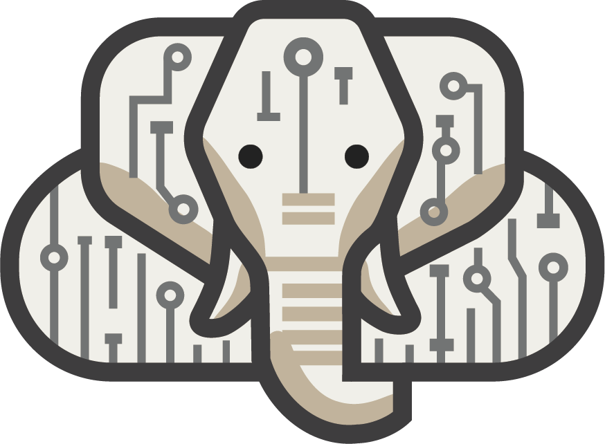

<p align="center">
  
</p>

<h1 align="center">IvoryOS</h1>

<p align="center">
  <b>Run your lab's instruments from one place.</b><br>
  Design workflows by drag and drop, run and optimize them, and keep every result,<br>
  on top of the Python drivers you already have.
</p>

<p align="center">
  <a href="https://github.com/ivoryzh/ivoryos-next/releases"><b>Download</b></a> ·
  <a href="https://ivoryos.ai">Automation Hub</a> ·
  <a href="docs/desktop_launcher_guide.md">Guide</a> ·
  <a href="https://discord.gg/3KdjhUmsYA">Discord</a>
</p>

---

## What is IvoryOS?

IvoryOS turns the Python code that controls your instruments into an app. It reads each
instrument's methods, their arguments and their types, and builds the interface from them: no
interface code, no configuration files. Scientists design and run experiments by pointing and
clicking, and anyone who can write a Python class can bring a new instrument.

It sits between point-and-click lab software and writing your own scripts: as easy to use as the
first, as open as the second. It runs on the computer next to your instruments and keeps working
without an internet connection.

## Features

- **Designer**: build a workflow from your instruments' methods by drag and drop, with prep, main
  and cleanup steps, If and While logic, waits, pauses for a person, and values passed from one
  step to the next. Every workflow can also be read, and downloaded, as the Python it runs.
- **Three ways to run**: **Once**, with the values filled in; **Iterate** over a spreadsheet of
  samples, with steps that run once per sample or once per batch; or **Optimize** with Bayesian
  optimization (Ax, BayBE or NIMO), from your own search space and objectives.
- **A person stays in charge**: a failed step pauses the run and waits for you to retry, skip or
  stop it. Stop holds the queue, a graceful stop finishes the current sample first, and the app
  notifies you when a run needs you.
- **Data History**: every run, step and value, searchable and exportable to CSV.
- **Workflow library**: saved, versioned workflows, and one workflow reused inside another, as a
  copy or as a link that follows its updates.
- **Automation Hub**: drivers, whole platforms and workflow templates shared by the community,
  installed from inside the app.
- **Plugins**: add your own pages and panels next to the built-in ones.
- **Works with AI agents**: an [MCP server](docs/agent_in_the_loop.md) lets Claude, or another
  agent, read your deck and propose workflows. Nothing is saved or run until a person accepts it.
- **IvoryOS Cloud** *(coming soon)*: watch and run the decks in every lab from one place. Sign up
  for early access from the app.

## Get started

### 1. Install the app

Download the installer for your computer from the
[Releases page](https://github.com/ivoryzh/ivoryos-next/releases):

| Windows | macOS (Apple silicon) | Linux |
|---|---|---|
| `IvoryOS-Setup-<version>.exe` | `IvoryOS-<version>-arm64.dmg` | `IvoryOS-<version>.AppImage` |

The app is not code-signed yet, so your computer will warn the first time you open it:

- **Windows**: SmartScreen says "Windows protected your PC". Choose **More info**, then **Run
  anyway**.
- **macOS**: open the `.dmg` and drag IvoryOS to Applications. If macOS says the app "is damaged"
  or "can't be opened", run this once in Terminal:
  ```bash
  xattr -cr /Applications/IvoryOS.app
  ```
- **Linux**: make the file executable (`chmod +x IvoryOS-*.AppImage`) and run it.

The first launch downloads Python, so it needs an internet connection and takes about a minute.

### 2. Try the example

Choose **Try the example** on the welcome page. It sets up a simulated Suzuki coupling screen,
with three syringe pumps, a heated reactor, a balance, a UV-Vis probe and an HPLC, all sharing one
reaction model. There is nothing to plug in, and the chemistry responds the way a real screen
would: build a workflow in the Designer, run it, then let the optimizer find the best temperature
and catalyst loading (add an optimizer under the deck's **Settings** first).

### 3. Bring your own instruments

Choose **Add a deck**. A deck is one set of instruments, with its own workflows and data.

- **From the Automation Hub**: pick drivers, or a whole platform, and the app installs them.
- **A driver you wrote**: any Python class works, and its type hints become the form.
  ```python
  class SyringePump:
      def __init__(self, port: str):
          ...

      def dispense(self, volume_ml: float, flow_rate_ml_min: float = 2.0) -> dict:
          """Deliver a volume into the vial."""
          ...
  ```
  `dispense` becomes a step with a required number field and an optional one already filled in
  with its default, and the docstring becomes its description. Enums and `Literal`s become
  drop-down lists, dataclasses become nested forms, and anything a method returns can be saved
  and used by later steps.
- **A Python script you already have**: choose **From a Python script**, or drop the `.py` file on
  the window. Create your instruments as objects in the script and end it with
  `ivoryos_edge.run(__name__)`:
  ```python
  import ivoryos_edge
  from my_lab import SyringePump

  pump = SyringePump(port="COM3")  # each object becomes an instrument

  ivoryos_edge.run(__name__)
  ```

Each running deck is also a web page, so you can open it in a browser on the same computer. Turn
on **Reachable from other computers on the network** in the deck's Settings to open it from
elsewhere in the lab.

## Documentation

| Guide | |
|---|---|
| [Desktop app guide](docs/desktop_launcher_guide.md) | How the app runs decks: profiles, ports, logs, and what to check when something goes wrong |
| [Plugins](docs/plugins.md) | Adding your own pages and panels |
| [AI agents and MCP](docs/agent_in_the_loop.md) | Letting Claude or another agent propose workflows for review |
| [Workflow reuse and versioning](docs/workflow_reuse_and_versioning.md) | Copies, links, versions and tags in the library |
| [How the optimizers behave](docs/optimizer_behavior.md) | Ax, BayBE and NIMO: rounds, the random start, failed experiments, existing data and plots |
| [Developing IvoryOS](docs/development.md) | Running from source, the demo deck, Cloud, tests and releases |

## Community and help

- **Automation Hub**: [ivoryos.ai](https://ivoryos.ai), to find drivers, platforms and workflow
  templates, or share your own.
- **Discord**: [join the community](https://discord.gg/3KdjhUmsYA) for questions, ideas and show
  and tell.
- **Problems**: when a deck will not start or an install fails, **Send to IvoryOS** in the app
  lets you review the details and send them to the team. For bugs and requests, open a
  [GitHub issue](https://github.com/ivoryzh/ivoryos-next/issues).

## Contributing

Contributions are welcome. [Developing IvoryOS](docs/development.md) covers running everything
from source and the tests, and [AGENTS.md](AGENTS.md) explains how the pieces fit together and
why.

## License

| Part | License |
|---|---|
| Everything except `cloud_frontend/` (edge server, desktop app, frontends, `packages/`, plugin template) | [Apache-2.0](LICENSE) |
| `cloud_frontend/` (IvoryOS Cloud) | [FSL-1.1-ALv2](cloud_frontend/LICENSE.md): use, modify and self-host it; don't offer it as a competing service. Each release becomes Apache-2.0 two years after it is published. |

The IvoryOS name and logo are covered by [TRADEMARKS.md](TRADEMARKS.md), not by the code licenses.
