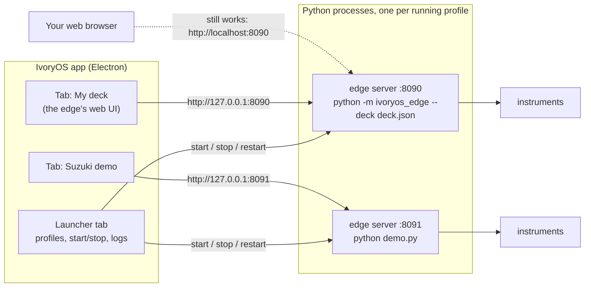
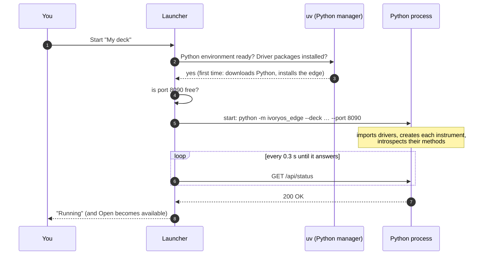
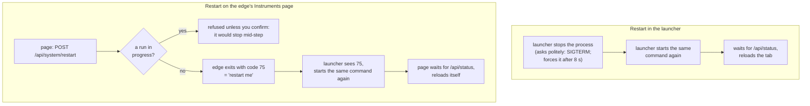
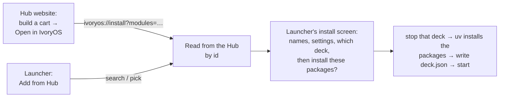

# The IvoryOS desktop launcher: how it works

A guide for people who run IvoryOS rather than develop it, written so that it also explains the
command-line ideas underneath: processes, ports, arguments, environment variables, exit codes.
You do not need any of this to *use* the launcher. It is here so that when something goes wrong,
or you want to know why it behaves as it does, the pieces make sense.

For developer detail see [desktop/README.md](../desktop/README.md), and for how an edge talks to
Cloud see [edge_cloud_sync.md](edge_cloud_sync.md).

---

## 1. The big picture

Before the launcher, running IvoryOS meant opening a terminal and typing `python demo.py`. That
starts the **edge server**: a Python program that talks to your instruments and serves the IvoryOS
web interface. You then opened `http://localhost:8080` in a browser.

The launcher does exactly the same thing, with buttons instead of a terminal:



The app is a manager and a window; **the Python edge server is unchanged**. Everything the edge
could do before, it still does, including being opened in a normal web browser.

## 2. A few terms, explained once

**Process.** A running program. When you run `python demo.py`, the operating system starts a
process. It lives until it finishes, crashes, or is told to stop. Each profile you start in the
launcher is one process, and you can see them in Activity Monitor (macOS) or Task Manager
(Windows) as `python`.

**Command line.** The exact text used to start a process: the program, then its *arguments*.
```
python  demo.py  --simulate
│       │        └── an argument for the script
│       └── an argument for Python: which file to run
└── the program
```

**Argument.** A word after the program name. Python hands the ones after the script name to the
script as `sys.argv`. A script only uses arguments it was written to read, so if your script does
not look at `sys.argv`, you never need to set any. That is why the launcher's "Arguments" field is
empty by default.

**Environment variable.** A named setting that a process inherits from whoever started it, like
`PUMP_PORT=COM3`. A Python script reads it with `os.environ`. The point: you can change a value
**without editing the script**. See [section 6](#6-script-profiles-arguments-and-environment-variables).

**Port.** A number that tells programs on one computer apart when they talk over the network. The
edge server listens on one, 8080 by default. Two programs cannot listen on the same port, which
is why each profile has its own (8090, 8091, …) and why the launcher says "Port 8080 is in use"
when something else already has it.

**localhost / 127.0.0.1.** "This computer." `http://localhost:8090` means "the program on this
computer listening on port 8090". **0.0.0.0** means "listen for other computers too".

**Exit code.** The number a process leaves behind when it ends. 0 means "finished normally";
anything else means something else happened. The launcher uses one special value, **75**, to
mean "restart me" (see [section 7](#7-restarting-what-actually-happens)).

**Log.** Everything the process prints (the lines you would have seen in the terminal). The
launcher captures them in the **Log** tab and in a file, so nothing is lost when there is no
terminal.

## 3. Profiles: saved ways of starting an edge

A **profile** is a saved recipe for starting an edge, like a bookmark for a command line. There
are two kinds.

| | **Deck profile** | **Python script profile** |
|---|---|---|
| What starts | `python -m ivoryos_edge --deck deck.json …` | `python your_script.py …` |
| Instruments come from | a **deck file** (data), edited in the launcher | your script's own code |
| Changing a COM port | Instruments tab → Edit → change `port` | set an environment variable (section 6), or edit the script |
| One broken instrument | the others still load; the broken one is listed with its error | the script stops, unless it handles the error itself |
| Add a driver from the Hub | yes, "Add from Hub" | no; install it and edit the script |
| Runs and workflows | its own data folder | wherever the script keeps them (same as from a terminal) |
| Good for | a bench you set up once and adjust | an existing script such as `demo.py` |

Several profiles can run at the same time, each on its own port.

## 4. What happens when you press Start



The launcher waits for the edge to **answer** rather than just for the process to start: a Python
server needs a few seconds to import drivers and connect instruments, and a window pointed at it
before then would only show "can't connect".

## 5. How a deck file becomes instruments

A deck profile does **not** generate a Python script. The edge reads the deck file (JSON) and does
by itself what a script would do by hand. This entry:

```json
{ "name": "pump_1", "import": "lab_drivers", "class": "SyringePump",
  "args": { "port": "COM3" }, "calls": [{ "method": "connect" }] }
```

becomes, inside the edge (`edge_server/ivoryos_edge/deck_config.py`):

```python
module = importlib.import_module("lab_drivers")   # 1. import
cls = getattr(module, "SyringePump")
pump_1 = cls(port="COM3")                          # 2. create (init)
pump_1.connect()                                   # 3. setup calls
```

**Each instrument is wrapped in its own try/except**, one per stage. If any stage fails, the error
is recorded and the next instrument is loaded anyway:

| Stage | Typical cause | What you see |
|---|---|---|
| import | driver package not installed, or a typo in the module or class | `No module named 'vendor_autosampler'` |
| init | device unplugged, wrong port, or a required argument missing | `could not open port COM7`, `missing 1 required positional argument: 'port'` |
| setup | `connect()` or another setup call failed | whatever the driver raised |

The instruments that loaded run normally. The ones that did not are marked red in the launcher and
listed under **Not loaded** on the edge's Instruments page, with the full error. Fix the cause
(plug it in, correct the port, install the package), then Restart.

A Python script gets no such safety net: if `SyringePump("COM7")` raises in `demo.py`, the script
stops, and the launcher shows "Stopped unexpectedly" with the error in the Log tab.

## 6. Script profiles: arguments and environment variables

If you just run your script, **leave both empty**. They exist for one situation: changing
something (usually a COM port) without editing the script.

A script cannot see the launcher's settings, only its own command line and environment. So to make
a port configurable, the script reads it from an environment variable, with a fallback:

```python
import os
pump_1 = SyringePump(port=os.environ.get("PUMP_PORT", "COM3"))   # COM3 if nothing is set
```

Then, in the profile's **Configuration** tab, set `PUMP_PORT = COM4` and press Restart. The
script is unchanged; the next process simply starts with `PUMP_PORT` set. The same script can
have two profiles: "Bench A" with `PUMP_PORT=COM3`, "Bench B" with `COM4`.

**Arguments** do the same job for scripts written to read them, e.g. with `argparse`:
`python demo.py --simulate`. Most IvoryOS scripts do not read any, so leave the field empty.

The launcher also sets a few variables itself, which is how a script started from it lands on the
profile's port without being changed: `IVORYOS_PORT`, `IVORYOS_HOST`, and `IVORYOS_DATA_DIR` if
the profile has its own data folder. `ivoryos_edge.run(__name__)` reads them.

## 7. Restarting: what actually happens

A restart always means **a brand-new Python process**, never "reload inside the old one". Python
cannot reliably unload a driver or let go of a serial port it holds; a new process starts clean,
re-reads the deck file, re-imports drivers (so an edited driver takes effect), and reconnects
every instrument.

There are two Restart buttons, and they take different routes to the same result:



Exit code 75 is the whole agreement between the two. Any other exit is a crash, and the launcher
shows it rather than restarting in a loop. Run from a terminal instead (`python demo.py`), there
is no launcher to restart it, so the edge replaces itself in place with the same command line.

**Windows** cannot replace a running program in place: "replacing" there starts a new process and
ends the old one, so the terminal gets its prompt back while the edge carries on detached. So on
Windows, `python -m ivoryos_edge --deck …` from a terminal runs a small restart loop that plays
the launcher's part (it keeps the terminal, starts the edge, starts it again on exit code 75, and
takes it down if the loop itself is closed). A script (`python demo.py`) cannot use it, because
its instruments already exist, holding their ports, before it asks IvoryOS to run; restarting it
from the page on Windows still detaches it from the terminal, and it says so. Run such a script
from the launcher (a script profile) to restart it cleanly.

One difference worth knowing: the launcher's Stop and Restart let the server shut down gracefully,
while the page's Restart exits immediately. Either way the operating system releases serial ports
and network connections, but a driver's own `close()` method is not called on the immediate path.

## 8. One window, and your browser still works

**Open** shows an edge's interface as a **tab in the same window**, next to the Launcher tab.
Closing a tab does not stop the edge; Stop does. The same interface is also an ordinary web page:

- The ↗ button next to Open opens it in your normal browser.
- Typing `http://localhost:8090` (the profile's port) in any browser **on this computer** works too.
- **Other computers** can reach it only if the profile's "Reachable from other computers" setting
  is on. It is off by default, because anyone who can reach the port can drive the instruments.

So the launcher replaces the terminal, not the browser.

## 9. Adding drivers from the Hub



Both routes end in the same place, and neither installs anything without asking. The deck file is
only changed once every package installed, so a failed install leaves your deck as it was. Drivers
are programs with access to your instruments, so only install from sources you trust.

A driver's Hub entry decides which settings the launcher asks for. If it is missing one (the
error says `missing 1 required positional argument: 'port'`), add it on the instrument with
**Edit → Add argument**, and consider fixing the entry on the Hub.

"Add from Hub" offers four kinds of thing, each added to the deck it was opened from. The
sidebar's **Automation Hub** entry opens the same browser (on its Platforms section) for the
selected deck (or the first one); with no deck at all it still opens, and the first thing you add asks for a deck name and
starts that deck (a platform's own form already offers "As a new deck"). Cancel the name, or an
install that fails, and no deck is left behind.

| Kind | What adding it does |
|---|---|
| Instrument | installs the driver, adds one instrument with the settings you fill in |
| Platform | a whole deck's worth: its drivers (each with its own name and settings), its plugins and its workflows. Goes **onto this deck**, or **into a new deck profile** of its own, on the next free port |
| Plugin | installs the package and lists it in the deck's `plugins`. **Only v2 plugins** (an `ivoryos_edge.plugins.Plugin`): a v1 plugin is a Flask blueprint for the original IvoryOS, cannot run here, and is shown with the reason instead of an Add button (see `docs/plugins.md` to port one) |
| Workflow template | saved into the deck's workflow library (through the edge's API while it runs, as a file it adopts otherwise), never replacing one: a name in use gets a number. A template that calls instruments this deck does not have is **still allowed**, after a warning; the Library marks its steps until they are pointed at this deck's instruments in the Designer |

**Public and private hub.** The switch at the top lists public rows, or the private hub: what only
you, or an organization you belong to, can see. It is a Pro feature and needs you signed in. The
launcher reads the catalog straight from the Automation Hub's database with your session, and the
database's row-level security decides which rows come back; the Hub website is not involved.
Private repositories (GitHub/GitLab) sit on the private side too: connect them by signing in on
GitHub or GitLab in your browser, or with a token.

**The sidebar is the tab list.** Click a running deck to open its page; a stopped one opens its
launcher page, where you can start it. The gear on each row always opens the launcher page
(instruments, log, settings). Drag rows to reorder them. Ctrl+B (or the button at the top left)
hides or shows the sidebar, from anywhere, including inside a deck's page. The reload button at
the top reloads the page you are looking at, for when it did not pick up a change.

**One theme.** Settings -> Appearance (System, Light, Dark) applies to the launcher, every deck's
page and Cloud together.

## 10. Where things are on disk

On macOS in `~/Library/Application Support/IvoryOS/` (Windows: `%APPDATA%\IvoryOS`, Linux:
`~/.config/IvoryOS`):

| Path | What |
|---|---|
| `profiles.json` | your profiles and the Hub address |
| `profiles/<id>/deck.json` | a deck profile's instruments (Settings → Show deck file) |
| `profiles/<id>/data/` | that deck's runs, workflows and Cloud settings |
| `runtime/venv/` | the Python environment all profiles use, managed by uv |
| `logs/<id>.log` | each profile's output (Log tab → Log file) |

Deleting `runtime/` is safe: it is rebuilt on the next start. Deleting `profiles/<id>/data/`
deletes that deck's run history.

## 11. When something goes wrong

| You see | Likely cause | What to do |
|---|---|---|
| "Port 8090 is in use by another program" | another edge or program on that port | stop it, or change the profile's port in Settings |
| "Port … is already used by …" | two profiles share a port | give one of them another port |
| An instrument is red: `No module named …` | its driver is not installed | Add from Hub, or install the package; then Restart |
| An instrument is red: `could not open port` | unplugged, powered off, wrong port | fix the cable or the `port`, then Restart |
| "Stopped unexpectedly" | the process crashed | read the Log tab (the last lines say why) |
| "uv was not found" | development build without uv | install uv (docs.astral.sh/uv), then Start again |
| The page in a tab is blank after a restart | it reloaded before the edge answered | click the tab and press Cmd/Ctrl+R |

## 12. Is this a normal way to build an app?

Yes. **A desktop shell that manages a local server and shows its web UI** is an established
pattern, especially for tools built on Python or other languages that already have a web
interface. The closest references:

- **JupyterLab Desktop**: an Electron app that bundles and manages Python environments, starts
  Jupyter servers, and shows their web UI in its own window. This is the nearest match in shape.
- **LM Studio** and **Ollama**: desktop apps managing a local server (start/stop, port, logs),
  whose server is also reachable from other programs.
- **Docker Desktop**: a desktop shell around a background engine that does the real work.
- **Opentrons App**: an Electron app for controlling lab robots, the nearest match in domain.

What keeps it from being chaotic is keeping the layers separate: the edge stays a plain web server
that works without the app, the app only starts, watches and shows it, and a profile is just a
saved command line. The Hub, the launcher and the browser all talk to the same edge.
