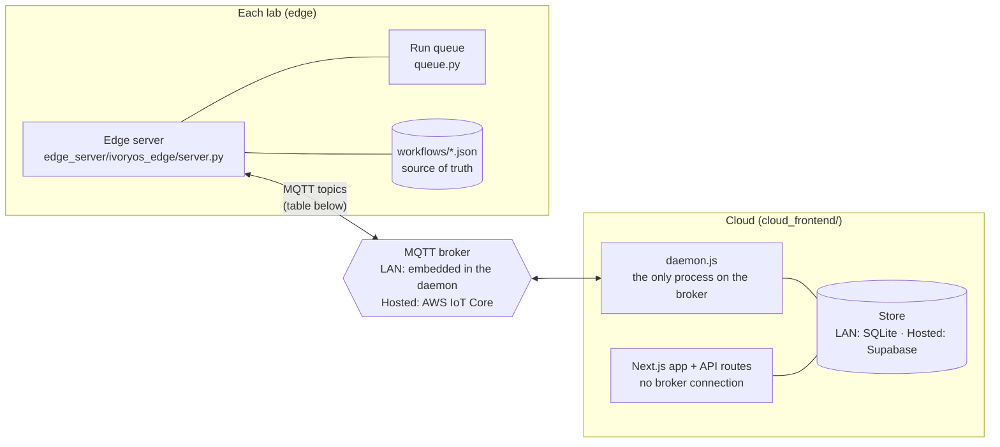
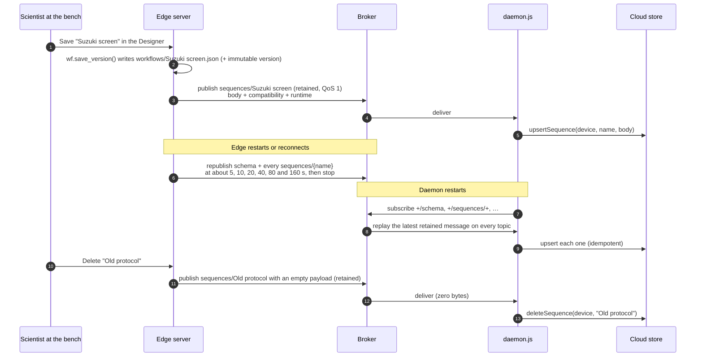
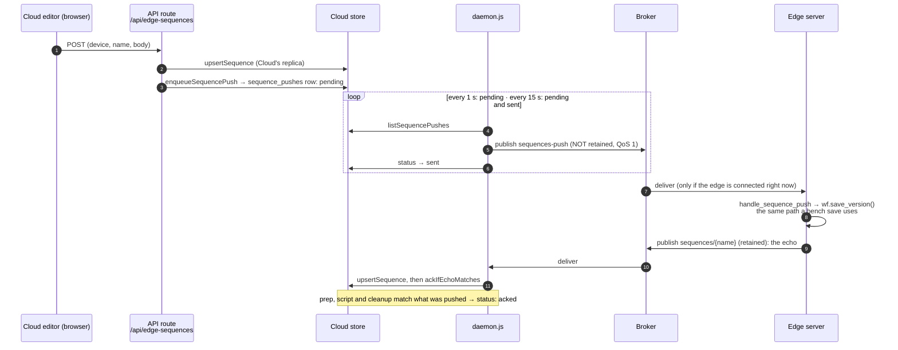
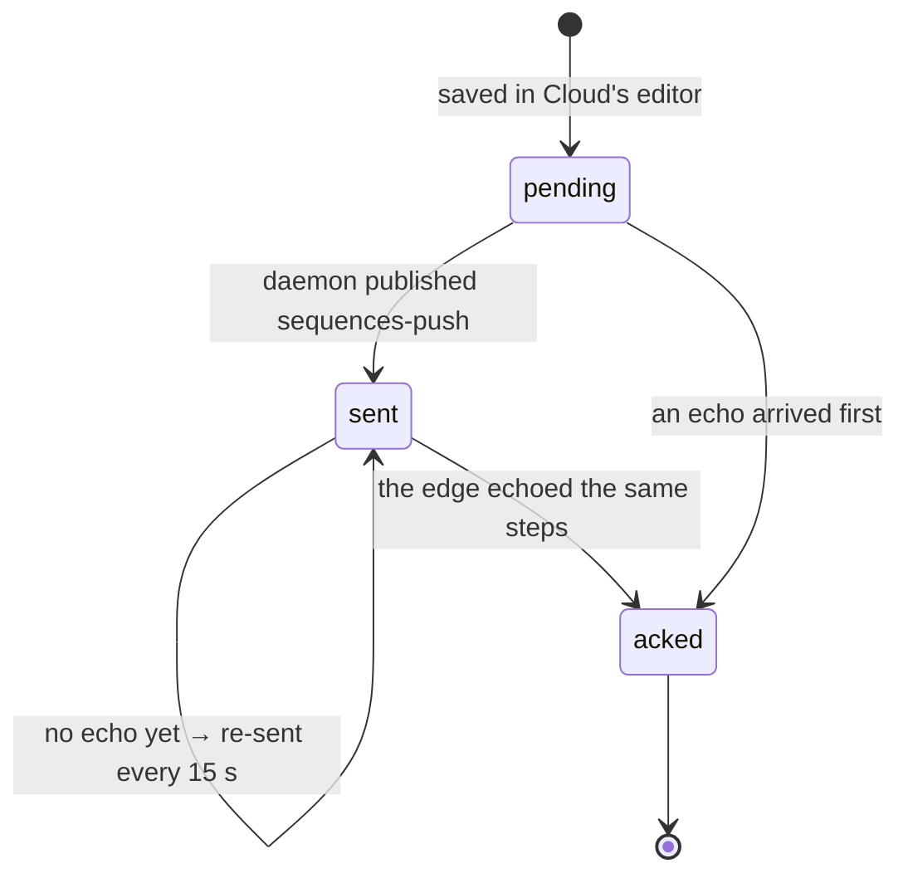
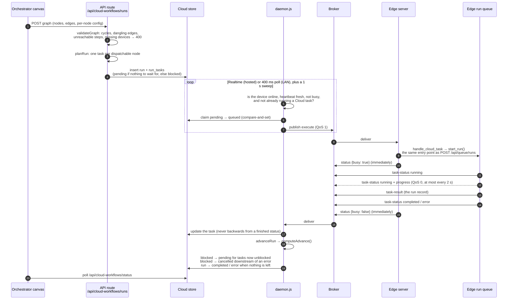
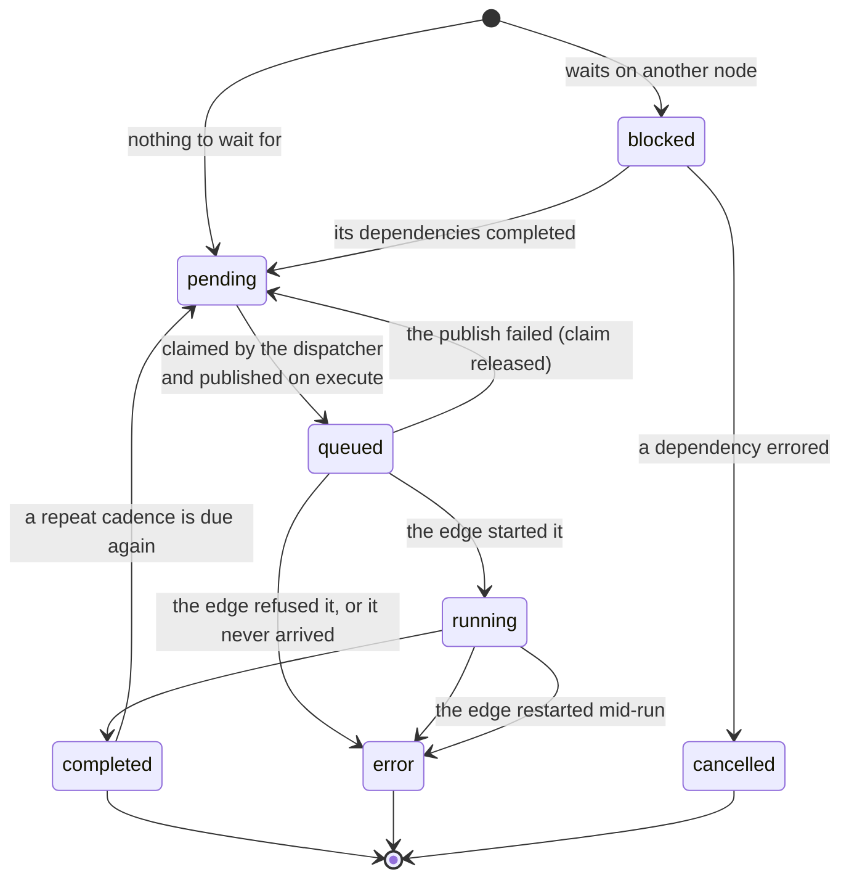

# Edge ↔ Cloud: workflow sync and job dispatch

How a Core instance at the bench (the **edge**) and the multi-lab dashboard (**Cloud**) keep their
workflows in step, and how Cloud gets a job run on an edge's instruments. For how the browser
talks to its own edge server, see [communication_flow.md](communication_flow.md).

## The shape of it

Four rules explain almost every design decision below:

1. **There is no HTTP between Cloud and an edge.** Everything travels over MQTT topics under
   `{prefix}/{device_id}/…` (prefix defaults to `ivoryos/edge`; `device_id` is the MQTT client id
   chosen when the device was paired). The edge only needs outbound access to the broker, which is
   what makes it work behind a lab firewall.
2. **Only `daemon.js` talks to the broker.** Next.js API routes are request-scoped and cannot own
   a long-lived connection, so they write intent into the store (a run to dispatch, a workflow to
   push) and the daemon acts on it. The store is the mailbox between the two.
3. **The edge owns its workflows; Cloud holds the jobs.** A workflow's durable copy lives on the
   edge, which keeps working if the network drops. Cloud keeps a replica and can *request* writes.
   Jobs work the other way round: Cloud keeps them until the edge is free, and never parks work in
   the edge's own queue.
4. **Delivery is at-least-once, and every write is idempotent or guarded.** Retained messages,
   echo-as-acknowledgement, compare-and-set claims and a "never move backwards from a finished
   status" guard stand in for a request/response protocol.

The same code runs in both deployment modes. `SUPABASE_URL` set means hosted (Supabase + AWS IoT);
unset means LAN (a SQLite file, with an MQTT broker the daemon starts itself). Nothing above
`cloud_frontend/src/lib/store/` branches on the mode.

## Topic map

| Topic (`{prefix}/{device_id}/…`) | Direction | Retained | QoS | Carries | Sent when |
|---|---|---|---|---|---|
| `status` | Edge → Cloud | yes | 0 | `{online, busy, ts, session}` | every 5 s, and immediately when a run is queued or finishes |
| `status` (Last Will) | broker → Cloud | **no** | — | `{online: false}` | the edge drops without disconnecting |
| `schema` | Edge → Cloud | yes | 1 | introspected instruments + optimizer catalog | on connect, then at ~5/10/20/40/80/160 s, then stops |
| `sequences/{name}` | Edge → Cloud | yes | 1 | a saved workflow body + compatibility verdict + typical runtime | on connect (same schedule), on every save, on a push echo |
| `sequences/{name}` (empty) | Edge → Cloud | yes | 1 | zero bytes: MQTT's tombstone | the workflow is deleted on the edge |
| `sequences-push` | Cloud → Edge | **no** | 1 | `{name, body, author}` | a workflow is saved in Cloud's editor |
| `execute` | Cloud → Edge | no | 1 | one task: `{block, runId, nodeId}` or `{run, runId, nodeId}` | the dispatcher releases a task |
| `task-status` | Edge → Cloud | no | 1 (0 for progress) | `{runId, nodeId, status, error?, progress?}` | start, progress (≤ every 2 s), finish, refusal |
| `task-result` | Edge → Cloud | no | 1 | the finished run's record (steps, outputs; up to ~100 KB) | once, just before the final status |
| `cloud-queue` | Cloud → Edge | no | 1 | what Cloud is holding for this device | when that summary changes, or the device comes back |

Two of these are easy to get wrong, and both have been:

- **`task-status` is not `status`.** Publishing task updates on the heartbeat topic made Cloud read
  `payload.online` as missing and mark the device offline every time a run started.
- **The Last Will is not retained.** AWS IoT refuses the whole connection, silently, if the Will
  has `retain=True`. A subscriber that connects later therefore never sees the Will, which is why
  the daemon also marks a device offline when its heartbeat is more than 15 s old.

Retained publishing needs `iot:RetainPublish` in the device's AWS IoT policy, not just
`iot:Publish`. Without it AWS disconnects the client on every retained publish, which looks
exactly like a flaky network (see AGENTS.md, section 0).

---

## 1. Workflow sync

### Edge → Cloud: retained topics, no sync step

Every saved workflow has its own retained topic. MQTT hands a new subscriber the latest retained
message on every topic it subscribes to, so there is no "sync" request anywhere. A daemon that
restarts, or an edge that reconnects, is caught up by the broker itself.

What each message carries, besides the body:

- **`compatibility`**: whether the workflow still runs on this deck, computed by the same
  `compatibility.check` the edge's own Library uses, so the two Libraries always agree. It is not
  part of the body, and `body_hash` ignores it.
- **`runtime`**: how long the workflow usually takes, from this edge's run history. A finished run
  that moves that number republishes only the workflows whose timing changed.

**Why the reconnect republish stops.** The repeat exists for a real, reproduced bug: AWS IoT could
drop the one-shot publish sent the moment a connection opened. That is a connect-time race, so
repeating past the first couple of minutes buys nothing. It did cost something: an earlier version
republished every 60 s forever, measured at 36 KB a minute (about 50 MB per device per day) of
unchanged data.

**Why the empty payload.** An empty retained message is how MQTT deletes one. The daemon checks for
it before parsing JSON. Without both halves, a deleted workflow was re-imported into Cloud from the
body still sitting on the broker.

### Cloud → Edge: a push, acknowledged by its echo

A workflow edited in Cloud has to reach the edge's disk, because that is where a run looks it up.
It also has to survive the edge republishing its own copy, which would otherwise quietly undo the
edit.

- **Not retained, on purpose.** A retained push would be re-applied by the edge every time it
  reconnected, long after anyone wanted it. The cost is that a push sent while the edge is offline
  is simply gone. That is why anything short of `acked` is re-sent until the echo arrives.
- **The echo is the acknowledgement.** It is matched on the executable content (prep, script and
  cleanup), not on `body_hash`. The edge recomputes the hash when it saves, so matching the hash
  left every push unacknowledged forever. Matching the content keeps the property that matters: if
  a bench edit wins a race with the push, the echo carries different steps and does not falsely
  acknowledge it.
- **A push is not a back door.** The edge applies it through `wf.save_version`, with the same
  versioning, validation and link checks as a local save. If the edge refuses a push, it sends no
  echo, and the push stays unacknowledged. Cloud treats "refused" and "lost in transit" as the same
  state, which it reports.

---

## 2. Triggering a job on an edge

A Cloud run is a graph: nodes (a single instrument step, a saved workflow, a spreadsheet, an
optimization campaign), each on some device, with edges for "this waits for that". Each dispatchable
node becomes one **task**.

### End to end

### A task's life

### The decisions that make it safe on real hardware

**One Cloud task per device, held in Cloud.** A ready task stays `pending` until its device is
online, has a heartbeat less than 15 s old, reports `busy: false`, and has no other Cloud task in
flight. `busy` is the edge's own answer: any run queued or in progress there, *including ones
started at the bench*, which Cloud's task table cannot see. Handing a task to a busy device would
only park it in that device's queue, where Cloud can no longer reorder it, cancel it, or tell
"waiting" from "lost". The edge publishes its heartbeat immediately whenever a run is queued or
finishes, so a freed device is used without waiting for the next 5 s tick.

**Claim, then publish.** The dispatcher moves a task `pending → queued` with a compare-and-set
*before* anything goes on the wire, so only one of two concurrent triggers (a Realtime event and
the sweep, say) can win it. Publishing first and recording afterwards left a window in which one
task could reach a real instrument twice. If the publish fails, the claim is released back to
`pending` and retried.

**A dispatched run is an ordinary run.** `handle_cloud_task` accepts either a bare `block` (one
instrument call, the smallest message on a broker that meters in 5 KB steps) or a whole `run`
(`{name, parameters, prep, sequence, cleanup}`, the exact body `POST /api/queue/runs` takes; used
for spreadsheets, optimization campaigns and merged chains). Both go through the same `start_run`
as a bench submission. The run shows up in the edge's Queue and Data History like any other,
tagged with `cloud_run_id` / `cloud_node_id`.

**Status only moves forward.** QoS 1 is in-order per connection, but across a reconnect a
"running" sent just before "completed" can arrive after it (this was observed). Once a task is
`completed`, `error` or `cancelled`, later updates, including late progress messages, match zero
rows and are dropped.

**Results before the final status.** `task-result` goes out first, on its own topic, so Cloud
already holds the data when it hears the task is done. Keeping the large record off `task-status`
keeps status and progress messages small.

**Failures end the run; they don't hang it.** An error cancels everything downstream of that task,
and the run reaches `completed` or `error` instead of sitting at `running`. The graph rules
(`planRun`, `computeAdvance`, `validateGraph`) live in one file, `cloud_frontend/src/lib/dag.js`,
used by both the API route and the daemon. Flow Control nodes are *transparent*: `A → Sleep → B`
means B waits for A. They are not treated as "already done", which used to let B start at the same
moment as A.

### When something goes wrong

| What happens | What Cloud does | Why not something else |
|---|---|---|
| Device offline or busy | Task stays `pending`, held in Cloud | Queuing on the device would take it out of Cloud's control |
| Publish to `execute` fails | Claim released: `queued → pending`, retried | — |
| Edge refuses the task (unknown workflow, bad parameters) | Edge sends `task-status error` with the reason | Previously it only printed, and the task sat `queued` forever |
| Task sent but never arrived (sent over 30 s ago, device idle for 20 s) | Marked `error`, **never re-sent** | If it did run and only the report was lost, re-sending would move the hardware twice |
| Edge restarts in the middle of a Cloud task | Once reconnected, the edge reports it as `error` ("The device restarted before this finished.") | Otherwise Cloud would hold every later task for that device behind it |
| Late or duplicate status message | Dropped by the terminal-status guard | — |
| Daemon restarts | Startup scan re-dispatches anything still `pending`; retained topics replay device state | Realtime only streams changes made after it subscribed |

### Repeats, schedules and what the bench sees

- **Repeat cadence (per node):** "every 20 minutes, 12 times". When an occurrence completes, the
  next one is scheduled (`not_before`) instead of advancing the run, so nothing downstream starts
  until all 12 have run.
- **Schedules (whole run):** "every night at 2 am". A schedule stores its run *already planned*.
  Firing copies those task rows into a new run, claimed with the same compare-and-set so two ticks
  can't start one occurrence twice. After downtime, the cadence resumes from now rather than
  firing the backlog all at once.
- **`cloud-queue`:** the edge never receives queued Cloud work, so the daemon sends each device a
  short summary of what Cloud is holding for it (ready, waiting on another step, next scheduled
  run). The edge's Queue page shows it. It is for information only: nothing on the edge acts on it.

---

## Connecting a device (for context)

A device is paired with an 8-character code from Cloud's Settings page, redeemed by the *edge
server* (`POST /api/cloud-settings/pair`), not the browser. The device's broker credentials are
minted at redemption and sent once over TLS. A device's name is its MQTT client id, so names must
be unique: two clients with the same id keep evicting each other, which looks like a flaky
connection. A headless deployment can set `CLOUD_TOKEN` in `.env` instead. Details are in
AGENTS.md, section 0.

## Where the code is

| Concern | Edge (`edge_server/ivoryos_edge/`) | Cloud (`cloud_frontend/`) |
|---|---|---|
| Broker connection, subscriptions, Last Will | `server.py` → `setup_broker`, `broker.py` | `daemon.js` (top), `src/lib/embedded-broker.js` |
| Heartbeat and resync schedule | `server.py` → `status_loop`, `publish_status`, `notify_status_changed` | `daemon.js` → `status` handler, `markStaleDevicesOffline` |
| Workflow publish / delete | `server.py` → `publish_sequences`, `published_sequence`, save and delete routes | `daemon.js` → `sequences` handler |
| Cloud → Edge push | `server.py` → `handle_sequence_push` | `api/edge-sequences/route.ts`, `daemon.js` → `drainSequencePushes`, `ackIfEchoMatches` |
| Run submission and graph rules | — | `api/cloud-workflows/runs`, `src/lib/dag.js` |
| Dispatch | `server.py` → `handle_cloud_task`, `start_run` | `daemon.js` → `dispatchTask`, `deviceNotReady` |
| Status, progress, results | `queue.py` → `report_run_finished`, `report_cloud_progress`, `publish_cloud_result` | `daemon.js` → `handleTaskStatus`, `advanceRun` |
| Lost tasks, schedules, cloud-queue | `server.py` → abandoned tasks in `status_loop` | `daemon.js` → `failLostTasks`, `tickSchedules`, `publishCloudQueues` |
| Storage (both modes) | — | `src/lib/store/` (`sqlite.js`, `supabase.js`) |
